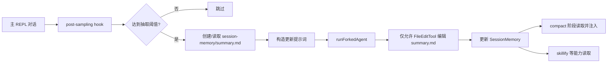
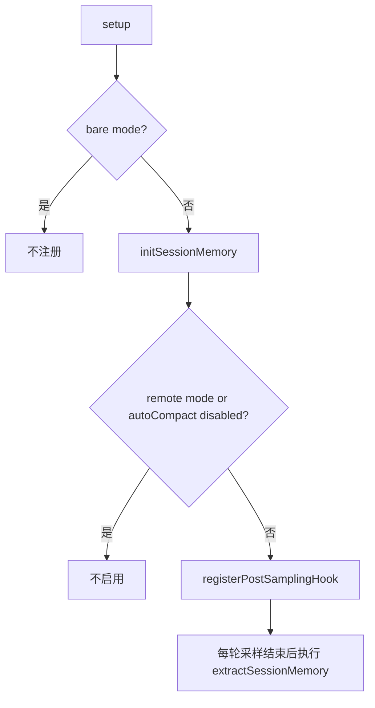
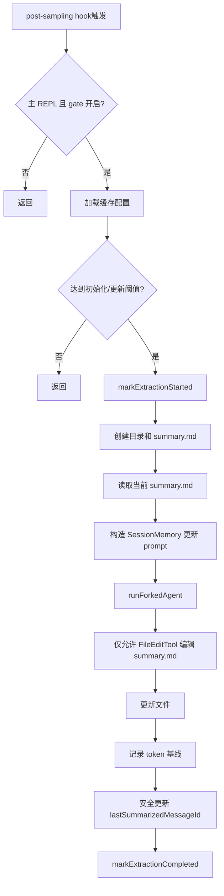
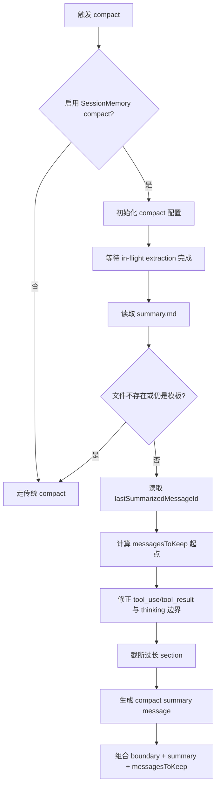

# SessionMemory 详细分析

`SessionMemory` 是 Claude Code 在**当前会话内部**维护的一份结构化 Markdown 笔记。它的目标不是做跨会话长期记忆，而是在上下文变长、发生 compact、会话恢复或后续派生技能时，保留“这次会话现在做到哪了”的高密度摘要。

核心相关文件：

- `src/services/SessionMemory/sessionMemory.ts`
- `src/services/SessionMemory/sessionMemoryUtils.ts`
- `src/services/SessionMemory/prompts.ts`
- `src/services/compact/sessionMemoryCompact.ts`
- `src/utils/permissions/filesystem.ts`
- `src/utils/hooks/postSamplingHooks.ts`
- `src/utils/sessionStoragePortable.ts`
- `src/setup.ts`

---

## 1. 总体定位

`SessionMemory` 的设计边界很明确：

- 它是**单 session、单文件**的结构化摘要，不是 Durable Memory。
- 它的主要消费者不是用户界面，而是 **compact 之后的上下文重建**。
- 它通过 **post-sampling hook + forked agent** 在后台更新，不阻塞主对话逻辑。
- 它只允许编辑当前 session 的 `summary.md`，权限边界非常窄。

从架构上看，它更像一个“会话续航层”，而不是知识库。

---

## 2. 存储结构分析

### 2.1 文件路径

`SessionMemory` 的文件路径是固定的：

- session 目录：`{projectDir}/{sessionId}/session-memory/`
- summary 文件：`{projectDir}/{sessionId}/session-memory/summary.md`

其中：

- `projectDir` 由 `getProjectDir(getCwd())` 计算，实际落到 `~/.claude/projects/<sanitized-cwd>/`
- `sessionId` 是当前会话 ID

对应实现：

- `src/utils/permissions/filesystem.ts` 中 `getSessionMemoryDir()`
- `src/utils/permissions/filesystem.ts` 中 `getSessionMemoryPath()`
- `src/utils/sessionStoragePortable.ts` 中 `getProjectDir()`

因此它与 transcript 一样，天然挂在当前 session 的持久化目录下，只是 transcript 是 `*.jsonl`，而 `SessionMemory` 是单独的 `summary.md`。

### 2.2 文件模板结构

默认模板定义在 `src/services/SessionMemory/prompts.ts` 的 `DEFAULT_SESSION_MEMORY_TEMPLATE`，固定包含 10 个 section：

1. `# Session Title`
2. `# Current State`
3. `# Task specification`
4. `# Files and Functions`
5. `# Workflow`
6. `# Errors & Corrections`
7. `# Codebase and System Documentation`
8. `# Learnings`
9. `# Key results`
10. `# Worklog`

每个 section 都有一行斜体说明文本，更新时必须原样保留。

这说明它不是随意追加日志，而是**强结构化表单**。系统要求模型只改 section 内容，不准改 header 和说明行，目的是保证：

- 后续 compact 可以稳定读取
- 长会话中内容可控，不会退化成无结构长文
- 自定义模板时仍能保持同一更新协议

### 2.3 可配置项

`SessionMemory` 支持用户级配置覆盖：

- 模板文件：`~/.claude/session-memory/config/template.md`
- 更新提示词：`~/.claude/session-memory/config/prompt.md`

如果文件不存在，则回退到默认模板与默认 prompt。

这意味着结构可以被定制，但系统的核心机制不变：仍然是“读取当前文件 -> 构造更新提示词 -> 只允许 edit 当前文件”。

---

## 3. 初始化与注册流程

### 3.1 启动时注册

`src/setup.ts` 会在非 bare 模式下调用 `initSessionMemory()`。

`initSessionMemory()` 做的事情不多，但很关键：

- remote mode 下直接禁用
- 依赖 `isAutoCompactEnabled()`，因为 SessionMemory 的主要用途就是服务 compact
- 满足条件后调用 `registerPostSamplingHook(extractSessionMemory)`

也就是说，SessionMemory 不是主动轮询任务，而是**挂在每轮采样完成后的 hook** 上。

### 3.2 hook 执行模型

`src/utils/hooks/postSamplingHooks.ts` 里，post-sampling hooks 会在一次采样结束后顺序执行。异常只记录，不会影响主流程。

所以 SessionMemory 的执行语义是：

- 它属于“对话后处理”
- 失败不会打断主会话
- 它是附属增强，不是核心链路

---

## 4. 查询分析：它如何被读取

这里的“查询”不是数据库查询，而是 SessionMemory 在系统里被哪些流程读取、如何决定读多少、读完用到哪。

### 4.1 直接读取接口

`src/services/SessionMemory/sessionMemoryUtils.ts` 提供统一读取函数：

- `getSessionMemoryContent()`

行为很直接：

- 从 `getSessionMemoryPath()` 读取 `summary.md`
- 读不到时，如果属于文件系统不可访问，返回 `null`
- 成功后打 `tengu_session_memory_loaded` 事件

它是所有消费方的统一入口。

### 4.2 compact 阶段的读取

`src/services/compact/sessionMemoryCompact.ts` 是 SessionMemory 的核心消费方。

`trySessionMemoryCompaction()` 的读取逻辑是：

1. 检查 feature gate：`tengu_session_memory` 与 `tengu_sm_compact`
2. 初始化 compact 配置
3. 调 `waitForSessionMemoryExtraction()`，等待正在进行的抽取完成，最多 15 秒
4. 读取 `lastSummarizedMessageId`
5. 调 `getSessionMemoryContent()` 读 `summary.md`
6. 如果文件不存在，返回 `null`
7. 如果内容仍等于模板，说明还没形成有效摘要，返回 `null`
8. 否则进入 session-memory compaction 路径

这个设计有两个关键点：

- compact 之前先等待后台抽取，避免拿到半成品
- 如果 `summary.md` 只是空模板，就回退到旧的 compact 方式

### 4.3 compact 读取后的裁剪

即使 `summary.md` 有内容，也不会无上限注入上下文。

`src/services/SessionMemory/prompts.ts` 中定义了两个预算：

- 单 section 上限：`MAX_SECTION_LENGTH = 2000`
- 总体上限：`MAX_TOTAL_SESSION_MEMORY_TOKENS = 12000`

更新 prompt 会根据当前文件内容分析 section token 大小，提醒抽取 agent 对超长 section 做压缩。

另外，在 compact 注入前，`truncateSessionMemoryForCompact()` 还会再次做裁剪，防止 SessionMemory 吃掉整个 post-compact token budget。

这说明查询侧有两层保护：

- 写入时就提醒不要写爆
- 读取注入时再次截断

### 4.4 其他读取方

除了 compact，`src/skills/bundled/skillify.ts` 也会读取 `SessionMemory`：

- `skillify` 会把 session memory 作为“本次会话做了什么”的摘要输入
- 再结合当前会话用户消息，生成可复用 skill

这说明 SessionMemory 已经不只是服务 compact，也开始充当**当前 session 的结构化事实源**。

---

## 5. 写入分析：它如何被更新

### 5.1 写入触发条件

SessionMemory 不是每轮都更新，核心判断在 `shouldExtractMemory(messages)`。

判断逻辑依赖三类状态：

1. **初始化阈值**
   - `minimumMessageTokensToInit`
   - 默认 `10000`
   - 在总上下文 token 没到阈值前，不启动 SessionMemory

2. **增量更新阈值**
   - `minimumTokensBetweenUpdate`
   - 默认 `5000`
   - 表示距离上次抽取后，上下文至少又增长了多少 token

3. **工具调用阈值**
   - `toolCallsBetweenUpdates`
   - 默认 `3`
   - 表示至少发生了多少次工具调用

最终触发条件是：

- `token 增量阈值满足 && tool 调用阈值满足`
- 或者 `token 增量阈值满足 && 最近一轮 assistant 没有 tool call`

第二条很重要。它表示系统会优先在“自然停顿点”抽取，即最近一轮已经没有工具调用时，就算 tool threshold 没达到，也可以更新。

### 5.2 为什么要记录 lastMemoryMessageUuid

`sessionMemory.ts` 内部维护了 `lastMemoryMessageUuid`，用来统计“自上次更新以来发生了多少 tool_use block”。

它不是全文重扫，而是：

- 从上次记录的 message uuid 开始
- 向后统计 assistant 消息中的 `tool_use`

这让工具密集型对话比纯聊天更容易触发更新，因为它们更可能产生“值得记录的工作轨迹”。

### 5.3 写入前的文件准备

真正执行更新前，`setupSessionMemoryFile()` 会做三件事：

1. `mkdir(sessionMemoryDir, 0o700)`
2. 如果文件不存在，用 `wx` 创建空文件，再写入模板，权限 `0o600`
3. 用 `FileReadTool` 读取当前内容

这里有几个实现细节值得注意：

- 目录和文件权限偏保守，说明它被当作本地私有会话数据
- 读取不是直接 `fs.readFile()`，而是走 `FileReadTool`
- 读取前会清掉 `readFileState` 缓存，避免 `file_unchanged` stub 干扰，确保拿到真实内容

### 5.4 写入不是直接写，而是“让 forked agent 编辑”

SessionMemory 的核心写入链路不是主线程拼字符串覆盖文件，而是：

1. 构造更新 prompt
2. 用 `runForkedAgent()` 启动一个隔离子 agent
3. 子 agent 只允许使用 `FileEditTool`
4. 且 `FileEditTool` 只能编辑当前 `summary.md`

权限函数是 `createMemoryFileCanUseTool(memoryPath)`，逻辑非常严格：

- 工具名必须是 `FILE_EDIT_TOOL_NAME`
- `input.file_path` 必须精确等于 `memoryPath`
- 否则一律 deny

这带来的好处是：

- SessionMemory 更新逻辑完全复用现有编辑工具链
- 同时把权限面收缩到“只能改这一个文件”
- 即使 prompt 失控，也很难越权改其他文件

### 5.5 更新 prompt 的约束

默认 prompt 在 `getDefaultUpdatePrompt()` 中，约束相当强：

- 不得提及“记笔记”“总结过程”等元信息
- 只允许调用 Edit tool，不准调用其他工具
- 必须保留全部 section header 和斜体说明
- 只改每个 section 的正文
- 可以跳过没有新信息的 section
- 内容要尽量细、尽量信息密
- `Current State` 必须始终更新到最新状态
- `Key results` 要保留用户要求的完整结果

换句话说，SessionMemory 并不是让模型“总结一下”，而是让模型按照固定 schema 持续维护一份工作台账。

### 5.6 成功写入后的状态推进

抽取成功后会做几件状态更新：

- `recordExtractionTokenCount(tokenCountWithEstimation(messages))`
- `updateLastSummarizedMessageIdIfSafe(messages)`
- `markExtractionCompleted()`

其中 `lastSummarizedMessageId` 很关键。compact 会拿它作为“哪些消息已经被 SessionMemory 概括过”的边界。

但它只会在“最后一轮 assistant turn 没有 tool calls”时更新，原因是要避免把 tool_use/tool_result 对拆开，导致后续 API 消息不合法。

---

## 6. 与 compact 的协作分析

这是 SessionMemory 最核心的系统价值。

### 6.1 compact 为什么需要它

传统 compact 是“把旧消息摘要成一段 summary，再保留少量最近消息”。这种做法的问题是：

- 总结结果较自由，结构不稳定
- 很难长期保持“当前状态、错误、文件、命令”这些工作信息
- resume 时如果缺少精细状态，恢复效率差

SessionMemory 的解决方式是提前把这些信息维护成固定结构，然后 compact 时直接拿来用。

### 6.2 compact 的边界计算

`trySessionMemoryCompaction()` 中：

- 如果 `lastSummarizedMessageId` 存在，则从该 message 之后开始保留消息
- 如果不存在，但已有 SessionMemory 内容，说明是 resumed session，进入“有 summary 但没有精确边界”的降级路径

`calculateMessagesToKeepIndex()` 会做三层处理：

1. 从 `lastSummarizedMessageId` 后开始
2. 向前扩张，直到满足最小 token 和最少文本消息数
3. 再调用 `adjustIndexToPreserveAPIInvariants()`，确保：
   - 不拆开 `tool_use` / `tool_result`
   - 不丢失同一 `message.id` 关联的 thinking block

这说明 SessionMemory compact 不是简单“保留最近 N 条”，而是在严格维护 API 消息合法性。

### 6.3 compact 生成的 summary 内容

compact 阶段会：

1. 读取 SessionMemory
2. 必要时做 section 截断
3. 用 `getCompactUserSummaryMessage(...)` 包装成 compact summary message
4. 再加一个 compact boundary message
5. 与保留的最近消息、hooks 结果、plan 附件一起组成 post-compact 上下文

如果发生截断，还会在 summary 中附加一句提示，让系统知道完整文件可在本地路径查看。

### 6.4 为什么要先等待抽取完成

`waitForSessionMemoryExtraction()` 最多等待 15 秒，超过 60 秒则视为 stale，不再继续等。

这个机制解决的是并发窗口问题：

- post-sampling hook 可能刚开始写 SessionMemory
- auto compact 可能同时发生
- 如果不等待，compact 可能读到旧内容或中间状态

因此 compact 读取前显式等待，是两条后台链路之间的同步点。

---

## 7. 查询与写入中的状态变量

`src/services/SessionMemory/sessionMemoryUtils.ts` 维护了一组轻量运行时状态：

- `sessionMemoryConfig`
- `lastSummarizedMessageId`
- `extractionStartedAt`
- `tokensAtLastExtraction`
- `sessionMemoryInitialized`

这些状态都在内存里，不额外持久化。

它们分别服务于不同问题：

- `sessionMemoryInitialized`：控制是否达到首次启用阈值
- `tokensAtLastExtraction`：控制增量更新频率
- `extractionStartedAt`：给 compact 提供等待依据
- `lastSummarizedMessageId`：给 compact 提供消息边界

也因此它有一个重要特征：

- **文件内容是持久的**
- **边界状态是会话内存态**

这正是 `trySessionMemoryCompaction()` 要兼容“resumed session case”的原因：恢复会话后文件还在，但 `lastSummarizedMessageId` 可能不在当前进程内存中了。

---

## 8. 配置与实验开关

SessionMemory 带有明显的实验特征，配置主要来自 GrowthBook：

- feature gate：`tengu_session_memory`
- 远程配置：`tengu_sm_config`
- compact gate：`tengu_sm_compact`
- compact 配置：`tengu_sm_compact_config`

其中特别值得注意的是：

- 抽取配置读取是 `CACHED_MAY_BE_STALE`，强调**不阻塞主流程**
- compact 配置初始化是 `BLOCKS_ON_INIT`，因为 compact 发生时已经是关键决策点，需要较稳定配置

这反映了系统的取舍：

- 平时抽取可以“快但可能略旧”
- compact 选择路径时要更谨慎

---

## 9. 设计取舍总结

### 9.1 优点

- 结构稳定。固定模板比自由 summary 更适合长会话续航。
- 更新低侵入。通过 post-sampling hook 后台执行，不打断主对话。
- 权限收敛。forked agent 只能编辑当前 `summary.md`。
- 与 compact 深度协同。不是附加信息，而是 compact 的核心输入之一。
- 支持恢复场景。即使边界状态丢失，已有 `summary.md` 仍然可被利用。

### 9.2 代价

- 依赖 prompt 约束。内容质量仍然受模型执行 prompt 的稳定性影响。
- 边界状态不持久化。`lastSummarizedMessageId` 丢失后只能走 resumed-session 降级逻辑。
- 抽取触发依赖 token/tool 阈值，短会话或轻量会话可能根本不会产生有效 SessionMemory。
- 它服务的是“当前 session 的工作连续性”，并不解决跨 session 的长期知识沉淀。

### 9.3 最准确的定位

如果要用一句话概括：

> `SessionMemory` 不是长期记忆库，而是一个由后台子 agent 维护、专门服务 compact 和会话续写的结构化 session 摘要文件。

---

## 10. 结论

项目中的 `SessionMemory` 采用的是“**单 session 文件 + 后台增量维护 + compact 时作为主摘要输入**”的设计。

从结构上看，它把当前会话状态拆成固定 section。

从查询上看，主要由 compact 和 skillify 读取，并带有模板检测、等待抽取完成、长度截断等保护机制。

从写入上看，它通过阈值驱动触发，借助 forked agent 和受限的 `FileEditTool` 精确更新 `summary.md`，同时用 `lastSummarizedMessageId` 与 compact 保持消息边界一致。

这套机制的核心价值不在“记住更多”，而在“**让当前会话即使被压缩、恢复或延续，仍然保持工程上下文连续性**”。
