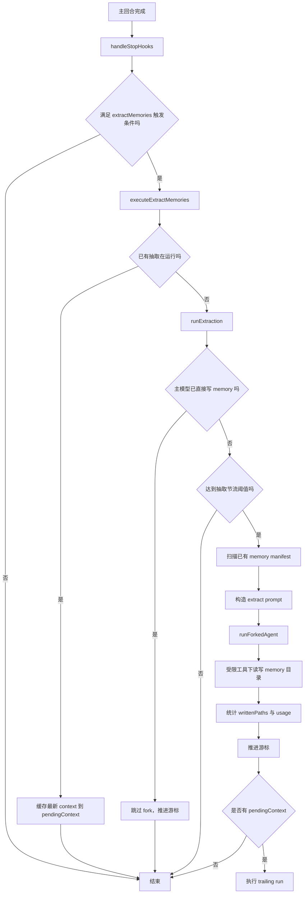
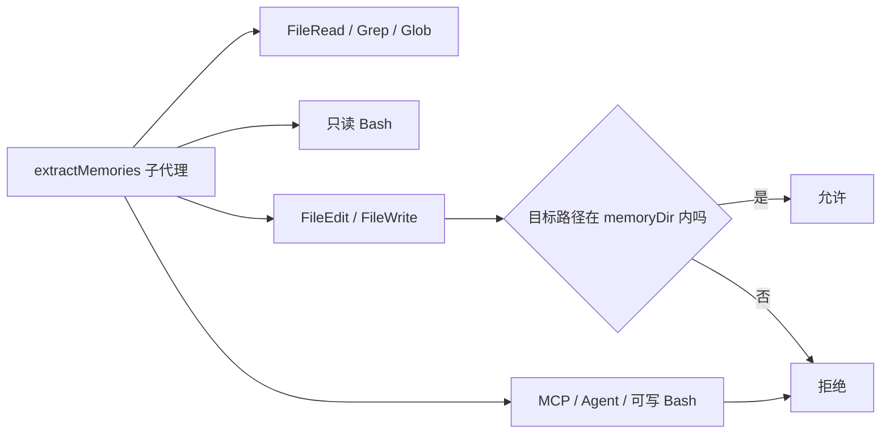
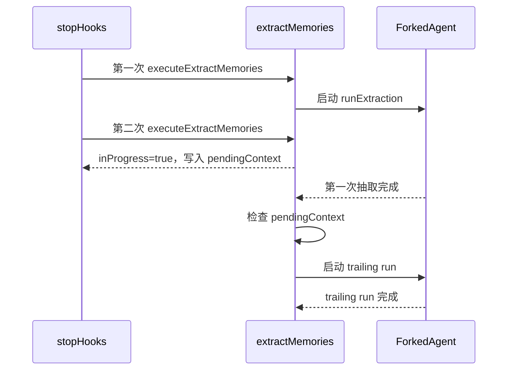
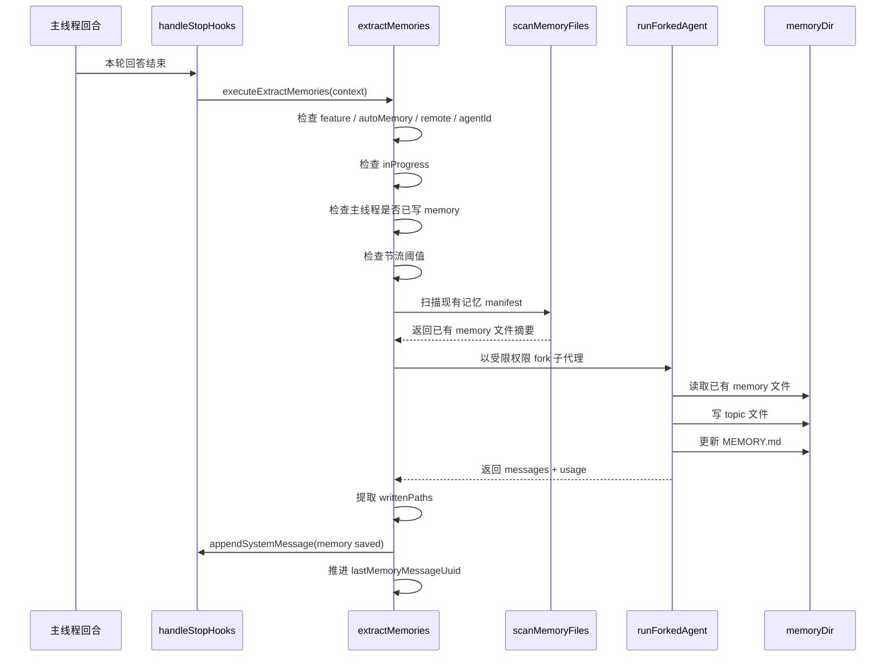

# extractMemories 后台抽取流程分析

## 1. 文档目标

本文专门分析当前项目中 `extractMemories` 的后台抽取逻辑，重点回答：

- 它什么时候触发
- 它为什么不会每次都真正执行
- 它如何保证不和主线程、子代理互相干扰
- 它怎么限制权限
- 它最终把什么写到哪里
- 它失败、并发、退出时怎么处理

相关核心代码：

- `src/query/stopHooks.ts`
- `src/services/extractMemories/extractMemories.ts`
- `src/services/extractMemories/prompts.ts`
- `src/utils/forkedAgent.ts`
- `src/cli/print.ts`
- `src/utils/backgroundHousekeeping.ts`

## 2. 一句话结论

`extractMemories` 本质上是一个“回合结束后触发的、带权限沙箱的、共享主线程 prompt cache 的后台 fork 子代理”，它只在满足开关条件时运行，只处理上次成功抽取之后新增的消息，并通过“主线程直写优先、互斥执行、尾随补跑、退出前 drain”这几层机制避免重复和丢失。

## 3. 它在系统中的位置

### 3.1 初始化

后台 housekeeping 启动时，会调用 `initExtractMemories()` 完成初始化：

- 建立 closure-scoped 状态
- 注入 `extractor`
- 注入 `drainer`

也就是说，`extractMemories` 的运行状态不是散落在模块全局变量里，而是在初始化时被封装进一个新的闭包。

### 3.2 触发入口

主触发点在 `handleStopHooks()`。

每次 query loop 完成后，如果满足条件，就 fire-and-forget 调用：

- `executeExtractMemories(stopHookContext, appendSystemMessage)`

这决定了它不是主回合链路的一部分，而是“回合结束后的后台善后逻辑”。

### 3.3 所处阶段

它发生在：

1. 主模型本轮回答结束之后
2. stop hooks 执行期间
3. 用户结果已经基本确定之后

因此它的定位不是“辅助当前回答”，而是“把本轮对话沉淀成长期记忆”。

## 4. 总体流程图



## 5. 触发条件

`extractMemories` 不是无条件执行的，它要经过几层门控。

### 5.1 stopHooks 调用门控

在 `handleStopHooks()` 中，只有同时满足下面条件才会触发：

- `EXTRACT_MEMORIES` feature 打开
- 当前不是 subagent
- `isExtractModeActive()` 返回 true
- 当前不是 `--bare` 模式

所以它只服务于主线程回合，不服务于普通子代理回合。

### 5.2 `isExtractModeActive()` 门控

`isExtractModeActive()` 还会继续判断：

- `tengu_passport_quail` 是否开启
- 当前是否允许该模式在交互或非交互环境运行

这意味着：

- 功能总开关没开时，完全不跑
- 非交互模式下也不是默认总跑，而是由 flag 决定

### 5.3 `executeExtractMemoriesImpl()` 内部门控

真正进入执行前还有三层：

- 如果是 subagent，直接返回
- 如果 auto memory 被关闭，直接返回
- 如果当前是 remote mode，直接返回

所以“stopHooks 触发了”不等于“一定会真的抽取”。

## 6. 初始化后的闭包状态

`initExtractMemories()` 内部维护了 5 个关键状态。

### 6.1 `inFlightExtractions`

作用：

- 记录当前所有尚未结束的抽取 Promise
- 供 `drainPendingExtraction()` 在进程退出前等待

意义：

- 后台任务虽然是 fire-and-forget，但系统仍然知道“还有哪些抽取没结束”

### 6.2 `lastMemoryMessageUuid`

作用：

- 记录上一次成功处理到的消息游标

意义：

- 下一次抽取只处理游标之后新增的消息
- 避免每轮都拿整段历史重跑

### 6.3 `inProgress`

作用：

- 表示当前是否已有一个 `runExtraction()` 正在执行

意义：

- 防止多个抽取并发运行，互相写同一批记忆文件

### 6.4 `turnsSinceLastExtraction`

作用：

- 做抽取节流

意义：

- 即使每轮都触发 stopHooks，也不一定每轮都真的 fork 抽取子代理

### 6.5 `pendingContext`

作用：

- 如果抽取期间又来了新的 stopHooks 调用，只保留最新的一份 context

意义：

- 并发情况下不排长队
- 当前抽取结束后只做一次“尾随补跑”

## 7. 主执行链路

### 7.1 计算本次候选消息范围

`runExtraction()` 首先用：

- `countModelVisibleMessagesSince(messages, lastMemoryMessageUuid)`

统计从上次游标之后到现在新增了多少“模型可见消息”。

这里排除了：

- progress
- system
- attachment

只关注：

- `user`
- `assistant`

这说明它抽取的原料是“真正进入模型上下文的会话内容”，不是 UI 杂项消息。

### 7.2 主线程直写优先

接着会调用：

- `hasMemoryWritesSince(messages, lastMemoryMessageUuid)`

检查主模型在这段消息范围内是否已经直接写过 memory 文件。

如果已经写过：

1. 直接跳过 fork 子代理
2. 把游标推进到最新消息
3. 记录 `tengu_extract_memories_skipped_direct_write`

这是非常关键的设计点：

- 主模型已经完成了记忆沉淀，就不再让后台代理重复做一遍
- 这保证“主线程直写”和“后台抽取”在同一批消息上互斥

### 7.3 节流控制

如果没有主线程直写，还要继续过一层节流判断。

逻辑是：

- `turnsSinceLastExtraction++`
- 与 `tengu_bramble_lintel` 比较
- 默认阈值为 `1`

含义：

- 默认每个 eligible turn 都可以抽取
- 但可以通过 flag 调大阈值，降低抽取频率

注意：

- trailing run 不受这层节流限制
- 因为 trailing run 处理的是已经积压的上下文，不能再被跳过

### 7.4 构造子代理执行环境

正式开始前会准备两样东西：

1. `canUseTool = createAutoMemCanUseTool(memoryDir)`
2. `cacheSafeParams = createCacheSafeParams(context)`

这两者分别解决两个问题：

- 工具权限边界
- prompt cache 复用

### 7.5 预扫描已有记忆清单

在 fork 之前，主线程会先扫描 memory 目录下现有 topic 文件头部，生成 manifest：

- `scanMemoryFiles(memoryDir, signal)`
- `formatMemoryManifest(...)`

这个 manifest 会直接注入给抽取子代理。

目的：

- 不让子代理浪费一轮去 `ls`
- 让它优先更新已有记忆，而不是盲目创建重复文件

### 7.6 组装抽取 prompt

然后根据是否开启 team memory 选择：

- `buildExtractAutoOnlyPrompt(...)`
- `buildExtractCombinedPrompt(...)`

这个 prompt 明确约束了抽取代理：

- 只分析最近 `~N` 条消息
- 不要去读代码验证
- 先读可能更新的 memory 文件，再并行写
- 只能写 memory 目录
- `MEMORY.md` 只是索引，不是正文

### 7.7 fork 子代理执行

随后通过 `runForkedAgent()` 运行 fork 子代理，关键参数：

- `promptMessages`: 当前这次抽取任务的 user prompt
- `cacheSafeParams`: 共享主线程 cache key
- `canUseTool`: 权限沙箱
- `querySource: 'extract_memories'`
- `forkLabel: 'extract_memories'`
- `skipTranscript: true`
- `maxTurns: 5`

这里有几个关键点：

- `skipTranscript: true`，避免和主线程 transcript 写入产生竞争
- `maxTurns: 5`，防止抽取代理陷入验证或搜索型回合
- 使用 `cacheSafeParams`，可以尽量复用主线程 prompt cache，降低成本

## 8. 权限模型

`extractMemories` 的权限模型非常收敛。

### 8.1 允许的能力

`createAutoMemCanUseTool(memoryDir)` 允许：

- `FileRead`
- `Grep`
- `Glob`
- 只读 `Bash`
- `FileEdit` / `FileWrite`，但仅限 memory 目录内路径
- `REPL`，但 REPL 内部实际执行的原子工具仍然会再次受这套权限限制

### 8.2 不允许的能力

明确禁止：

- MCP
- Agent
- 可写 Bash
- 超出 memoryDir 的 FileEdit / FileWrite
- `rm`

这说明抽取代理的设计目标非常纯粹：

- 只允许“读一些上下文，改 memory 目录”
- 不允许把抽取过程扩展成普通自治代理

### 8.3 权限图



## 9. 执行完成后做什么

### 9.1 推进游标

只有 `runForkedAgent()` 成功返回后，才会把：

- `lastMemoryMessageUuid`

推进到最新消息。

这意味着：

- 成功才确认“这段消息已经被消费”
- 如果执行报错，游标不推进，下次还会重新考虑这一段消息

### 9.2 提取真实写入文件

抽取完成后，会扫描 fork 子代理产生的 assistant tool_use blocks，提取出所有写入路径：

- `extractWrittenPaths(result.messages)`

然后做两层区分：

- `writtenPaths`: 所有 Edit/Write 触达的路径
- `memoryPaths`: 去掉 `MEMORY.md` 之后真正的 topic 文件

这是因为：

- `MEMORY.md` 更新通常只是机械性加索引
- 真正代表“产生了新记忆”的是 topic 文件

### 9.3 打点与日志

系统会记录：

- 输入/输出 token
- cache read/create token
- turn count
- files written
- memories saved
- team memories saved
- duration

并输出 debug 日志，方便观察：

- 启动
- 跳过
- 完成
- 写了哪些路径
- 是否存在 system message 回传

### 9.4 给主线程追加提示消息

如果 `memoryPaths.length > 0`，会创建：

- `createMemorySavedMessage(memoryPaths)`

再通过 `appendSystemMessage` 回注到主线程会话里。

这意味着用户在主会话里可以看到类似“记忆已保存”的系统提示，但这是非阻塞的附加反馈，不影响主回答。

## 10. 并发与合并策略

这是 `extractMemories` 设计里最容易被忽略，但最值钱的一部分。

### 10.1 单实例互斥

如果 `inProgress === true`，新来的抽取请求不会并发起第二个 fork。

而是：

1. 记录日志 `extraction in progress`
2. 上报 `tengu_extract_memories_coalesced`
3. 把最新 context 覆盖写入 `pendingContext`
4. 立即返回

所以它不是队列模型，而是“只保留最后一份待补跑上下文”。

### 10.2 尾随补跑

当前 `runExtraction()` 在 `finally` 里会检查是否存在 `pendingContext`。

如果有：

1. 取出最新 pending context
2. 清空 `pendingContext`
3. 再调用一次 `runExtraction({ isTrailingRun: true })`

这个 trailing run 的特点：

- 不再经过节流阈值判断
- 只处理“上一次游标推进之后新增的消息”

因此它解决的问题是：

- 在抽取执行期间，新回合又结束了
- 这些新增内容不能丢
- 但也不需要把中间每次调用都排队执行

### 10.3 并发时序图



## 11. 为什么它不会丢消息

看起来它是 fire-and-forget，但实际上有几层防丢设计。

### 11.1 游标只在成功后推进

如果 fork 失败：

- 不推进 `lastMemoryMessageUuid`
- 下次还会处理这一段消息

### 11.2 抽取中的新请求会合并为尾随补跑

不会出现：

- 当前抽取执行中
- 新结束的回合完全丢掉

### 11.3 非交互退出前会 drain

在 `print.ts` 里，响应已经输出给用户后，会额外执行：

- `drainPendingExtraction()`

这一步会等待：

- 所有 in-flight extraction 完成
- 或软超时

这样就避免了 headless/print 模式下，进程过快退出把抽取子代理直接杀死。

## 12. 为什么它不会和主线程互相污染

### 12.1 主线程写 memory 时后台直接跳过

这一条解决“重复写”。

### 12.2 `skipTranscript: true`

这一条解决“主线程 transcript 与子代理 transcript 竞争写入”。

### 12.3 限制工具权限

这一条解决“抽取代理跑偏去做别的事”。

### 12.4 cacheSafeParams 只共享 cache，不共享执行副作用

它借用了主线程的：

- system prompt
- user context
- system context
- toolUseContext
- messages prefix

目的是共享 prompt cache。

但实际执行仍然是一个独立 fork query loop，不会直接复用主线程执行状态。

## 13. prompt 设计要点

`extractMemories` 的 prompt 有几个非常明确的工程意图。

### 13.1 只看最近消息

prompt 明确要求：

- 只使用最近 `~newMessageCount` 条消息
- 不要扩展调查

这样避免后台代理把抽取逻辑变成全局分析。

### 13.2 先读后写

prompt 明确建议：

1. 第一轮并行 Read 所有可能要修改的 memory 文件
2. 第二轮并行 Write/Edit

这和工具约束是配套的，因为 `FileEdit` 本身要求先读。

### 13.3 预注入 existing manifest

主线程提前注入已有记忆列表，目的是：

- 减少一轮探索
- 抑制重复记忆文件

### 13.4 团队记忆与个人记忆分流

如果 team memory 开启，prompt 会变成 combined 版本，明确：

- private 和 team 各自有独立 `MEMORY.md`
- 敏感数据不能进 team memory

## 14. 写入结果到底保存到哪里

默认是 auto memory 目录：

```text
<memoryBase>/projects/<sanitized-git-root>/memory/
```

写入结果通常包含两类文件：

- topic 文件，例如 `feedback_testing.md`
- `MEMORY.md` 索引文件

如果 team memory 开启，还可能写入 team 目录对应的 topic 文件和索引。

## 15. 失败路径

### 15.1 失败不会打断主流程

整个 `extractMemories` 是 best-effort：

- 异常只写 debug log 和 analytics
- 不会向用户报错
- 不会让主回合失败

### 15.2 失败后的恢复方式

因为失败不推进游标，所以后续回合还有机会重新覆盖这段消息。

这是一种“最终一致”的恢复方式，而不是强一致事务。

## 16. 详细时序图



## 17. 调试时最该看什么

如果你要排查 `extractMemories`，优先看这几类问题。

### 17.1 为什么没触发

检查：

- `EXTRACT_MEMORIES` feature 是否开启
- `tengu_passport_quail` 是否开启
- `isExtractModeActive()` 是否成立
- 是否 `--bare`
- 是否 remote mode
- 是否 auto memory 被关闭

### 17.2 为什么触发了但没写

检查：

- 主线程是不是已经直写了 memory
- 是否被节流阈值拦住
- fork 子代理是否 0 写入
- prompt 是否只判断“无需保存”

### 17.3 为什么看起来有延迟

检查：

- 是否发生了 `inProgress` 合并
- 是否正在等待 trailing run
- 非交互模式是否在退出前 drain

### 17.4 为什么会重复

正常情况下重复会被以下机制压制：

- 主线程直写互斥
- existing manifest 提示先更新不要重复创建
- 游标推进

如果仍重复，优先怀疑：

- 记忆文件命名与描述不稳定
- 抽取 prompt 认为原文件不适合更新
- 某次失败导致游标未推进

## 18. 结论

`extractMemories` 不是简单的“对话结束后再跑个总结器”，而是一个完整的后台状态机：

- 由 stopHooks 触发
- 由闭包状态维护执行游标和并发控制
- 由受限工具权限保护写入边界
- 由 forked agent 复用主线程 prompt cache
- 由 trailing run 处理抽取期间新增消息
- 由 drain 保障 headless 退出前尽量完成

如果从工程视角看，它更接近“异步的增量记忆沉淀管线”，而不是普通的 post-processing hook。
