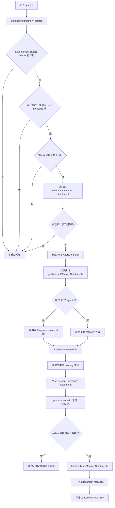

# startRelevantMemoryPrefetch 相关记忆预取流程分析

## 1. 文档目标

本文专门分析当前项目中 `startRelevantMemoryPrefetch` 的异步相关记忆预取逻辑，重点回答：

- 它在什么时机触发
- 它为什么不会阻塞主回合
- 它如何选择检索 auto memory 还是 agent memory
- 它如何避免重复注入已经出现过的记忆
- 它如何与工具调用、用户中断、query loop 多轮迭代协同
- 它最终把什么内容以什么形式注入上下文

相关核心代码：

- `src/query.ts`
- `src/utils/attachments.ts`
- `src/memdir/findRelevantMemories.ts`
- `src/memdir/memoryScan.ts`
- `src/memdir/paths.ts`

## 2. 一句话结论

`startRelevantMemoryPrefetch` 本质上是一个“每个用户回合只启动一次、在主模型流式生成和工具执行期间后台并发运行、只在结果已经就绪时才被零等待消费、并带有会话级去重与字节预算限制的相关记忆预取器”。

它的定位不是保证每轮都一定补充记忆，而是尽量把记忆检索的延迟隐藏在主回合执行时间里，让 `relevant_memories` attachment 在“不额外阻塞当前回答”的前提下出现。

## 3. 它在系统中的位置

### 3.1 启动位置

`startRelevantMemoryPrefetch()` 的启动点在 `query()` 主循环外层。

在进入 `while (true)` 之前，`query.ts` 会执行：

- `using pendingMemoryPrefetch = startRelevantMemoryPrefetch(state.messages, state.toolUseContext)`

这意味着：

- 它是“每个用户 turn 一次”的预取，而不是每次 loop iteration 一次
- 预取 prompt 在整个 turn 内保持不变，不会重复向 sideQuery 提同一个问题

### 3.2 消费位置

真正把预取结果转成 attachment 的动作发生在工具执行之后、skill prefetch 注入之前。

消费点不会主动等待预取完成，而是只检查：

- `pendingMemoryPrefetch.settledAt !== null`
- `pendingMemoryPrefetch.consumedOnIteration === -1`

只有“已经完成且尚未消费”时，才会把结果注入当前回合。

### 3.3 所处阶段

它发生在：

1. 用户 turn 已经开始
2. query loop 正在运行
3. 主模型流式输出和工具调用可能仍在进行
4. attachment 汇总阶段尝试捞取已完成的预取结果

因此它的定位不是“预先构造完整上下文再发模型”，而是“在回合中并发准备一批可能有用的记忆，并在来得及的时候补充进来”。

## 4. 总体流程图

## 5. 触发条件

`startRelevantMemoryPrefetch` 不是无条件运行的，它前面有几层明显的门控。

### 5.1 功能开关门控

函数开头先判断：

- `isAutoMemoryEnabled()`
- `getFeatureValue_CACHED_MAY_BE_STALE('tengu_moth_copse', false)`

只要其中任意一个不满足，就直接返回 `undefined`。

这说明：

- auto memory 总开关关闭时，完全不做相关记忆预取
- 即使 auto memory 开着，相关记忆预取仍然受独立 feature flag 控制

### 5.2 输入消息门控

接着会从 `messages` 里取最后一条：

- `m.type === 'user' && !m.isMeta`

也就是说：

- 只看最后一条“真实用户消息”
- 会跳过 system 注入、meta user message 等非真实提问

如果没有这样的消息，预取不启动。

### 5.3 查询质量门控

函数随后拿 `getUserMessageText(lastUserMessage)` 提取文本，并判断：

- 文本不能为空
- 至少要包含空白字符，即不能只是单词级 prompt

设计意图很明确：

- 单词级输入上下文太弱，不值得发起一次相关性选择

### 5.4 会话预算门控

`collectSurfacedMemories(messages)` 会扫描历史 `relevant_memories` attachment，统计：

- 已经露出过的 path 集合
- 已经注入过的累计字节数

如果累计字节已经达到：

- `RELEVANT_MEMORIES_CONFIG.MAX_SESSION_BYTES = 60 * 1024`

就直接停止新的预取。

这意味着：

- 它不仅控制单次注入，还控制整场会话的累计注入成本
- compact 之后旧 attachment 不在消息里了，这个预算会自然“重置”

## 6. 预取句柄与生命周期

`startRelevantMemoryPrefetch()` 返回的不是结果本身，而是一个 `MemoryPrefetch` 句柄：

- `promise`：真正的异步预取任务
- `settledAt`：任务是否已经完成
- `consumedOnIteration`：在哪次 iteration 被消费
- `[Symbol.dispose]()`：回合退出时的统一清理动作

### 6.1 为什么要用句柄而不是直接 await

因为它的设计目标就是：

- 先启动
- 后轮询
- 永不在 collect 点阻塞 turn

如果直接 `await`，就会把相关记忆检索重新放回主链路，失去“隐藏延迟”的意义。

### 6.2 为什么用 `using`

`query.ts` 用：

- `using pendingMemoryPrefetch = ...`

把这个句柄绑定到整个 turn 的生命周期。

结果是：

- 正常返回时会 dispose
- 抛错时会 dispose
- generator 被外部 `.return()` 关闭时也会 dispose

这避免了在 query loop 各种早退分支里手动补清理逻辑。

## 7. 主执行链路

### 7.1 先继承 turn 级中断信号

预取内部先创建：

- `createChildAbortController(toolUseContext.abortController)`

作用是：

- 用户按 Escape 时，sideQuery 能立即被取消
- 不必等到整个 query loop 结束才靠 dispose 收尾

### 7.2 选择搜索目录

`getRelevantMemoryAttachments()` 会先解析用户输入中的 agent mention：

- 如果存在 `@agent-xxx`，只搜索对应 agent 的 memory 目录
- 否则搜索默认 auto memory 目录

这说明它默认是：

- 主会话查 auto memory
- 点名 agent 时查 agent 自己的私有记忆

这是一种显式的隔离策略，而不是把所有 memory 目录混在一起检索。

### 7.3 调用相关性选择器

每个目录都会调用：

- `findRelevantMemories(input, dir, signal, recentTools, alreadySurfaced)`

`findRelevantMemories()` 自己内部又分两步：

1. `scanMemoryFiles()` 扫描 memory 文件头部信息
2. `sideQuery()` 调 Sonnet 选择“最多 5 个最有用的文件名”

这里的选择不是简单关键词匹配，而是：

- 先构造 manifest
- 再让 sideQuery 按系统提示词做选择

### 7.4 recentTools 抑制无效文档

预取会把：

- `collectRecentSuccessfulTools(messages, lastUserMessage)`

得到的近期成功工具名传给 selector。

含义是：

- 如果模型刚刚已经把某个工具用得很顺，工具使用参考文档就不要再作为 relevant memory 重复塞给它
- 但工具的 warnings、gotchas、known issues 仍然可以被选中

这体现的不是“禁用工具相关记忆”，而是“抑制已经证明没必要再提醒的文档型记忆”。

### 7.5 结果读取与裁剪

相关性筛完之后，`readMemoriesForSurfacing()` 会实际读取文件内容，并施加两层硬限制：

- `MAX_MEMORY_LINES = 200`
- `MAX_MEMORY_BYTES = 4096`

如果超限：

- 不直接丢弃
- 而是保留截断后的前部内容
- 并附带一段提示，要求用户或模型用 `FileRead` 看完整文件

这说明它优先保证：

- “最相关记忆至少先露出开头”

而不是：

- “超限就整文件不显示”

### 7.6 最终产物

只要至少读到一条 memory，它就返回：

- `[{ type: 'relevant_memories', memories }]`

否则返回空数组。

所以这个预取器的最终职责不是改写 memory，也不是修改消息历史，而是生成一种标准 attachment。

## 8. 为什么不会阻塞主回合

### 8.1 启动早

它在 `while (true)` 之前就启动。

这意味着：

- 主模型开始流式输出时，相关记忆选择已经在后台跑了
- 工具执行期也可以继续利用这段时间

### 8.2 消费点零等待

collect 阶段只判断：

- `settledAt !== null`

如果还没完成，就直接跳过，不做任何等待。

这决定了：

- 预取结果来得及就用
- 来不及就放弃本次注入
- 不会为了记忆补充拖慢当前响应

### 8.3 允许多次尝试消费

因为 query loop 可能有多次 iteration，所以如果第一次 collect 时还没 ready：

- 下一次 iteration 还会再次检查

直到：

- promise 完成并被消费
- 或者整个 turn 结束

所以它并不是“一次 collect 没赶上就彻底没机会”，而是“在 turn 生命周期内尽量多给几次非阻塞机会”。

## 9. 去重与重复抑制

这是这套机制里最关键的一部分。

### 9.1 对历史已露出记忆去重

`collectSurfacedMemories()` 会扫描当前消息历史里的 `relevant_memories` attachment，拿到：

- `paths`
- `totalBytes`

这些 `paths` 会提前传给 `findRelevantMemories()`。

意义：

- selector 在候选阶段就优先把预算花在“没露出过的记忆”上

### 9.2 对本 turn 工具已读文件去重

`getRelevantMemoryAttachments()` 在 selector 返回后还会再过滤一层：

- `!readFileState.has(m.path)`
- `!alreadySurfaced.has(m.path)`

其中 `readFileState` 是累计的，而不是只记录当前 iteration。

这意味着：

- 如果模型这轮已经通过 `FileRead/FileWrite/Edit` 实际接触过某个 memory 文件
- 预取 attachment 就不会再把同一个文件重复塞回上下文

### 9.3 collect 时再次去重并登记

真正消费时，`filterDuplicateMemoryAttachments()` 还会做一遍最终过滤：

- 先把已在 `readFileState` 里的 memory 排除掉
- 然后再把幸存者写回 `readFileState`

这个“先过滤、后登记”的顺序是刻意设计的。

因为如果在预取阶段就先写 `readFileState`：

- collect 阶段会把自己刚选出来的文件全部当成“已在上下文”再过滤掉

源码注释里明确说明，这个顺序是 load-bearing 的。

### 9.4 单 turn 只消费一次

`consumedOnIteration` 初始为 `-1`。

一旦消费成功，会设为：

- `turnCount - 1`

这确保：

- 同一个预取结果不会在后续 iteration 重复注入

## 10. 失败、中断与退出处理

### 10.1 sideQuery 或检索失败

`getRelevantMemoryAttachments()` 外层有统一 `catch`：

- abort error 不记日志
- 非 abort error 记 `logError`
- 最终返回 `[]`

所以失败的默认退路是：

- “没有相关记忆注入”

而不是：

- “打断主回合”

### 10.2 单目录失败不拖垮整体

多目录检索时，每个目录的 `findRelevantMemories()` 自己也有：

- `.catch(() => [])`

这表示：

- 某个目录失败，不影响其它目录继续返回结果

### 10.3 用户中断

预取请求绑定到 turn 级 abort signal。

所以当用户主动取消时：

- sideQuery 会尽快被中断
- 不需要等到 query loop 退出时再被动清理

### 10.4 turn 结束时统一收尾

`[Symbol.dispose]()` 会：

1. 调 `controller.abort()`
2. 打点 `tengu_memdir_prefetch_collected`

打点内容包括：

- `hidden_by_first_iteration`
- `consumed_on_iteration`
- `latency_ms`

这说明系统不仅关心“有没有注入”，也关心：

- 预取有没有真正把延迟藏在第一轮 iteration 里

## 11. 它最终向模型提供了什么

它不会直接把 memory 文件内容拼进 system prompt，而是以 attachment 的方式提供：

- attachment type: `relevant_memories`

每条 memory 携带的信息包括：

- `path`
- `content`
- `mtimeMs`
- `header`
- 可选的 `limit`

其中 `header` 会包含 freshness 信息，例如：

- 记忆距今多久
- memory 文件路径

因此模型拿到的不是纯裸文本，而是带有：

- 路径定位
- 新旧程度
- 截断提示

这些辅助上下文的信息块。

## 12. 总结

`startRelevantMemoryPrefetch` 的核心价值，不是“提高相关记忆召回率”这么简单，而是把“相关记忆选择”从主链路里的同步阻塞步骤，改造成了一个带预算、可取消、可去重、可零等待消费的后台预取步骤。

它的几个关键设计点可以概括为：

- 每个 turn 只启动一次，避免重复 sideQuery
- 结果 ready 才消费，不 ready 就跳过，不阻塞当前回答
- 用户点名 agent 时，只查该 agent 的 memory，保持隔离
- 历史 attachment、工具已读文件、当前预取结果三层去重
- turn 退出统一 abort 和 telemetry，上下文收尾清晰

所以这套机制本质上是在做一件事：

- 尽量把“记忆召回的收益”保留下来，同时把“对当前交互延迟的成本”压到最低
