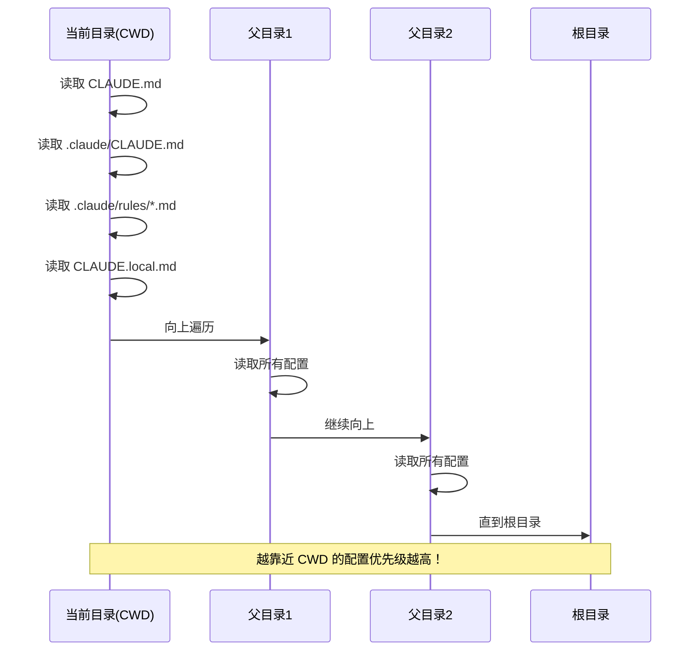
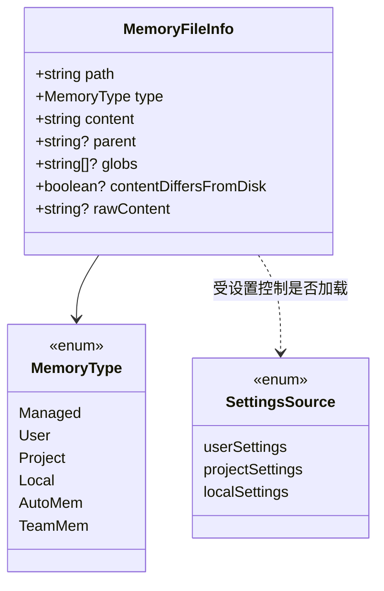

# Claude Code 记忆文件加载逻辑分析

## 问题：为什么 "土豆" 这个外号能被系统知道？

**答案**："土豆" 这个信息存储在 **User Memory** 中，路径是 `~/.claude/CLAUDE.md`。系统启动时会自动加载个人全局配置文件，而不是项目的 MEMORY.md 索引文件。

---

## 记忆加载流程图

```mermaid
flowchart TD
    Start([系统启动]) --> SystemContext[getSystemContext<br/>获取系统上下文]
    SystemContext --> GitStatus{获取 Git 状态}
    GitStatus --> UserContext[getUserContext<br/>获取用户上下文]

    UserContext --> CheckDisable{检查是否禁用<br/>CLAUDE_CODE_DISABLE_CLAUDE_MDS}
    CheckDisable -->|禁用| ReturnEmpty[返回空记忆]
    CheckDisable -->|启用| LoadMemory[getMemoryFiles<br/>加载所有记忆文件]

    LoadMemory --> Priority1[1. Managed Memory<br/>/etc/claude-code/CLAUDE.md]
    Priority1 --> Priority1b[1b. Managed Rules<br/>/etc/claude-code/.claude/rules/*.md]

    Priority1b --> CheckUser{userSettings<br/>是否启用?}
    CheckUser -->|是| Priority2[2. User Memory<br/>~/.claude/CLAUDE.md<br/><b>土豆就在这里!</b>]
    Priority2 --> Priority2b[2b. User Rules<br/>~/.claude/rules/*.md]
    CheckUser -->|否| SkipUser[跳过用户记忆]

    Priority2b --> WalkDir[向上遍历目录<br/>从 CWD 到根目录]
    WalkDir --> Priority3[3. Project Memory<br/>CLAUDE.md, .claude/CLAUDE.md]
    Priority3 --> Priority3b[3b. Project Rules<br/>.claude/rules/*.md]
    Priority3b --> Priority4[4. Local Memory<br/>CLAUDE.local.md]

    Priority4 --> CheckAddDir{检查额外目录<br/>ADDITIONAL_DIRECTORIES?}
    CheckAddDir -->|是| ExtraDir[加载额外目录的<br/>CLAUDE.md]
    CheckAddDir -->|否| CheckAutoMem

    ExtraDir --> CheckAutoMem{AutoMemory<br/>是否启用?}
    CheckAutoMem -->|是| Priority5[5. Auto Memory<br/>memory.md]
    CheckAutoMem -->|否| CheckTeamMem

    Priority5 --> CheckTeamMem{TeamMemory<br/>是否启用?}
    CheckTeamMem -->|是| Priority6[6. Team Memory<br/>team-memory.md]
    CheckTeamMem -->|否| ProcessResult

    SkipUser --> WalkDir

    ProcessResult[处理所有记忆文件] --> Filter[过滤注入文件]
    Filter --> Format[getClaudeMds<br/>格式化为系统提示]
    Format --> Cache[缓存结果]
    Cache --> Return[返回上下文]
    ReturnEmpty --> Return

    style Priority2 fill:#90EE90,stroke:#228B22,stroke-width:3px
    style Start fill:#87CEEB
    style Return fill:#FFD700
```



---

## 记忆类型优先级（从低到高）

| 优先级 | 类型 | 路径 | 说明 |
|-------|------|------|------|
| 1 | Managed | `/etc/claude-code/CLAUDE.md` | 全局管理配置（策略设置） |
| 1b | Managed Rules | `/etc/claude-code/.claude/rules/*.md` | 全局管理规则 |
| 2 | **User** | `~/.claude/CLAUDE.md` | **用户私有全局配置（土豆在这里）** |
| 2b | User Rules | `~/.claude/rules/*.md` | 用户私有规则 |
| 3 | Project | `./CLAUDE.md`, `./.claude/CLAUDE.md` | 项目级配置 |
| 3b | Project Rules | `./.claude/rules/*.md` | 项目规则（有条件/无条件） |
| 4 | Local | `./CLAUDE.local.md` | 项目本地私有配置 |
| 5 | AutoMem | `.claude/memory.md` | 自动记忆（Auto Memory） |
| 6 | TeamMem | `.claude/team-memory.md` | 团队共享记忆 |

**重要**：文件按**反向优先级顺序**加载，后加载的文件优先级更高，模型会更重视。

---

## 目录遍历逻辑



---

## 关键代码路径

### 1. 上下文构建入口

**文件**: `src/context.ts`

```typescript
// getUserContext 是记忆加载的入口
export const getUserContext = memoize(async (): Promise<{[k: string]: string} => {
  const shouldDisableClaudeMd = isEnvTruthy(process.env.CLAUDE_CODE_DISABLE_CLAUDE_MDS)

  // 获取所有记忆文件
  const claudeMd = shouldDisableClaudeMd
    ? null
    : getClaudeMds(filterInjectedMemoryFiles(await getMemoryFiles()))

  return {
    ...(claudeMd && { claudeMd }),
    currentDate: `Today's date is ${getLocalISODate()}.`,
  }
})
```

### 2. 记忆文件加载核心逻辑

**文件**: `src/utils/claudemd.ts:790-1075`

```typescript
export const getMemoryFiles = memoize(
  async (forceIncludeExternal: boolean = false): Promise<MemoryFileInfo[]> => {
    const result: MemoryFileInfo[] = []
    const processedPaths = new Set<string>()

    // 1. 首先加载 Managed 文件
    const managedClaudeMd = getMemoryPath('Managed')
    result.push(...(await processMemoryFile(managedClaudeMd, 'Managed', processedPaths, includeExternal)))

    // 2. 加载 Managed Rules
    const managedClaudeRulesDir = getManagedClaudeRulesDir()
    result.push(...(await processMdRules({rulesDir: managedClaudeRulesDir, type: 'Managed', ...})))

    // 3. 加载 User 文件（如果启用了 userSettings）
    if (isSettingSourceEnabled('userSettings')) {
      const userClaudeMd = getMemoryPath('User')  // <-- 这里就是 ~/.claude/CLAUDE.md
      result.push(...(await processMemoryFile(userClaudeMd, 'User', processedPaths, true)))
      // ...
    }

    // 4. 向上遍历目录加载 Project 和 Local 配置
    const dirs: string[] = []
    let currentDir = originalCwd
    while (currentDir !== parse(currentDir).root) {
      dirs.push(currentDir)
      currentDir = dirname(currentDir)
    }

    for (const dir of dirs.reverse()) {
      // 加载 CLAUDE.md, .claude/CLAUDE.md, .claude/rules/*.md, CLAUDE.local.md
      // ...
    }
  }
)
```

### 3. 格式化输出

**文件**: `src/utils/claudemd.ts:1153-1195`

```typescript
export const getClaudeMds = (memoryFiles: MemoryFileInfo[], filter?: ...): string => {
  const memories: string[] = []

  for (const file of memoryFiles) {
    if (file.content) {
      const description =
        file.type === 'Project'
          ? ' (project instructions, checked into the codebase)'
          : file.type === 'User'
            ? " (user's private global instructions for all projects)"  // User 类型描述
            : ...

      memories.push(`Contents of ${file.path}${description}:\n\n${file.content}`)
    }
  }

  return `${MEMORY_INSTRUCTION_PROMPT}\n\n${memories.join('\n\n')}`
}
```

---

## 记忆类型数据结构



---

## 为什么 "土豆" 出现在系统提示中？

通过检查本次会话的系统提示（在 `context.ts:185` 中被构建），可以看到：

```
Contents of /Users/lixp/.claude/CLAUDE.md (user's private global instructions for all projects):

用户外号 ： 土豆
```

这段内容被包含在系统提示中，所以我能知道你的外号是"土豆"。

---

## MEMORY.md 与 CLAUDE.md 的区别

| 特性 | MEMORY.md | CLAUDE.md |
|------|-----------|-----------|
| 用途 | 记忆索引、记录项目信息 | 系统指令、配置行为 |
| 加载方式 | 通过 Auto Memory 系统可选加载 | 核心加载逻辑，默认必加载 |
| 位置 | `.claude/memory/` 目录 | 用户家目录、项目根目录 |
| 优先级 | AutoMem（较低） | User（较高） |
| 内容 | 用户/项目/反馈记忆 | 系统指令、行为配置 |

---

## 相关环境变量

| 变量 | 作用 |
|------|------|
| `CLAUDE_CODE_DISABLE_CLAUDE_MDS` | 完全禁用所有 CLAUDE.md 加载 |
| `CLAUDE_CODE_ADDITIONAL_DIRECTORIES_CLAUDE_MD` | 启用额外目录的记忆加载 |

---

## 总结

1. **"土豆"信息存储位置**: `~/.claude/CLAUDE.md`（User Memory）
2. **加载顺序**: Managed → User → Project → Local → AutoMem → TeamMem
3. **优先级规则**: 后加载的覆盖先加载的（越靠近 CWD 优先级越高）
4. **缓存机制**: 使用 `memoize` 缓存，会话期间只加载一次
5. **设置控制**: 通过 `userSettings` 等设置源启用/禁用不同类型记忆
