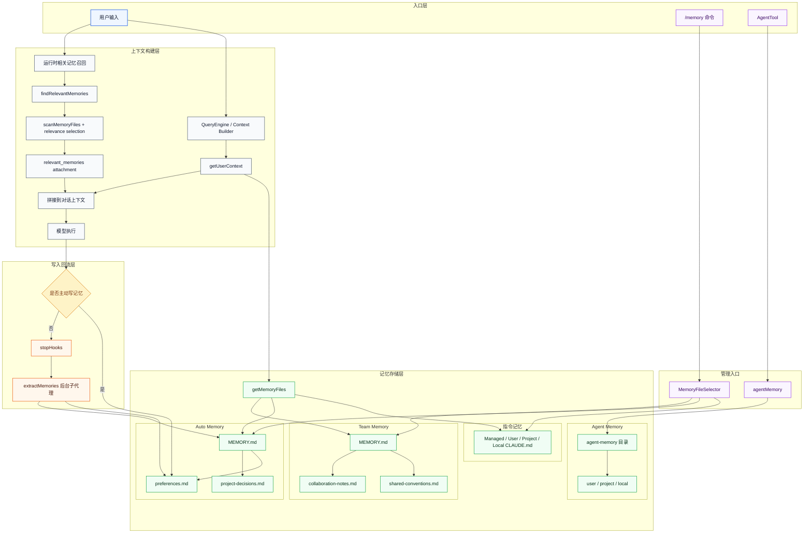
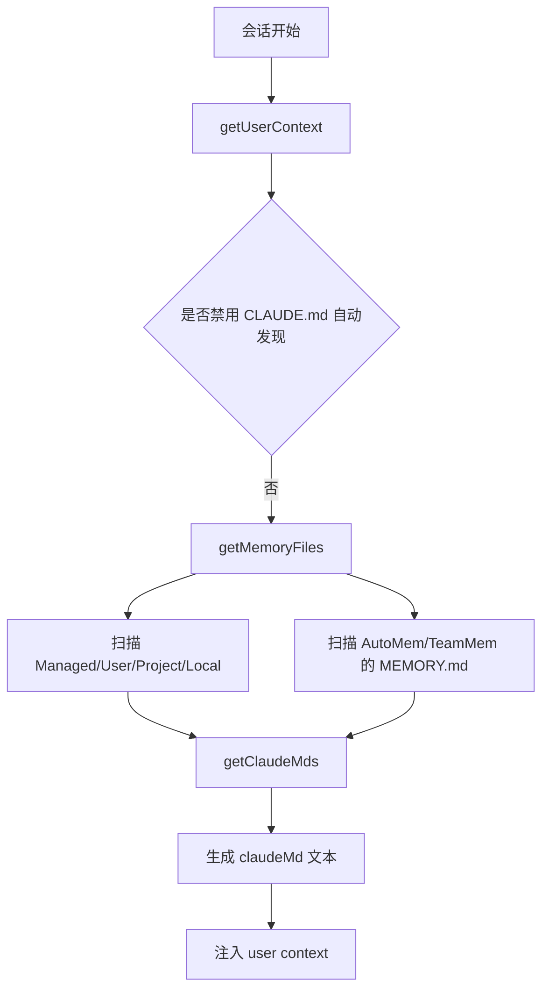
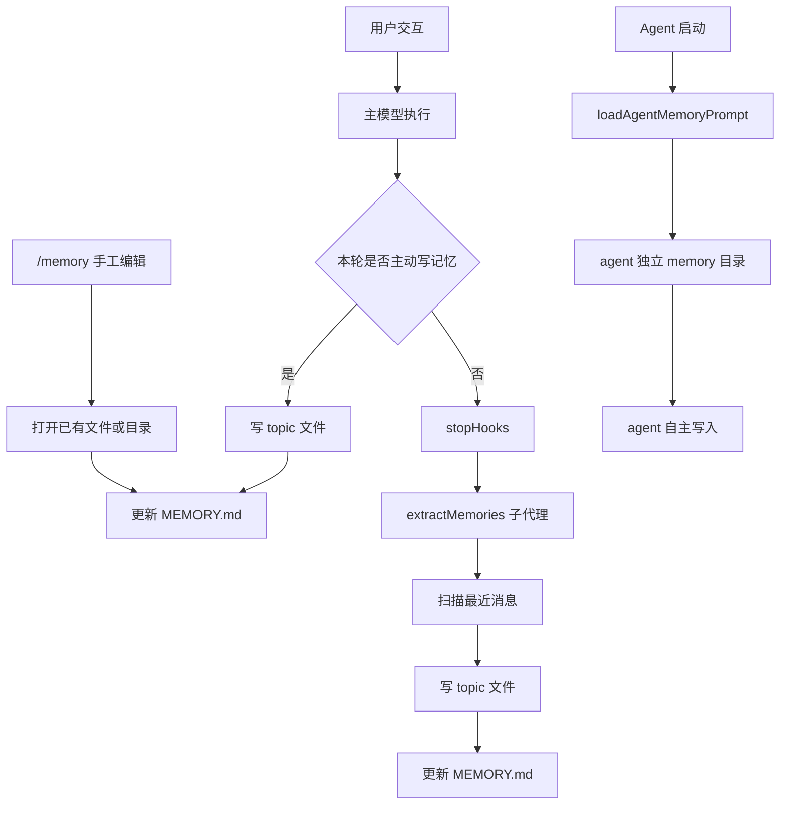
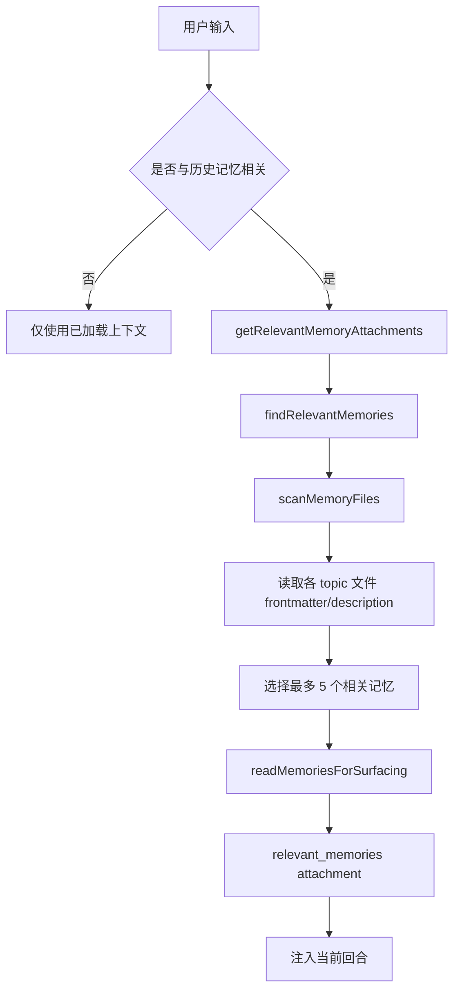
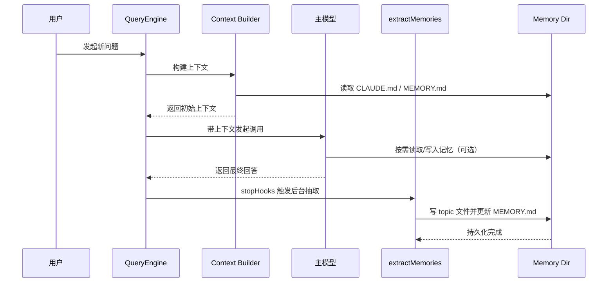

# 当前项目记忆能力设计与使用说明

## 1. 文档目的

本文基于当前仓库实现，梳理项目里的“记忆”相关能力，包括：

- 记忆体系的分层设计
- 系统里如何使用这些记忆
- 记忆写入发生在哪里
- 记忆查询发生在哪里
- 关键调用链和目录结构
- 适合日常维护的使用建议

这里的“记忆”不是单一模块，而是几套机制叠加：

1. `CLAUDE.md` / `.claude/rules/*.md` 指令记忆
2. auto memory 自动持久化记忆
3. team memory 团队共享记忆
4. agent memory 子代理持久化记忆
5. 背景抽取与按需召回能力

## 2. 总体设计结论

当前项目把“记忆”拆成了两大类：

| 类别 | 作用 | 典型载体 | 加载方式 |
|---|---|---|---|
| 指令型记忆 | 告诉模型“应该如何工作” | `CLAUDE.md`、`.claude/CLAUDE.md`、`.claude/rules/*.md`、`CLAUDE.local.md` | 对话开始时直接拼进上下文 |
| 事实型记忆 | 保存跨会话仍然有价值的用户/项目/反馈/外部引用信息 | auto memory 目录下 `MEMORY.md` + topic 文件 | 一部分在对话开始时加载索引，一部分在查询时按需召回 |

这套设计的核心不是“把所有内容都塞进 prompt”，而是：

- 启动时先注入高价值、低体积的固定记忆
- 运行中按需补充相关记忆
- 对话结束后再用后台子代理抽取新的长期记忆
- 不同作用域用不同目录隔离，避免污染

## 3. 关键模块与职责

| 模块 | 主要职责 |
|---|---|
| `src/context.ts` | 构建用户上下文，把记忆内容并入对话上下文 |
| `src/utils/claudemd.ts` | 发现、读取、解析各类 `CLAUDE.md`/rules/auto memory 索引 |
| `src/memdir/memdir.ts` | 构建 auto memory 提示词，定义 `MEMORY.md` 规范与写法 |
| `src/memdir/paths.ts` | 解析 auto memory 存储路径、开关和目录规则 |
| `src/services/extractMemories/extractMemories.ts` | 在回合结束后后台抽取长期记忆并写入 |
| `src/memdir/findRelevantMemories.ts` | 根据用户输入，从记忆目录里挑出最相关的记忆 |
| `src/utils/attachments.ts` | 将相关记忆作为 attachment 注入当前回合 |
| `src/commands/memory/memory.tsx` | `/memory` 命令入口，用于人工查看和编辑记忆文件 |
| `src/tools/AgentTool/agentMemory.ts` | 子代理专用的持久化记忆目录与 prompt 构建 |

## 4. 架构图



## 5. 记忆能力分层

### 5.1 指令型记忆：`CLAUDE.md` 体系

这是最靠近“系统行为约束”的一层。

`getMemoryFiles()` 会按优先级扫描和加载以下内容：

1. Managed memory
2. User memory：`~/.claude/CLAUDE.md`
3. Project memory：`CLAUDE.md`、`.claude/CLAUDE.md`、`.claude/rules/*.md`
4. Local memory：`CLAUDE.local.md`

实现位置见 `src/utils/claudemd.ts`。

特点：

- 主要用于行为规则、项目规范、额外说明
- 会在对话开始时被直接加载进上下文
- 支持 `@include`
- 支持按目录向上遍历，越靠近当前目录优先级越高

### 5.2 auto memory：跨会话事实记忆

这是项目里真正意义上的“长期记忆目录”。

默认目录由 `getAutoMemPath()` 计算：

```text
<memoryBase>/projects/<sanitized-git-root>/memory/
```

其中：

- `memoryBase` 默认是 `~/.claude`
- 也可以由 `CLAUDE_CODE_REMOTE_MEMORY_DIR` 或可信 settings 覆盖

见 `src/memdir/paths.ts`。

auto memory 的组织方式：

- `MEMORY.md`：索引文件
- 若干 topic 文件：真正存储记忆内容

每条记忆文件要求带 frontmatter，核心字段包括：

- `name`
- `description`
- `type`

类型被严格限制为四类：

- `user`
- `feedback`
- `project`
- `reference`

见 `src/memdir/memoryTypes.ts`。

### 5.3 team memory：团队共享记忆

这是 auto memory 的扩展层，只有在 `TEAMMEM` 打开时才参与。

特点：

- 与 private auto memory 并存
- 有独立的 team 目录和 `MEMORY.md`
- 适合保存团队级约定、项目上下文和外部系统入口

当前仓库保留了这套能力的接口和分支，但是否生效受 feature flag 控制。

### 5.4 agent memory：子代理独立记忆

每个 agent 可以拥有自己的持久化记忆目录，作用域有三种：

- `user`：`<memoryBase>/agent-memory/<agentType>/`
- `project`：`<cwd>/.claude/agent-memory/<agentType>/`
- `local`：`<cwd>/.claude/agent-memory-local/<agentType>/`

见 `src/tools/AgentTool/agentMemory.ts`。

这意味着：

- 主对话的 auto memory 和 agent memory 是两条平行体系
- agent 被 @ 提及时，运行时相关记忆检索会优先查该 agent 自己的记忆目录

## 6. 对话开始时如何加载记忆

### 6.1 启动加载链路

`getUserContext()` 会在会话开始时调用：

```text
getUserContext
  -> getMemoryFiles
  -> filterInjectedMemoryFiles
  -> getClaudeMds
  -> 注入 user context
```

对应实现：

- `src/context.ts`
- `src/utils/claudemd.ts`

其中：

- `CLAUDE.md` 体系会被直接拼成上下文文本
- auto memory / team memory 默认通过 `MEMORY.md` 索引进入上下文
- 某些 flag 打开时，索引会不直接注入，转而更多依赖“按需召回”

### 6.2 加载流程图



## 7. 记忆写入在哪里发生

这一部分是最关键的。当前项目中，记忆写入不是只有一个入口，而是四条链路。

### 7.1 链路一：主模型在当前回合直接写入

`loadMemoryPrompt()` 会把“如何保存记忆”的规则写进系统提示，包括：

- 记忆分类
- 什么该记、什么不该记
- 如何创建 topic 文件
- 如何更新 `MEMORY.md`

因此主模型在运行时可以直接使用 FileWrite / FileEdit 写入 memory 目录。

写入规范是两步：

1. 先写单独的记忆文件
2. 再把该文件登记到 `MEMORY.md`

对应定义在 `src/memdir/memdir.ts`。

### 7.2 链路二：后台抽取 `extractMemories`

如果主模型这轮没有自己写记忆，那么在回合结束时，`handleStopHooks()` 会异步触发 `executeExtractMemories()`。

流程：

1. stop hook 触发
2. fork 一个 memory extraction 子代理
3. 子代理只允许读和对 memory 目录写
4. 子代理分析最近消息
5. 将可长期保留的信息写入 auto memory

这个后台代理有几个重要约束：

- 如果主模型已经写过 memory，则跳过，避免重复
- 只允许对 auto memory 目录进行 Edit/Write
- Read/Grep/Glob 可用，Bash 仅允许只读命令

对应实现：

- `src/query/stopHooks.ts`
- `src/services/extractMemories/extractMemories.ts`
- `src/services/extractMemories/prompts.ts`

### 7.3 链路三：人工通过 `/memory` 命令编辑

`/memory` 命令会：

1. 先清理并预热 `getMemoryFiles()` 缓存
2. 打开 `MemoryFileSelector`
3. 列出已有记忆文件和可直接打开的目录
4. 必要时自动创建目标文件
5. 调用本地编辑器打开文件

它既可以打开：

- User memory
- Project memory
- auto-memory folder
- team memory folder
- 各个 agent 的 memory folder

对应实现：

- `src/commands/memory/memory.tsx`
- `src/components/memory/MemoryFileSelector.tsx`

### 7.4 链路四：agent 自己写入 agent memory

agent 启动时，如果配置了 memory scope，会调用 `loadAgentMemoryPrompt()`，把 agent 专属记忆目录和写入规范放进该 agent 的 system prompt。

之后 agent 自己可以往其专属目录写入：

- `user` scope
- `project` scope
- `local` scope

### 7.5 写入流程图



## 8. 记忆查询在哪里发生

查询也分成“启动时全量加载”和“运行时按需召回”两类。

### 8.1 查询方式一：启动时通过 `getMemoryFiles()` 加载

这是最基础的查询方式。

系统启动时会遍历并读取：

- Managed/User/Project/Local `CLAUDE.md`
- auto memory 的 `MEMORY.md`
- team memory 的 `MEMORY.md`

这一步不是查 topic 文件全文，而是先查“规则文件和索引文件”。

因此，启动阶段查到的是：

- 行为约束
- 项目规范
- 长期记忆索引

### 8.2 查询方式二：运行时按需召回 relevant memories

#### 触发者：纯代码逻辑，无模型参与

**谁决定调用**：**代码硬逻辑触发**，主模型不参与是否召回的决策。

**入口函数**：`startRelevantMemoryPrefetch()`（位于 `src/utils/attachments.ts:2362`）

**触发时机**：主查询循环 (`query.ts`) 在每次用户发送新消息、开始一轮新对话时自动调用。

#### 触发条件判断逻辑（代码层硬编码）

该函数有四层过滤条件，全部通过才会执行召回，**不需要主模型判断**：

| 判断条件 | 检查逻辑 | 说明 |
|---------|---------|------|
| Auto Memory 开关 | `isAutoMemoryEnabled()` | 必须开启自动记忆功能 |
| Feature Flag | `tengu_moth_copse` | 必须开启该特性开关 |
| 有效用户输入 | 查找最后一个非 meta 的 user 消息，且输入不能只包含单个单词（需包含空格） | 单词提示缺乏足够上下文进行有效检索 |
| 会话字节上限 | 已召回记忆总字节数 < `MAX_SESSION_BYTES` | 避免上下文过度膨胀 |

**关键点**：主模型不会说"我觉得这次需要查一下记忆"，而是代码判断"条件满足，自动去查"。

#### 查询执行流程

```
startRelevantMemoryPrefetch()               【代码触发，无模型参与】
  ↓
getRelevantMemoryAttachments()              // attachments.ts:2197
  ├─ 提取 agent @提及 → 确定搜索目录         // L2207-2214
  │   ├─ 如果用户 @agent → 只搜该 agent 的记忆目录
  │   └─ 否则 → 搜索 auto memory 目录
  ↓
findRelevantMemories()                      // findRelevantMemories.ts:39
  ├─ scanMemoryFiles()                      // 扫描 .md 文件的 frontmatter
  ├─ selectRelevantMemories()               【Sonnet 侧查询，选择哪些记忆】
  │   ├─ 构建 manifest（文件名+description）
  │   ├─ sideQuery()                        // 发送给 Sonnet
  │   └─ 返回最多 5 个相关文件名
  ↓
readMemoriesForSurfacing()                  // attachments.ts:2280
  └─ 读取文件前 N 行（受 MAX_MEMORY_LINES / MAX_MEMORY_BYTES 限制）
```

#### 两阶段分工

| 阶段 | 是否模型参与 | 参与者 | 职责 |
|-----|-------------|--------|------|
| **触发召回** | **否** | 代码硬逻辑 | 检查开关、输入有效性、字节上限，条件满足自动触发 |
| **选择记忆** | **是** | Sonnet 侧查询 | 从候选文件中挑选最相关的最多 5 个 |

#### 相关性选择逻辑（模型参与部分）

**选择器**：Sonnet 模型（通过 `sideQuery` 调用，非主模型）  
**系统 Prompt**：`SELECT_MEMORIES_SYSTEM_PROMPT`（`findRelevantMemories.ts:18-24`）

**选择规则**：
- 基于用户 query 和记忆文件的 filename + description 判断相关性
- 最多选择 5 个最相关的记忆文件
- 排除本回合已展示过的记忆（通过 `alreadySurfaced` 集合去重）
- 排除最近成功使用过的工具的文档（避免在模型已熟练使用时重复提示）
- 不确定是否有用的记忆不选（保守策略）

#### 返回与注入

最终结果以 `relevant_memories` attachment 形式注入当前回合上下文，包含：
- `path`：记忆文件路径
- `mtimeMs`：修改时间（用于 freshness 显示）
- `content`：文件内容（可能被截断，带读取提示）
- `header`：格式化头部信息

对应实现：

- `src/memdir/findRelevantMemories.ts`
- `src/memdir/memoryScan.ts`
- `src/utils/attachments.ts`

### 8.3 查询方式三：嵌套目录记忆按文件路径注入

除了长期记忆外，系统还会在读某个代码文件时，按路径触发更细粒度的 `CLAUDE.md` / rules 注入。

这部分不是 auto memory，而是“针对目标文件的上下文指令查询”。

调用链在 `src/utils/attachments.ts` 中，通过：

- `getNestedMemoryAttachmentsForFile()`
- `memoryFilesToAttachments()`

实现按路径的动态记忆附着。

### 8.4 查询方式四：人工通过 `/memory`、`/context` 查看

人工视角下有两个入口：

- `/memory`：打开并编辑记忆文件
- `/context`：查看当前上下文里已经加载了哪些 memory files

`/context` 非交互输出中会列出：

- memory type
- path
- token 占用

## 9. 查询流程图



## 10. 目录与“写哪里、查哪里”速查表

### 10.1 指令型记忆

| 场景 | 写入位置 | 查询位置 | 说明 |
|---|---|---|---|
| 用户全局规则 | `~/.claude/CLAUDE.md` | `getMemoryFiles()` 启动扫描 | 适合跨项目个人偏好 |
| 项目规则 | `<repo>/CLAUDE.md` | `getMemoryFiles()` 启动扫描 | 适合团队共享规范 |
| 项目局部规则 | `<repo>/.claude/CLAUDE.md`、`<repo>/.claude/rules/*.md` | `getMemoryFiles()` + 嵌套路径注入 | 适合更细粒度约束 |
| 本地私有规则 | `<repo>/CLAUDE.local.md` | `getMemoryFiles()` 启动扫描 | 不进版本库的项目私有规则 |

### 10.2 事实型记忆

| 场景 | 写入位置 | 查询位置 | 说明 |
|---|---|---|---|
| 主会话长期记忆 | `<autoMemPath>/MEMORY.md` 和 topic 文件 | 启动时查 `MEMORY.md`，运行时查 topic 文件 | auto memory 主体系 |
| 团队共享长期记忆 | `<teamMemPath>/MEMORY.md` 和 topic 文件 | 与 auto memory 类似 | 依赖 `TEAMMEM` |
| agent 用户级记忆 | `<memoryBase>/agent-memory/<agentType>/` | agent 被调用时加载；@agent 时优先检索 | 跨项目 agent 经验 |
| agent 项目级记忆 | `<cwd>/.claude/agent-memory/<agentType>/` | 同上 | 项目共享 |
| agent 本地级记忆 | `<cwd>/.claude/agent-memory-local/<agentType>/` | 同上 | 本地私有 |

## 11. 实际使用方式

### 11.1 如果你想让系统“长期记住某件事”

优先放到 auto memory，而不是普通对话里反复说。

推荐内容：

- 用户偏好
- 长期有效的协作反馈
- 项目背景、决策原因、截止时间
- 外部系统入口

不推荐内容：

- 代码结构
- 当前分支状态
- 临时任务进度
- 可以从代码或 git 直接推断的事实

### 11.2 如果你想修改行为规范

优先写 `CLAUDE.md` 体系，而不是 auto memory。

原因：

- `CLAUDE.md` 在会话开始就稳定加载
- 更适合约束“怎么做”
- 更适合团队共同维护

### 11.3 如果你想人工维护记忆

用 `/memory`。

适合场景：

- 快速查看当前有哪些规则和记忆文件
- 手动编辑 `CLAUDE.md`
- 打开 auto-memory folder 或 agent memory folder

### 11.4 如果你想确认当前回合到底用了哪些记忆

用 `/context`。

它会列出当前上下文中的 memory files 及 token 开销，适合排查：

- 为什么模型会遵守某条规则
- 哪个记忆文件占用上下文过大
- 某份记忆是否真的被加载了

## 12. 一次完整生命周期示例



## 13. 设计优点与边界

### 13.1 优点

- 把“规则”与“事实”分层，减少 prompt 污染
- 通过 `MEMORY.md` 索引控制上下文体积
- 通过 topic 文件保存细节，避免每次全量注入
- 通过后台抽取降低主回合负担
- 通过 agent memory 保持多代理隔离

### 13.2 边界与注意事项

- `MEMORY.md` 只是索引，不应该直接塞大量正文
- 记忆会过时，代码里已明确要求使用前验证当前状态
- 某些能力依赖 feature flag，例如 `TEAMMEM`、部分 recall 优化
- KAIROS 打开时写入策略会切成 daily log 模式，而不是直接维护 `MEMORY.md`

## 14. 维护建议

建议把当前项目的记忆维护策略定成下面这条线：

1. 项目规范、开发约束、输出要求，优先进 `CLAUDE.md`
2. 用户偏好、项目背景、历史决策原因，优先进 auto memory
3. 共享给团队的长期知识，再考虑 team memory
4. 特定 agent 的经验，放进 agent memory
5. 用 `/context` 定期检查上下文膨胀
6. 保持 `MEMORY.md` 简短，把正文沉到 topic 文件

## 15. 关键源码索引

| 主题 | 文件 |
|---|---|
| 启动时注入上下文 | `src/context.ts` |
| 记忆文件发现与加载 | `src/utils/claudemd.ts` |
| auto memory prompt 与写法规范 | `src/memdir/memdir.ts` |
| auto memory 路径与开关 | `src/memdir/paths.ts` |
| 记忆类型定义 | `src/memdir/memoryTypes.ts` |
| 相关记忆检索 | `src/memdir/findRelevantMemories.ts` |
| 记忆扫描 | `src/memdir/memoryScan.ts` |
| 运行时 attachment 注入 | `src/utils/attachments.ts` |
| 回合结束自动抽取 | `src/services/extractMemories/extractMemories.ts` |
| `/memory` 命令 | `src/commands/memory/memory.tsx` |
| agent memory | `src/tools/AgentTool/agentMemory.ts` |

## 16. 一句话总结

当前项目的记忆系统，本质上是“`CLAUDE.md` 指令系统 + auto memory 长期事实库 + 回合后后台抽取 + 运行时按需召回 + agent 独立记忆”的组合架构；写入主要发生在主模型直接写、后台抽取、`/memory` 手工编辑、agent 自写四个入口，查询主要发生在启动时上下文装配和运行时相关记忆召回两条主链上。
