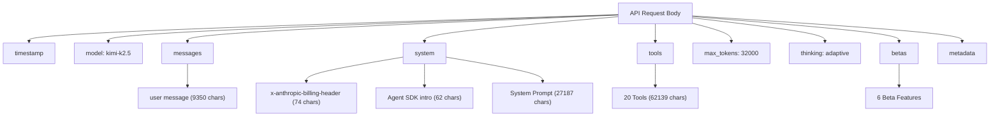
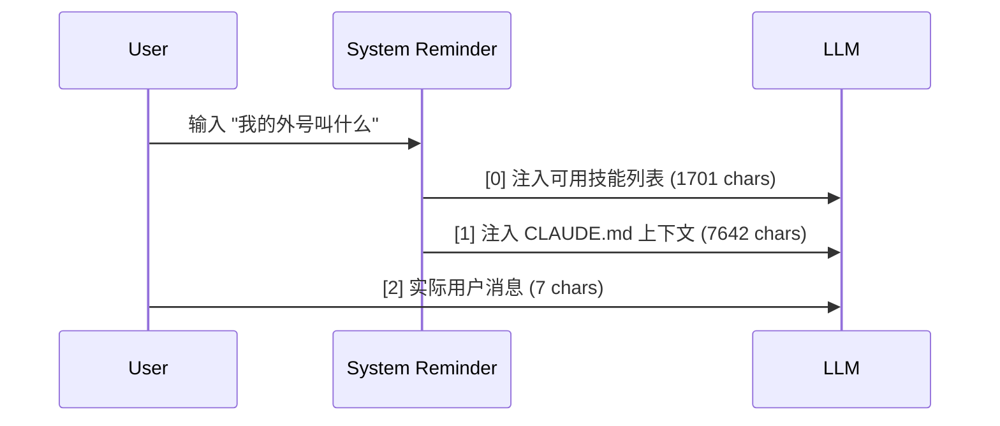
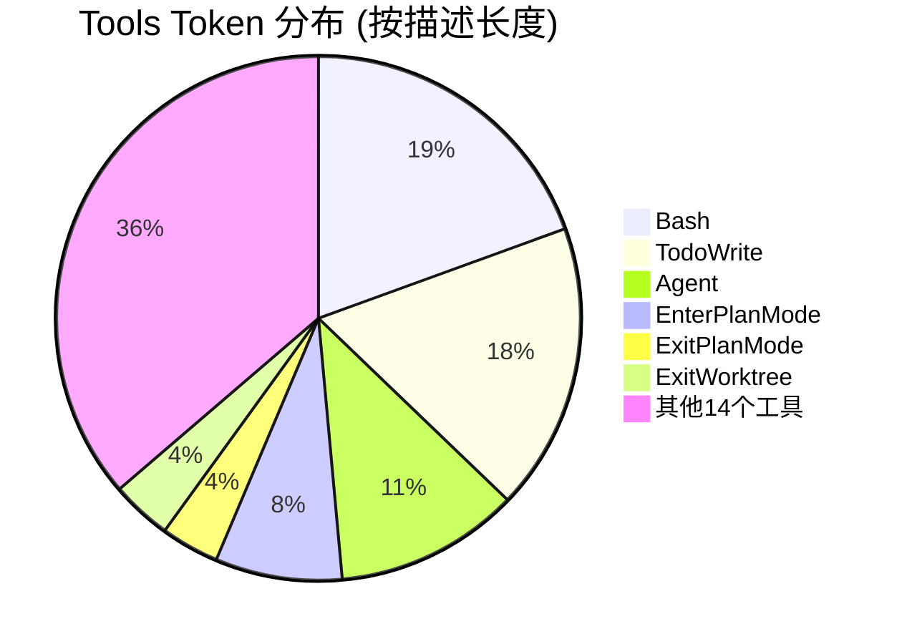
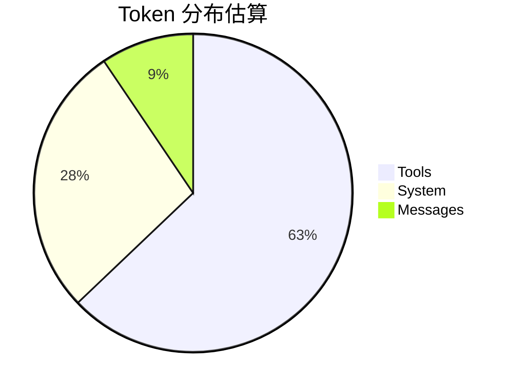
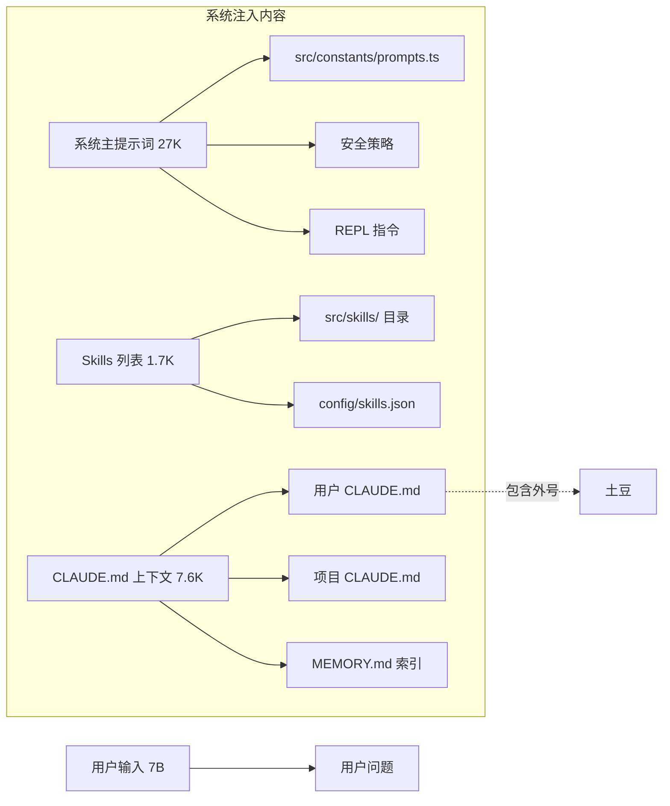

# Claude Code API 请求体结构分析报告

**会话ID**: `dc1e629e-aa08-4446-a8e1-2ff02a2320ac`  
**时间**: 2026-04-08T08:35:47.130Z  
**模型**: kimi-k2.5

---

## 请求体顶层结构



---

## 各部分详细分析

### 1. System 字段（共 3 项，约 27,323 字符）

| 序号 | 类型 | 长度 | 来源 | 说明 |
|------|------|------|------|------|
| [0] | text | 74 chars | Anthropic 计费头 | `x-anthropic-billing-header: cc_version=2.1.888.f95; cc_entrypoint=sdk-cli;...` |
| [1] | text | 62 chars | Agent SDK 基础定义 | "You are a Claude agent, built on Anthropic's Claude Agent SDK..." |
| [2] | text | 27,187 chars | **系统主提示词** | 完整的系统指令、工具使用规范、安全策略等 |

#### System[2] 内容来源
这个最长的部分包含：
- 系统核心指令（软件工程任务协助）
- 安全规范（禁止恶意代码等）
- 工具使用通用指南
- REPL 指令系统说明（/help、/fix、/commit 等）
- 项目特定记忆（Auto Memory）

---

### 2. Messages 字段（1 条用户消息，共 9,350 字符）

| 序号 | 类型 | 长度 | 来源 | 内容特征 |
|------|------|------|------|----------|
| [0] | text | 1,701 chars | **Skills 列表** | `<system-reminder>` 可用技能列表（update-config、simplify、mermaid-flow等） |
| [1] | text | 7,642 chars | **CLAUDE.md 上下文** | 项目配置、用户外号"土豆"、CLAUDE.md 和 MEMORY.md 内容 |
| [2] | text | 7 chars | **用户实际输入** | "我的外号叫什么" |



#### Message[1] 详细内容来源
- `/Users/lixp/.claude/CLAUDE.md` - 用户外号"土豆"
- `/Users/lixp/lxpConfig/pyWorkSpace/claude-code/CLAUDE.md` - 项目配置
- `MEMORY.md` 记忆索引内容
- 当前日期 (2026-04-08)

---

### 3. Tools 字段（20 个工具，共约 62,139 字符）

| 序号 | 工具名 | 描述长度 | 参数数量 | 功能分类 |
|------|--------|----------|----------|----------|
| 0 | Agent | 5,848 | 6 | **代理系统** - 启动子代理处理复杂任务 |
| 1 | AskUserQuestion | 1,074 | 4 | 用户交互 - 询问用户偏好 |
| 2 | Bash | 10,003 | 5 | **执行系统** - 运行 Bash 命令 |
| 3 | Edit | 1,095 | 4 | 文件操作 - 编辑文件 |
| 4 | EnterPlanMode | 4,022 | 0 | 模式控制 - 进入计划模式 |
| 5 | EnterWorktree | 1,335 | 1 | Git工作流 - 进入 git worktree |
| 6 | ExitPlanMode | 1,849 | 1 | 模式控制 - 退出计划模式 |
| 7 | ExitWorktree | 1,923 | 2 | Git工作流 - 退出 git worktree |
| 8 | Glob | 371 | 2 | 文件操作 - 文件匹配 |
| 9 | Grep | 866 | 14 | 搜索系统 - 内容搜索 |
| 10 | NotebookEdit | 513 | 5 | 文件操作 - 编辑 Jupyter Notebook |
| 11 | Read | 1,680 | 4 | 文件操作 - 读取文件 |
| 12 | Skill | 1,272 | 2 | **代理系统** - 调用预定义技能 |
| 13 | TaskOutput | 701 | 3 | 任务系统 - 获取任务输出 |
| 14 | TaskStop | 203 | 2 | 任务系统 - 停止任务 |
| 15 | TodoWrite | 9,114 | 1 | 任务系统 - 待办列表 |
| 16 | WebFetch | 1,479 | 2 | 网络系统 - 获取网页内容 |
| 17 | WebSearch | 1,318 | 3 | 网络系统 - 网络搜索 |
| 18 | Write | 618 | 2 | 文件操作 - 写文件 |
| 19 | mcp__web-search-prime__web_search_prime | 130 | 5 | 网络系统 - MCP 搜索 |



---

### 4. Betas 字段（6 个实验性功能）

```json
[
  "claude-code-20250219",           // Claude Code 核心功能
  "context-1m-2025-08-07",          // 100万 token 上下文
  "interleaved-thinking-2025-05-14", // 交错思考模式
  "context-management-2025-06-27",  // 上下文管理
  "prompt-caching-scope-2026-01-05", // 提示缓存范围
  "effort-2025-11-24"               // 努力程度控制
]
```

---

### 5. Max Tokens 和思考模式

| 参数 | 值 | 说明 |
|------|-----|------|
| max_tokens | 32,000 | 最大输出 token 数 |
| thinking.type | adaptive | 自适应思考模式 |

---

## Token 消耗估算

### 计算方法
- 英文约为 4 chars/token
- 中文约为 1.5 chars/token
- 混合内容取系数 0.6（保守估计）

### 各部分估算

| 部分 | 字符数 | 估算 Token | 占比 |
|------|--------|------------|------|
| System | 27,323 | ~16,393 | 27.6% |
| Messages | 9,350 | ~5,610 | 9.5% |
| Tools | 62,139 | ~37,283 | 62.9% |
| **总计** | **98,812** | **~59,287** | 100% |

### 实际意义
- 这是一个**大型上下文请求**，已接近 kimi-k2.5 的上下文限制
- Tools 定义占据了 **62.9%** 的 token，是最大开销
- System prompt 占 **27.6%**，主要是安全规范和指令
- 用户实际输入仅 7 chars，占比极小



---

## 数据来源总结

### 系统注入的内容来源



---

## 优化建议

1. **Tools 优化**: 如果不需要全部 20 个工具，可以减少加载以节省 token
2. **上下文压缩**: 考虑使用 `/compact` 指令压缩对话历史
3. **文件读取**: 使用 `Read` 工具按需读取大文件，而非全部放入上下文
4. **Memory 管理**: 定期清理不再需要的 `MEMORY.md` 条目

---

## 附录：完整请求体 JSON 结构

```json
{
  "timestamp": "2026-04-08T08:35:47.130Z",
  "model": "kimi-k2.5",
  "messages": [
    {
      "role": "user",
      "content": [
        {"type": "text", "text": "<system-reminder>Skills...</system-reminder>"},
        {"type": "text", "text": "<system-reminder>CLAUDE.md...</system-reminder>"},
        {"type": "text", "text": "我的外号叫什么"}
      ]
    }
  ],
  "system": [
    {"type": "text", "text": "x-anthropic-billing-header..."},
    {"type": "text", "text": "You are a Claude agent..."},
    {"type": "text", "text": "You are an interactive agent..."}
  ],
  "tools": [{...}, {...}, ...],  // 20 items
  "max_tokens": 32000,
  "thinking": {"type": "adaptive"},
  "betas": [...],  // 6 items
  "metadata": {...}
}
```
