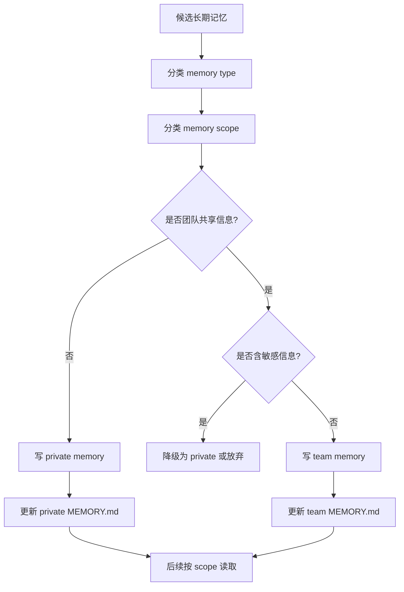

# team memory 详细分析

## 1. 定位

`team memory` 是在 `auto-memory` 之上增加 scope 维度的共享记忆层。它解决的不是“能不能记住”，而是“这条记忆该只属于个人，还是应该成为团队共识”。

关键源码锚点：

- `src/memdir/teamMemPrompts.ts`
- `src/memdir/memdir.ts`

## 2. 存取、触发时机、生命周期策略

### 2.1 存储

- private 目录保存个人记忆
- shared team 目录保存可协作共享的记忆
- 每个目录都有自己的 `MEMORY.md` 和 topic files

### 2.2 读取

- team memory 开启后，会构建 combined prompt
- 主回合会同时感知 private 与 shared 的边界规则
- 查询时可按 scope 读取对应目录内容

### 2.3 写入触发

- 当模型判断某个事实不是个人偏好，而是团队长期规则时
- 当项目约束、流程规范、公共入口等信息适合跨成员复用时
- 写入前必须判断是否涉及敏感信息

### 2.4 生命周期

- private memory 随个人长期存在
- team memory 生命周期通常与项目、团队或产品线一致
- shared 记忆要求更严格的审查与去敏策略

## 3. 执行伪代码

```text
onMemoryWrite(candidate):
  type = classifyMemoryType(candidate)
  scope = classifyScope(candidate)

  if scope == private:
    writeToPrivateMemory(type, candidate)
  else if scope == team and not containsSensitiveInfo(candidate):
    writeToTeamMemory(type, candidate)
  else:
    fallbackToPrivateOrDiscard()

onMemoryRead(query):
  privateHits = searchPrivateMemories(query)
  teamHits = searchTeamMemories(query)
  mergeByScopePolicy(privateHits, teamHits)
```

## 4. 详细代码流程分析

### 4.1 scope 成为一等决策

- `buildCombinedMemoryPrompt()` 不只是拼两个目录路径。
- 它把“哪些应永远 private、哪些可共享、shared 中不能放什么”直接写入 prompt taxonomy。
- 因此 scope 判定不是运行后的 ACL，而是在写入前由模型先做语义判断。

### 4.2 team memory 与 auto-memory 的关系

- auto-memory 主要解决“长期记住”
- team memory 在此基础上再解决“记忆归属”
- 同一条记忆会同时有 `type` 和 `scope` 两个维度

### 4.3 风险控制点

- 个人偏好进入 team 目录会污染团队记忆
- 敏感信息进入 team 目录会造成协作泄露
- 因此 team memory 的核心不是扩大写入，而是提高共享门槛

## 5. Mermaid 流程图



## 6. 对车机智能语音座舱的借鉴意义

- 车机里也存在 scope 问题，例如“个人驾驶员偏好”和“整车通用配置”不能混存。
- 家庭共享车辆、多驾驶员场景下，记忆若不分 scope，会导致错误个性化。
- 共享层必须做隐私隔离，例如地址、联系人、支付偏好默认不应进入家庭共享记忆。

## 7. 面向车机语音记忆系统的设计建议

### 7.1 建议的 scope 分层

- `driver-private`：某驾驶员独占偏好，如座椅、媒体、常用联系人。
- `vehicle-shared`：整车公共记忆，如空调默认策略、儿童锁规则、保养提醒。
- `fleet-shared`：车队或企业车辆共享规则，如运营 SOP、设备巡检要求。

### 7.2 中间件映射

- `Redis`：按 `vehicleId + profileId + scope` 存热数据。
- `ES`：存共享规则、可过滤的设备知识、运营约束。
- `Milvus`：存跨驾驶员语义偏好摘要，但向量元数据必须带 `scope` 和权限标签。

### 7.3 延迟与扩展策略

- 读取时先按 profile 精确命中 `Redis`，减少 scope 混淆。
- `ES` 查询必须强制加 `scope` filter。
- `Milvus` 召回后再做 metadata 过滤与权限裁剪。
- 共享写入采用审批或显式确认机制，降低误写污染。
