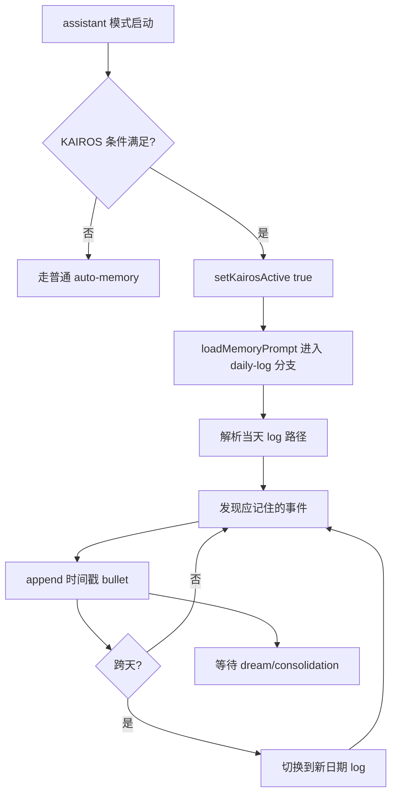

# KAIROS daily log 详细分析

## 1. 定位

`KAIROS` 将长期记忆从“可编辑知识库”切换成“按天追加的事件日志”。它面向长生命周期 assistant session，而不是普通任务式会话。

关键源码锚点：

- `src/main.tsx`
- `src/bootstrap/state.ts`
- `src/assistant/index.ts`
- `src/memdir/memdir.ts`
- `src/memdir/paths.ts`

## 2. 存取、触发时机、生命周期策略

### 2.1 存储

- 路径模式：`logs/YYYY/MM/YYYY-MM-DD.md`
- 单日单文件
- append-only，不做在线重排和整理

### 2.2 读取

- 当前写入目标由 `currentDate` 推导
- 主要供后续 consolidation 或 dream 使用
- 不再依赖实时维护 `MEMORY.md`

### 2.3 触发时机

- build-time `feature('KAIROS')`
- assistant mode 为真
- 工作目录可信
- `kairosGate` 通过或 `--assistant` 强制
- `setKairosActive(true)` 后，`loadMemoryPrompt()` 走 daily-log 分支

### 2.4 生命周期

- 单条记录先以事件流形态存在
- 当天持续 append
- 后续由 dream/consolidation 蒸馏为 durable topic memory

## 3. 执行伪代码

```text
onAssistantModeEnabled():
  if KAIROS feature and trust and gate pass:
    kairosActive = true

loadMemoryPrompt():
  if kairosActive:
    return buildAssistantDailyLogPrompt()
  else:
    return buildRegularMemoryPrompt()

onDurableSignalDetected(event):
  logFile = resolveDailyLogPath(today)
  appendTimestampedBullet(logFile, event)

atMidnight():
  switchToNewDailyLogFile()
```

## 4. 详细代码流程分析

### 4.1 KAIROS 是运行态锁存，不是普通 flag

- `KAIROS` 是否启用取决于 feature、assistant mode、工作目录 trust、gate 判定等多个条件。
- 这意味着 KAIROS 不是随处可用，而是只在特定产品模式下成立。

### 4.2 prompt 分支切换

- `loadMemoryPrompt()` 在 auto-memory 开启且 `getKairosActive()` 为真时，优先返回 `buildAssistantDailyLogPrompt(skipIndex)`。
- 该分支优先级高于 TEAMMEM。
- 源码注释直接说明 append-only daily log 与 team sync 不可直接组合。

### 4.3 写入路径变化

- 普通 auto-memory 写的是 topic file 与 `MEMORY.md`
- KAIROS 写的是当日日志文件
- 每条记录以时间戳短 bullet 形式追加，避免高频重写索引

### 4.4 设计动机

- 长会话下若频繁改写 index，会导致上下文缓存抖动
- append-only 日志更适合连续运行、持续追加的 assistant
- 真正的知识沉淀延后到离线 consolidation 阶段

## 5. Mermaid 流程图



## 6. 对车机智能语音座舱的借鉴意义

- 在车机里，长生命周期语音助手也更适合先写事件流，而不是实时重写“用户画像主档”。
- 例如一天内的导航、媒体、空调、电话操作，可先形成驾驶事件日志，再离线归纳稳定偏好。
- 这能显著降低在线写放大和主档抖动，适合车端资源受限与高频交互场景。

## 7. 面向车机语音记忆系统的设计建议

### 7.1 在线写路径

- `Redis Stream` 或 list 作为日内事件缓冲。
- 热事件同时写 `Redis` 供即时对话续用。
- 批量刷入 `ES` 形成日内行为日志索引。

### 7.2 离线归纳

- 定时任务从 `ES` 拉取当日行为流。
- 通过规则与模型归纳出稳定偏好摘要。
- 再将摘要 embedding 写入 `Milvus`，结构化主档写回 `ES/Redis`。

### 7.3 时延、简单性、扩展性

- 在线只做 append，不做复杂聚合，保证时延。
- 归纳逻辑放离线 worker，保证主链路简单。
- 以事件流为中心，天然适合后续扩展新技能、新设备和新画像字段。
