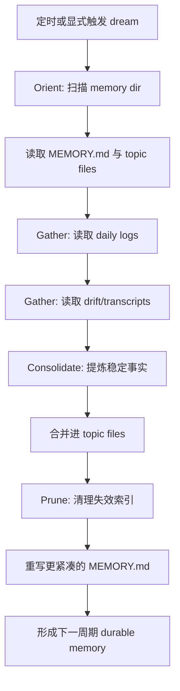

# dream / consolidation 详细分析

## 1. 定位

`dream / consolidation` 是 Claude Code 的离线整理层。它不负责首轮记忆采集，而负责将散乱日志、旧 topic、潜在漂移统一整理成可长期复用的 durable memory。

关键源码锚点：

- `src/services/autoDream/consolidationPrompt.ts`
- `src/services/autoDream/autoDream.ts`
- `src/skills/bundled/index.ts`

## 2. 存取、触发时机、生命周期策略

### 2.1 输入

- daily logs
- 现有 `MEMORY.md`
- 现有 topic files
- transcripts 中近期信号

### 2.2 输出

- 更新后的 topic memory
- 被修剪后的 `MEMORY.md`
- 失效引用删除或合并后的索引

### 2.3 触发时机

- 非 KAIROS 模式：可由后台 `autoDream` 触发
- KAIROS 模式：注释表明改用 disk-skill 版本 `dream`
- feature `KAIROS` 或 `KAIROS_DREAM` 打开时才会注册相关 skill

### 2.4 生命周期

- 输入是短期事件流或松散历史
- 输出是长期 durable memory
- 本质上是 memory 的二次加工和版本整理阶段

## 3. 执行伪代码

```text
runConsolidation():
  orient = inspectMemoryDirAndIndex()
  signals = gatherRecentSignals(dailyLogs, drift, transcripts)
  durableFacts = extractStableFacts(signals)
  mergeIntoTopicFiles(durableFacts)
  pruneStalePointers()
  rewriteCompactMemoryIndex()
```

## 4. 详细代码流程分析

### 4.1 四阶段工作流

- Orient：先理解当前 memory landscape，而不是盲目重写。
- Gather recent signal：优先读取 daily logs，再看 drift 与 transcripts。
- Consolidate：把值得长期保存的信息并入 topic files。
- Prune and index：清理过期入口，保持索引简短。

### 4.2 与 extractMemories 的区别

- `extractMemories` 是回合后补写
- `dream` 是更慢、更冷静、更偏全局整理的蒸馏过程
- 它不仅抽取新记忆，还负责修复旧记忆漂移和索引膨胀

### 4.3 KAIROS 差异

- `autoDream.ts` 明确写出：`getKairosActive()` 时不走普通后台 consolidation
- 说明 KAIROS 模式下，整理链路与普通模式在触发方式上已经分叉

## 5. Mermaid 流程图



## 6. 对车机智能语音座舱的借鉴意义

- 车机长期记忆不能完全依赖在线写入，必须有离线整理层。
- 用户一天内会产生大量噪声事件，只有经过归纳后才能形成稳定偏好。
- consolidation 可以避免用户画像越来越脏，支持版本治理和过期淘汰。

## 7. 面向车机语音记忆系统的设计建议

### 7.1 离线整理架构

- 从 `ES` 拉取行为日志、从 `Redis` 拉取热缓存快照、从 `Milvus` 拉取相似偏好片段。
- 用规则引擎先做频次、稳定性、冲突检查。
- 再由模型或规则合成“长期偏好摘要”和“需淘汰的旧记忆”。

### 7.2 存储更新策略

- 结构化主档写回 `ES`。
- 高频热点字段回刷 `Redis`。
- 语义摘要更新到 `Milvus`。

### 7.3 满足三项目标

- 访问时延：在线只查热层和摘要层，不跑离线整理。
- 简单高效：整理链路单独部署，不阻塞语音主链。
- 可扩展：后续新增座舱域，只需扩展日志 schema 与 consolidation rule。
