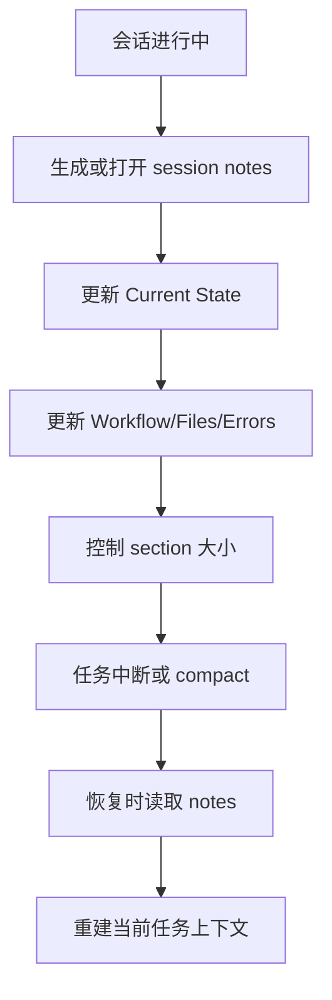

# SessionMemory 详细分析

## 1. 定位

`SessionMemory` 不是长期记忆，而是当前会话的结构化续写笔记。它服务于 compact、resume、continuation 等场景，确保当前任务中断后还能顺畅接续。

关键源码锚点：

- `src/services/SessionMemory/prompts.ts`

## 2. 存取、触发时机、生命周期策略

### 2.1 存储

- 当前 session 对应的 notes 文件
- 内置固定章节模板，如 `Current State`、`Workflow`、`Errors & Corrections`

### 2.2 读取

- 会话恢复、压缩、续写时读取
- 为当前任务提供结构化状态，而不是长期用户画像

### 2.3 触发时机

- 当前上下文需要 compact
- 对话跨轮持续较长，需要显式保留任务结构
- 恢复已中断的会话时

### 2.4 生命周期

- 生命周期仅限当前会话或该任务续写周期
- 任务结束后可归档，不应直接进入长期记忆库

## 3. 执行伪代码

```text
onSessionProgress():
  notes = openSessionNotes()
  updateSections(
    currentState,
    filesAndFunctions,
    workflow,
    errorsAndCorrections,
    keyResults
  )

onSessionResume():
  notes = readSessionNotes()
  rebuildCurrentTaskContext(notes)
```

## 4. 详细代码流程分析

### 4.1 模板约束

- SessionMemory 采用固定段落结构，不允许随意发散成自由文本。
- prompt 要求保留 header 与描述段，避免 notes 格式持续漂移。

### 4.2 更新方式

- 只能用 `Edit` 工具修改 notes file。
- 不允许把 note-taking instruction、本轮 system prompt 或其他记忆内容机械搬运进 notes。
- 每个 section 都要控制 token 规模，避免 session note 再次膨胀。

### 4.3 与长期记忆的边界

- 当前任务状态、已尝试方案、局部错误修正都适合放 SessionMemory。
- 但这些内容通常不适合直接持久化成跨会话 memory。

## 5. Mermaid 流程图



## 6. 对车机智能语音座舱的借鉴意义

- 车机也需要把“当前对话态”与“长期用户记忆”分开。
- 例如当前导航、多轮订票、连续设定空调场景，都属于 session memory，不应误入长期偏好。
- 这样能减少错误画像固化，也便于中断恢复。

## 7. 面向车机语音记忆系统的设计建议

### 7.1 车机中的 session memory 内容

- 当前意图树
- 当前槽位填充状态
- 最近一次澄清问题
- 当前技能执行进度
- 最近失败原因

### 7.2 中间件映射

- `Redis` 作为 session state 主存储，按 `sessionId` 管理，设置短 TTL。
- `ES` 不建议承担主会话态，仅在需要回放审计时异步落盘。
- `Milvus` 不建议存纯 session state。

### 7.3 设计原则

- 读写必须毫秒级，优先放 `Redis`。
- 与长期记忆彻底隔离，避免污染画像。
- 状态 schema 要稳定，支持扩技能而不破坏旧会话。
