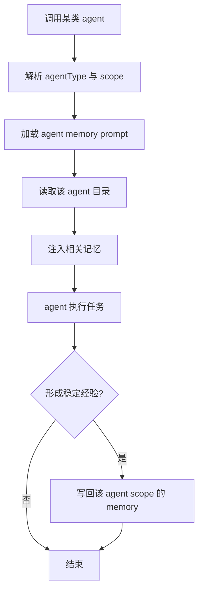

# agent memory 详细分析

## 1. 定位

`agent memory` 是给子代理保留跨会话经验的独立持久化层。它与主会话 memory 平行存在，强调“特定 agent 类型的长期经验”。

关键源码锚点：

- `src/tools/AgentTool/agentMemory.ts`

## 2. 存取、触发时机、生命周期策略

### 2.1 存储

- `user`：`~/.claude/agent-memory/<agentType>/`
- `project`：`.claude/agent-memory/<agentType>/`
- `local`：`.claude/agent-memory-local/<agentType>/`

### 2.2 读取

- 当对应 agent 被调用时，加载该 agent 专属 memory prompt
- 若运行时有相关性召回，也优先查该 agent 自己的目录

### 2.3 写入触发

- agent 在多次执行中形成稳定经验
- 这些经验对同类型 agent 后续任务持续有价值

### 2.4 生命周期

- user-scope：跨项目长期存在
- project-scope：随项目持续
- local-scope：本机、本仓库有效，不应版本化共享

## 3. 执行伪代码

```text
onAgentInvoke(agentType, scope):
  prompt = loadAgentMemoryPrompt(agentType, scope)
  relevant = maybeFindRelevantAgentMemories(agentType)
  inject(prompt, relevant)

onAgentLearn(agentType, scope, fact):
  if factIsStableAndReusable(fact):
    writeAgentMemory(agentType, scope, fact)
```

## 4. 详细代码流程分析

### 4.1 与主 memory 平行

- agent memory 并不是主 memory 的一个子目录别名。
- 它有自己的目录体系、scope 规则和 prompt 装载逻辑。
- 这表明 Claude Code 把 agent 看作长期存在的执行角色，而不只是一次性 worker。

### 4.2 scope 设计

- user-scope 适合跨项目通用经验，例如某类 agent 的通用工作偏好。
- project-scope 适合项目知识和团队共识。
- local-scope 适合本机实验、个人临时增强，不进入协作面。

### 4.3 工程价值

- 让不同 agent 类型积累专业化经验，避免所有经验都挤进主 assistant memory。
- 降低跨 agent 的知识污染。

## 5. Mermaid 流程图



## 6. 对车机智能语音座舱的借鉴意义

- 车机语音系统通常由多个 skill/agent 组成，如导航、媒体、车控、知识问答。
- 各技能应有自己的经验层，不应把导航经验直接污染媒体域。
- 同时还应保留一层全局用户画像，用于跨技能共享的稳定偏好。

## 7. 面向车机语音记忆系统的设计建议

### 7.1 技能分域记忆

- 导航 agent：常去地点、路线偏好、避堵偏好。
- 媒体 agent：音乐来源、收藏风格、播控习惯。
- 车控 agent：空调、座椅、车窗、香氛偏好。

### 7.2 中间件映射

- `Redis`：各技能热缓存，按 `domain + userId` 分区。
- `ES`：各技能结构化画像与可过滤规则。
- `Milvus`：各技能语义画像向量库，支持模糊表达召回。

### 7.3 架构原则

- 先域内召回，再决定是否升级到全局画像。
- 领域间共享必须经过显式映射与治理。
- 每个 agent 记忆 schema 独立演进，保证扩展性。
