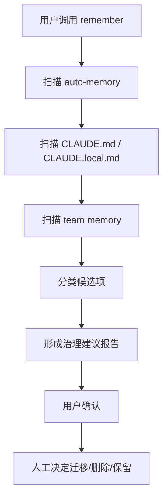

# remember skill 详细分析

## 1. 定位

`remember` 不是自动写入层，而是人工治理层。它用于审视当前记忆版图，帮助用户把真正重要的信息上升为长期规则、长期记忆或本地配置。

关键源码锚点：

- `src/skills/bundled/remember.ts`

## 2. 存取、触发时机、生命周期策略

### 2.1 输入

- auto-memory
- `CLAUDE.md`
- `CLAUDE.local.md`
- team memory

### 2.2 输出

- 审阅建议
- 候选迁移方案
- 哪些内容应该保留、升级、移动或删除

### 2.3 触发时机

- 用户显式调用 `remember`
- 需要清理 memory landscape 或做人工治理时

### 2.4 生命周期

- 自身不直接落盘
- 通过人工决策影响其他记忆层的生命周期

## 3. 执行伪代码

```text
onRememberSkill():
  inspect(autoMemory, teamMemory, CLAUDEmd, localClaudeMd)
  classifyItemsInto(
    shouldStayInMemory,
    shouldPromoteToClaudeMd,
    shouldMoveToLocal,
    shouldDeleteOrIgnore
  )
  outputReviewReport()
```

## 4. 详细代码流程分析

### 4.1 人工治理而非全自动

- `remember` 不直接替用户写入最终结果。
- 它先做审视、分类、建议，让用户参与治理闭环。
- 这表明 Claude Code 团队默认认为 memory 不能完全自动化。

### 4.2 治理目标

- 把长期稳定的工作规则上升到 `CLAUDE.md`
- 把仅本机有效的信息放进 `CLAUDE.local.md`
- 把协作共识放到 team memory
- 把低价值、临时性内容从 memory 里移除

### 4.3 系统意义

- 自动记忆擅长捕捉信号
- 人工整理擅长做长期制度化沉淀
- 两者结合才能让记忆系统长期可维护

## 5. Mermaid 流程图



## 6. 对车机智能语音座舱的借鉴意义

- 车机记忆系统也不能完全自动演化，必须保留人工治理与运营校正能力。
- 一些全局策略、品牌规则、法规约束，不应由自动抽取得出，而应由人工确认后下发。
- 用户个人画像也需要可视化治理入口，允许查看、删除和纠正。

## 7. 面向车机语音记忆系统的设计建议

### 7.1 治理能力设计

- 提供运营后台，查看各类记忆命中、来源、置信度、过期状态。
- 提供用户侧入口，允许删除最近偏好、重置画像、关闭个性化。
- 提供规则升格机制，将高频人工确认项升级为平台规则。

### 7.2 中间件映射

- `Redis`：展示最近热记忆与命中统计。
- `ES`：承载治理后台查询、审计、变更历史。
- `Milvus`：支持查看相似语义簇，帮助发现错误聚类或错误画像。

### 7.3 满足三项目标

- 访问时延：治理链路不进入在线主链。
- 简单高效：自动抽取与人工审核解耦。
- 可扩展：后续可扩到家庭共享、品牌运营、法规策略等多种治理域。
