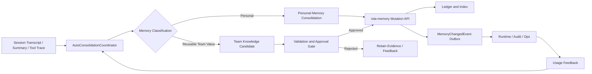
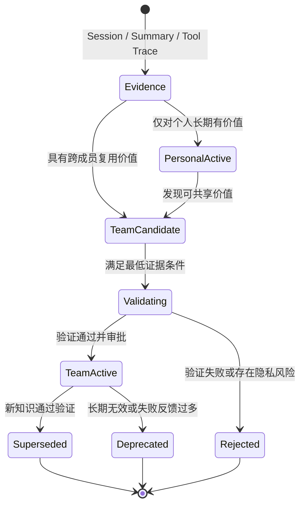
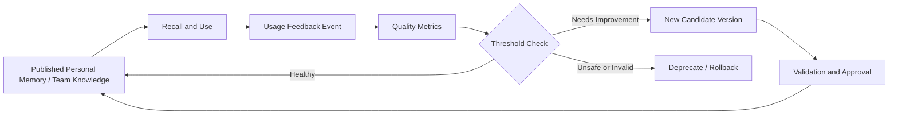

# iota 对齐 autoDream 能力方案

## 1. 背景与目标

当前 `iota` 相关项目已经形成两层基础能力：

- `iota-core`
  - `RedisClaudeSessionStore`：承接 Claude Code session transcript 与 summary 的共享存储
  - `RedisConversationStore`：承接 Hermes conversation transcript 的共享存储
  - `MemoryGateway + MemoryContextService`：承接长期记忆 recall、prompt 注入与工具面
- `iota-memory`
  - 统一 `MemoryRecord` 数据模型
  - `write / recall / search / classify` 协议与 HTTP/MCP 服务
  - ledger/index 分层、selector-axis merge、supersede 机制

这解决了两件事：

1. 会话记录不再依赖本地文件，具备集群能力。
2. 长期记忆不再依赖本地 markdown 文件，具备服务化能力。

但当前仍缺一条关键链路：

> 缺少类似 Claude Code `autoDream` 的后台记忆整理能力，用于从近期 session 增量信号中整理、合并、修正、裁剪长期记忆，并把“记忆被改写”作为正式事件暴露出来。

本方案的目标是对齐 `autoDream` 的核心能力，而不是复刻其文件形态。

---

## 2. autoDream 能力分析

### 2.1 定位

`autoDream` 不是在线 recall，也不是普通 write-back，而是一个后台触发的长期记忆整理任务。其职责是对近期 session 和已有 memory 做二次蒸馏，得到更稳定、更紧凑、更少冲突的 durable memory。

关键源码：

- [autoDream.ts](/Users/lixp/lxpConfig/pyWorkSpace/claude-code/src/services/autoDream/autoDream.ts:1)
- [consolidationPrompt.ts](/Users/lixp/lxpConfig/pyWorkSpace/claude-code/src/services/autoDream/consolidationPrompt.ts:1)
- [consolidationLock.ts](/Users/lixp/lxpConfig/pyWorkSpace/claude-code/src/services/autoDream/consolidationLock.ts:1)

### 2.2 触发机制

`autoDream` 具备一套严格的后台调度门控：

1. 时间门控：距离上次 consolidation 已超过 `minHours`
2. session 门控：上次 consolidation 之后新增 session 数达到 `minSessions`
3. 并发门控：通过 lock 避免多个进程同时整理
4. scan throttle：避免在 session 条件不满足时每轮重复扫描

这说明 `autoDream` 是受控的后台治理能力，不是每轮都执行的在线流程。

### 2.3 输入信号

`autoDream` 不会粗暴全量读取 transcript，而是按优先级收集信号：

1. memory 目录中的现有索引与 topic memory
2. daily logs
3. 近期 session transcript 中与当前怀疑主题相关的窄查询结果

也就是说，它的输入模型是：

- 先看已有长期记忆长什么样
- 再看最近哪里出现了新证据或漂移证据
- 最后只对有价值部分做整理

### 2.4 整理动作

`autoDream` 的整理能力包括：

- 合并重复 topic
- 将新事实并入已有记忆
- 删除被新证据否定的旧事实
- 把相对时间改写为绝对日期
- 修剪索引，保持入口轻量
- 避免把临时任务状态、代码路径、debug 噪声直接固化为长期记忆

### 2.5 输出与用户感知

`autoDream` 不是静默工作。它会：

- 更新 memory 文件
- 更新索引文件
- 通过 task/progress watcher 跟踪改动
- 在主 transcript 中给出 “Improved ...” 形式的完成反馈

这说明它不仅有整理逻辑，还有“被整理了什么”的可见反馈面。

### 2.6 `buildConsolidationPrompt` 中文翻译

为了更直接地理解 `autoDream` 到底让 agent 做什么，下面给出 [consolidationPrompt.ts](/Users/lixp/lxpConfig/pyWorkSpace/claude-code/src/services/autoDream/consolidationPrompt.ts:1) 中核心 Prompt 的中文翻译。

#### 标题与任务定义

```text
# Dream：记忆整理

你正在执行一次 dream，也就是对记忆文件进行反思性整理的一轮处理。
请把你最近学到的内容，综合整理成持久、结构良好、适合长期复用的记忆，
以便未来的会话能更快完成背景定位。

记忆目录：`<memoryRoot>`
<如果目录不存在时该如何处理的提示>

Session transcripts：`<transcriptDir>`
这些是较大的 JSONL 文件。只做窄范围 grep，不要整文件通读。
```

#### Phase 1 - Orient

```text
阶段 1：建立全局认知

- 用 `ls` 查看记忆目录，先理解当前已经有哪些内容
- 读取 `MEMORY.md`，理解当前索引结构
- 浏览已有 topic memory 文件，优先在现有记忆上改进，而不是重复创建
- 如果存在 `logs/` 或 `sessions/` 子目录（assistant-mode 布局），检查最近内容
```

这一步明确要求 agent 先理解“当前 memory landscape”，而不是直接新增记忆。

#### Phase 2 - Gather recent signal

```text
阶段 2：收集近期信号

寻找最近出现的、值得持久化的信息。优先级大致如下：

1. Daily logs（`logs/YYYY/MM/YYYY-MM-DD.md`）
   如果存在，这是追加式日志流，应优先检查

2. 已有记忆发生漂移的地方
   如果你在当前代码库里发现某些事实已经与旧记忆矛盾，要特别关注

3. Transcript 搜索
   如果你需要某些具体上下文
   例如“昨天构建失败的错误信息是什么？”
   则对 JSONL transcript 做窄范围 grep：
   `grep -rn "<narrow term>" <transcriptDir>/ --include="*.jsonl" | tail -50`

不要穷举式阅读 transcripts。
只有在你已经怀疑某件事重要时，才去找对应证据。
```

这一步体现出 dream 的目标不是“读完历史”，而是“基于怀疑点收集证据”。

#### Phase 3 - Consolidate

```text
阶段 3：整理并写回

对于每一条值得记住的信息，在记忆目录顶层写入或更新一个 memory 文件。
具体格式、memory type 约定、应该保存什么、不该保存什么，
以 system prompt 中 auto-memory 部分的规则为准。

重点关注：

- 尽量把新信号合并进已有 topic memory，而不是创建近似重复的新文件
- 把相对时间（例如“昨天”“上周”）改写成绝对日期，避免未来失去解释性
- 删除已经被新调查结果证伪的旧事实
  如果今天的调查推翻了旧记忆，应直接修正源头
```

这一步就是 dream 最核心的治理动作：

- 合并
- 改写
- 去重
- 绝对时间化
- 修正旧错误

#### Phase 4 - Prune and index

```text
阶段 4：修剪并维护索引

更新 `MEMORY.md`，要求它始终保持在：

- 不超过 `<MAX_ENTRYPOINT_LINES>` 行
- 大小不超过约 25KB

`MEMORY.md` 是索引，不是内容正文。
每一条索引都应该是一行、约 150 个字符以内，格式类似：

- [Title](file.md) - 一句简短说明

不要把记忆正文直接写进 `MEMORY.md`。

还需要执行：

- 删除那些已经陈旧、错误、或被替代的记忆入口
- 如果某一条索引过长（例如超过约 200 字符），说明它承载了本该放在 topic file 里的内容
  应缩短索引，并把细节移回 topic file
- 为新近变得重要的记忆补充入口
- 解决矛盾
  如果两个文件互相冲突，应修正错误的那个
```

这一步说明 `MEMORY.md` 的角色不是知识正文，而是“可控大小的导航入口”。

#### 收尾要求

```text
最后返回一段简短总结，说明你整理、更新、修剪了什么。
如果最终没有变化（记忆已经足够紧凑），就明确说明没有改动。
```

#### 从这段 Prompt 可以直接得出的结论

从 `buildConsolidationPrompt` 本身可以非常清楚地看出，dream 让 agent 做的不是简单“抽取记忆”，而是一套后台记忆治理任务：

1. 先理解当前长期记忆结构
2. 再从 recent logs / transcripts 中找增量证据
3. 对已有记忆做合并、修正、替换、删除
4. 维护轻量索引，而不是堆积正文
5. 最后返回本次整理摘要

这也是为什么 `iota` 对齐时，重点不应放在“怎么存一条 memory”，而应放在“怎么做 consolidation + rewrite + prune + change event”。

---

## 3. autoDream 背后的设计本质

`autoDream` 真正重要的不是 `MEMORY.md + topic files` 这个文件组织，而是背后的四个设计原则：

1. 长期记忆需要离线整理层  
   在线写入只能解决“先记下来”，不能解决“长期保持干净”。

2. 长期记忆要围绕主题归并  
   不能按 turn 无限追加，必须按 topic/axis 做合并、替换和裁剪。

3. 长期记忆要允许被改写  
   新证据出现时，旧记忆不是永远保留，而是允许 supersede、delete、rewrite。

4. 改写必须可感知  
   系统不仅要有最终状态，还要知道“谁在什么时候把哪条记忆改写成了什么”。

你关心的两个问题，正好对应其中后两条：

- 记忆是怎么整理的？
- 记忆被改写的事件，`iota` 一定要感知。

---

## 4. iota 当前能力盘点

### 4.1 `iota-core` 已有能力

#### 4.1.1 会话存储已服务化

- `RedisClaudeSessionStore` 已承接 Claude Code transcript、subagent transcript、session summary
- `RedisConversationStore` 已承接 Hermes transcript 与 recent index

相关代码：

- [claude_session_store.py](/Users/lixp/lxpConfig/pyWorkSpace/iota-core/src/iota_core/storage/claude_session_store.py:1)
- [redis_backend.py](/Users/lixp/lxpConfig/pyWorkSpace/iota-core/src/iota_core/storage/redis_backend.py:1)

这意味着后台整理任务已经有可靠的 session 数据来源，不必再依赖本地 transcript 文件。

#### 4.1.2 长期记忆 recall 与注入已存在

`iota-core` 已有：

- `MemoryGateway`
- `MemoryContextService`
- `enable_memory_prompt`
- `MemoryAPI`

它可以在运行时 recall 长期记忆并注入 `<iota-memory>` prompt capsule。

相关代码：

- [runtime.py](/Users/lixp/lxpConfig/pyWorkSpace/iota-core/src/iota_core/runtime.py:570)
- [context.py](/Users/lixp/lxpConfig/pyWorkSpace/iota-core/src/iota_core/memory/context.py:1)
- [memory_api.py](/Users/lixp/lxpConfig/pyWorkSpace/iota-core/src/iota_core/tools/memory_api.py:1)

### 4.2 `iota-memory` 已有能力

#### 4.2.1 统一记忆模型

`iota-memory` 已经不是 markdown memory，而是统一的 `MemoryRecord` 模型，包含：

- `type`
- `facet`
- `scope / scope_id`
- `record_kind`
- `selectors`
- `primary_scope`
- `metadata`

这比 `MEMORY.md + topic files` 更适合做服务化治理。

#### 4.2.2 写入、召回、检索、分类

当前已具备：

- `write_memories`
- `recall_memories`
- `search_memories`
- `classify_memories`

相关代码：

- [service.py](/Users/lixp/lxpConfig/pyWorkSpace/iota-memory/packages/iota-memory/src/iota_memory/service.py:1)
- [gateway.py](/Users/lixp/lxpConfig/pyWorkSpace/iota-memory/packages/iota-memory-protocol/src/iota_memory_protocol/gateway.py:1)
- [classify.py](/Users/lixp/lxpConfig/pyWorkSpace/iota-memory/packages/iota-memory-protocol/src/iota_memory_protocol/classify.py:1)

#### 4.2.3 已有 merge-aware write 雏形

`MemoryService.write_memories()` 已支持基于 selector-axis 的 merge-aware write：

- 同轴且 value 相同：直接复用旧记录
- 同轴但 value 冲突：生成新记录并 supersede 旧记录

这已经非常接近 `autoDream` 中“更新旧主题而不是重复创建”的核心思想。

---

## 5. 单用户模型与多用户模型的关键差异

这一点在方案里必须单独强调。

`Claude Code` 和 `Hermes` 原始 memory 形态大多面向单个操作者或单个本地工作空间，因此很多默认前提是成立的：

- 一个用户就是一个主要记忆主体
- 一个工作区就是一个主要 project scope
- dream 任务只需要整理“我最近的 session”
- memory rewrite 的影响范围天然较小

但 `iota-core` 和 `iota-memory` 面向的是服务化、多用户、多会话、多项目场景，这意味着 `autoDream` 的单用户心智模型不能原样照搬。

### 5.1 多用户场景下需要新增的约束

在 `iota` 里，consolidation 不能理解成“系统定期做一次梦”，而必须理解成：

> 针对某个明确的主体边界，在该边界内做一次受控的记忆整理。

这个主体边界至少可能包括：

- `user_scope_id`
- `project_scope_id`
- `session_scope_id`
- `agent namespace`

因此 dream/consolidation 的最小调度单元不能是“整个系统”，而应是某个隔离键，例如：

- `user_scope_id`
- `project_scope_id`
- `agent_namespace`

### 5.2 多用户场景下的设计影响

这会直接影响方案中的 5 个点：

1. 调度粒度  
   consolidation job 必须按隔离键触发，不能全局扫描所有用户 transcript。

2. 现有记忆查询
   `existing_active_memories` 必须严格带 scope 条件，不能因为语义相似就跨用户或跨项目合并。

3. 改写权限  
   某个 consolidation job 只能改写自己隔离域内的 memory，不能动别的用户或别的项目的 active 记录。

4. 事件归属  
   `MemoryChangedEvent` 必须带 scope / isolation 归属，否则后续审计与消费都会混乱。

5. 运维观测  
   后台任务、事件、失败重试、热点用户都要能按 user / project / namespace 分桶观测。

### 5.3 对当前方案的直接修正

所以，本文中的 consolidation 方案应补充一条硬约束：

- 所有 consolidation 输入、候选查询、写回动作、改写事件，必须带明确的多用户隔离键
- 任何未带隔离键的 dream job 都不允许落地执行

### 5.4 第一阶段只建设两大类长期记忆

结合 Hermes 的分层记忆和持续学习思想，`iota` 第一阶段应主动收敛，只建设两大类长期记忆：

| 记忆类型 | 服务对象 | 典型内容 | 默认 scope | 生效要求 |
| --- | --- | --- | --- | --- |
| 个人记忆 | 单个用户 | 用户偏好、习惯、个人背景、个人工作方式、个人经验 | `user` | 在用户隔离域内整理后可生效 |
| 团队共享知识记忆 | 团队或项目 | 项目事实、架构决策、最佳实践、故障经验、可复用流程 | `team/project` | 必须经过提升、验证与审批流程 |

Session transcript、summary、tool call、执行轨迹不作为第三类长期记忆。它们属于证据来源层，用于证明个人记忆或团队知识为什么应该创建、更新或废弃。

两类记忆必须遵守以下边界：

1. 个人记忆默认只服务本人，不能因为被频繁使用就自动共享给团队。
2. 团队共享知识必须具有跨 session 或跨成员复用价值，不能保存个人偏好。
3. 从个人经验中发现的团队价值，只能先生成团队知识候选，不能直接写入团队 active memory。
4. 团队知识的发布、改写和删除需要比个人记忆更严格的质量门禁。

### 5.5 团队知识的内容形态

团队共享知识仍然属于 memory domain，不需要再引入第三套独立存储模型。建议通过 `record_kind` 区分内容形态：

- `fact`：稳定项目事实和环境约束
- `decision`：架构决策、取舍理由和适用边界
- `procedure`：可复用工作流程，对应 Hermes 中的 Skill / procedural memory
- `lesson`：故障原因、错误恢复和经验结论

其中 `procedure` 不能只保存一句结论，至少应包含：

- 适用条件
- 执行步骤
- 所需工具或依赖
- 成功验证方式
- 常见失败与恢复方式

这吸收了 Hermes “不是只记录发生了什么，而是提炼以后应该怎么做”的设计思想。

---

## 6. iota 与 autoDream 的差距

当前差距不在“存储介质”，而在“后台治理链路”。

### 6.1 缺后台 consolidation coordinator

当前 `iota` 有：

- 在线 recall
- 在线写 memory
- 手工 search

但没有一个统一的后台协调器来完成：

- 时间门控
- session 门控
- 并发锁
- 近期 session 扫描
- consolidation 执行

### 6.2 缺 dream-style 整理流程

当前 `classify_memories` 更像“对一段文本做分类”，不等于“对一批 session 增量和已有 memory 做整理”。

换句话说，缺的不是分类器本身，而是：

- 整理任务输入协议
- 旧记忆候选收集
- 合并/裁剪/替换决策
- 整理结果写回策略

### 6.3 缺轻量索引视图

`autoDream` 有 `MEMORY.md` 作为入口索引。  
`iota-memory` 虽然底层模型更强，但目前缺少面向整理器和运营人员的“记忆目录视图”：

- 当前有哪些 topic/axis
- 哪些记录是当前生效版本
- 哪些记录互为 supersede 链
- 哪些记录最近发生漂移

### 6.4 缺记忆改写事件

这是本次方案里最关键的 gap。

当前 `iota-memory` 内部有 supersede 行为，但外部未形成标准化事件流。这样会导致：

- runtime 不知道哪些记忆被改写了
- 运维平台无法审计改写链路
- 无法订阅“某用户画像发生变更”
- 无法对接后续的观测、告警、回放能力

### 6.5 缺 session summary / hint 层的整理输入

`RedisClaudeSessionStore` 已有 summary sidecar，这是很好的基础。  
但 `RedisConversationStore` 目前主要暴露 transcript 和 recent index，还缺适合 consolidation 的摘要层。

如果没有 summary/hint，后台整理只能扫大段 transcript，成本高且效果差。

### 6.6 缺个人经验到团队知识的提升链路

当前方案可以把 session 信号整理成 memory，但还没有明确回答：

- 哪些内容只能留在个人记忆
- 哪些个人经验具有团队复用价值
- 团队知识候选如何验证和审批
- 发布后的团队知识效果如何持续评估

如果缺少这条链路，系统容易走向两个极端：

- 所有内容都留在个人 scope，团队无法复用有效经验
- 个人经验被直接提升到团队 scope，造成错误知识或隐私污染

### 6.7 缺知识质量评估与反馈闭环

`supersede` 只能表达版本替换，不能证明新版本比旧版本更好。

团队共享知识还需要补齐：

- 来源证据和 lineage
- 候选版本与发布版本
- 质量评分和验证结果
- 人工审批与回滚
- 实际召回、采用、成功、纠正和失败反馈

这部分借鉴 Hermes Self-Evolution 中“真实会话产生候选、评测作为门禁、人工审批后发布、使用反馈继续驱动优化”的闭环思想。

---

## 7. 对齐方案总览

建议把对齐方案定义为四层：

1. Session evidence：transcript、summary、tool call、执行轨迹等证据来源层
2. `iota-core`：后台整理、知识提升与验证编排层
3. `iota-memory`：个人记忆和团队共享知识的读写与版本治理层
4. Event / feedback：改写感知、审计与效果反馈层

架构关系如下：



这条链路里：

- `iota-core` 负责拿 session 增量、组织整理输入、区分个人记忆与团队知识候选，并编排验证和审批
- `iota-memory` 负责两类长期记忆的查询、写入、状态流转、版本替换和事件输出
- 改写结果通过事件输出给外部感知，使用效果通过反馈事件回流到下一轮整理

这里需要再补一条多用户约束：

- 每个 consolidation job 必须绑定明确的隔离键，例如 `user_scope_id + project_scope_id`
- job 的查询范围、改写范围、事件范围都不得越过该边界
- 个人记忆提升为团队知识时，必须经过显式 scope promotion，不能通过普通 merge 跨 scope 写入

---

## 8. 关键设计一：记忆怎么整理

### 8.1 设计原则

`iota` 不应复制 `MEMORY.md` 文件形态，而应复用现有 `MemoryRecord` 模型来表达同样的整理能力。

建议的整理原则如下：

1. 以 `selector axis` 作为主题归并轴
2. 以 `record_kind + type/facet + scope` 作为记忆语义分类轴
3. 以当前 active record 作为“主题当前版本”
4. 以 supersede 链表达“旧版本被新版本替换”
5. 以 manifest projection 作为“索引视图”

### 8.2 从 `MEMORY.md` 映射到 `manifest projection`

Claude Code 的组织方式：

- `MEMORY.md`：索引
- topic file：正文

`iota` 中建议映射为：

- `manifest projection`
  - 每个 `scope/scope_id` 下聚合当前 active memories
  - 提供轻量条目：topic、axis、record_kind、summary、updated_at
- `MemoryRecord`
  - 存放正文内容与 metadata

因此，`iota` 不需要真的生成 markdown 索引文件，也能实现同样的“入口轻量 + 正文归并”。

### 8.3 建议的整理输入

一次 consolidation job 建议输入以下对象：

- `job_id`
- `isolation_key`
- `scopes`
  - `user_scope_id`
  - `project_scope_id`
  - `session_scope_ids[]`
- `recent_session_summaries[]`
- `recent_transcript_hints[]`
- `existing_active_memories[]`
- `classification_profile`

其中 `existing_active_memories` 用于让整理器知道“当前长期记忆已经长什么样”，避免每次都从零生成。

这里的“整理器”建议放在 `iota-core` 的 coordinator 或独立 orchestration service 中，而不是放进 `iota-memory`。  
`iota-memory` 只需要提供：

- 取 existing active memories 的查询能力
- 执行写入/替换/删除的能力
- 输出 memory change event 的能力

多用户场景下再补一条：

- `existing_active_memories` 的读取条件必须同时包含 `isolation_key` 与相关 scope，禁止只按文本或 selector 做宽查询

### 8.4 建议的整理决策类型

一次 consolidation 输出不应只有“新 memory 列表”，而应显式输出动作类型：

- `keep`
- `create`
- `merge_into_existing`
- `supersede_existing`
- `delete_existing`
- `noop`

这能保证系统知道：

- 哪些是新增
- 哪些是沿用
- 哪些是改写
- 哪些是删除

这些动作决策建议由外部 consolidation coordinator 产生，再调用 `iota-memory` 的显式 memory mutation API 落地，而不是让 `iota-memory` 内嵌智能体自行决定。

### 8.5 主题归并规则

建议以 `selectors.topic + selectors.axis` 作为归并主轴。

示例：

- 用户偏好：
  - `topic=language_preference`
  - `axis=response_language`
- 项目规则：
  - `topic=memory_architecture`
  - `axis=write_policy`
- 项目战略：
  - `topic=autodream_alignment`
  - `axis=current_phase_goal`

规则如下：

1. 同 `topic+axis` 且 value 语义等价：保留当前 active 记录
2. 同 `topic+axis` 但内容冲突：创建新版本并 supersede 旧版本
3. 同 topic 不同 axis：并存
4. 无法归并到已知 axis：允许新建，但必须写明 topic/axis

### 8.6 时间改写规则

`autoDream` 的一个重要能力是把相对时间改成绝对时间。  
`iota` 方案中也建议明确要求：

- consolidation 输出时，禁止使用“昨天、上周、最近、这次”作为主要时间锚点
- 应改写为绝对日期或时间范围
- 对事件型记忆增加结构化 metadata：
  - `observed_at`
  - `source_session_id`
  - `consolidated_at`

### 8.7 生命周期与删除规则

建议将 active memory 与历史 memory 分层：

- active：当前 recall 主路径可见
- candidate：已提取但尚未满足发布条件，不参与正式 recall
- validating：正在进行规则验证、离线评测或人工审批
- rejected：未通过验证、审批或隐私检查，保留原因但不参与 recall
- deprecated：曾经生效但已不建议继续使用
- superseded：不参与主 recall，但参与审计与回放
- deleted：明确软删除，不参与 recall

这与 `autoDream` 的“修正源头而不是无限累积错误”保持一致。

### 8.8 个人记忆与团队共享知识的整理策略

两类记忆共享 consolidation 基础设施，但不能共享完全相同的写入策略。

个人记忆整理重点：

- 从用户自己的 session 中提取偏好、习惯、背景和个人经验
- 只在当前用户隔离域内合并和改写
- 用户明确表达和多次稳定行为可以作为高置信信号
- 用户纠正应优先触发旧个人记忆的修正

团队共享知识整理重点：

- 从一个或多个成员的成功路径、错误恢复、用户纠正和项目决策中发现可复用知识
- 优先形成 `fact / decision / procedure / lesson`
- 必须保留来源证据，不允许只保留模型生成的结论
- 在验证和审批完成前只能处于 candidate 状态

### 8.9 从个人经验提升为团队知识

个人经验不能通过普通 scope merge 直接变成团队知识，必须经过显式提升流程：



建议提升动作显式建模为：

- `promote_candidate`：从个人经验或 session evidence 生成团队知识候选
- `validate_candidate`：执行规则校验、证据校验和离线评测
- `approve` / `reject`：人工或策略审批
- `publish`：进入团队 active recall
- `rollback`：回退到上一个已验证版本

### 8.10 团队知识质量门禁

团队知识候选发布前至少需要经过以下检查：

| 门禁 | 检查内容 |
| --- | --- |
| Scope 与隐私门禁 | 不包含个人偏好、个人身份信息或无权共享内容 |
| 证据门禁 | 保留 `source_session_ids`、来源成员数量、观察时间和关键轨迹 |
| 复用价值门禁 | 对团队或项目具有跨 session 复用价值，不是一次性任务状态 |
| 语义门禁 | 与已有 active knowledge 不重复、不冲突，或明确说明替换关系 |
| 效果门禁 | 可验证的 procedure 应通过任务级测试；其他知识至少通过规则或人工评审 |
| 审批门禁 | 高风险 `decision / procedure` 必须人工批准后发布 |

建议为团队知识增加以下治理 metadata：

- `knowledge_status`
- `confidence`
- `evidence_count`
- `source_user_count`
- `validation_method`
- `validation_result`
- `approved_by`
- `approved_at`
- `rollback_memory_id`

这里应借鉴 Hermes Self-Evolution 的原则：

> 局部候选表现更好，不代表可以直接发布；必须通过独立验证和回归门禁，且高风险变更需要人工审批。

### 8.11 渐进召回与上下文预算

Hermes 将 prompt memory、session search 和 skill content 分层加载，核心价值是避免知识规模增长直接导致上下文成本增长。`iota` 也应采用渐进召回：

1. 常驻或高优先级层
   只包含少量稳定个人偏好和关键团队规则。

2. Manifest 层
   默认只返回 knowledge name、summary、适用条件、scope 和版本信息。

3. Detail 层
   当前任务明确命中后，再加载完整事实、决策背景或 procedure 正文。

4. Evidence 层
   只有在需要解释、审计或重新验证时，才加载来源 session 和执行轨迹。

这样可以让团队知识持续增长，但 prompt 注入成本保持可控。

### 8.12 使用反馈闭环

团队知识发布不是终点。系统需要持续记录其实际效果，并将其作为下一轮 consolidation 和验证输入。

建议记录：

- `recalled`：是否被召回
- `selected`：agent 是否选择使用
- `applied`：是否实际执行
- `succeeded`：任务是否成功
- `corrected`：是否被用户纠正
- `failed`：是否与失败存在关联
- `unused`：是否长期未使用

建议反馈流程如下：



个人记忆也可以使用反馈纠错，但默认不需要像团队知识一样执行完整发布审批。

---

## 9. 关键设计二：记忆被改写的事件，iota 一定要感知

这是方案的硬要求，建议直接上升为领域事件。

### 9.1 为什么必须事件化

仅有最终 memory 状态不够，原因有三：

1. 无法追踪“某条记忆为什么变了”
2. 无法让 runtime 或运维平台感知“最近发生了画像/规则漂移”
3. 无法支撑未来的回放、审计、告警、人工审批

因此需要正式的 `MemoryChangedEvent`。

### 9.2 事件模型建议

建议事件字段至少包括：

| 字段 | 含义 |
| --- | --- |
| `event_id` | 唯一事件 ID |
| `event_type` | `created` / `updated` / `superseded` / `deleted` / `merged` / `promoted` / `published` / `rolled_back` |
| `isolation_key` | 本次改写所属隔离键 |
| `memory_id` | 当前记录 ID |
| `previous_memory_ids` | 被替换的旧记录 ID 列表 |
| `scope` / `scope_id` | 归属范围 |
| `type` / `facet` / `record_kind` | 记忆语义分类 |
| `selectors` | 主题归并轴 |
| `source` | `tool` / `runtime` / `auto_consolidation` / `admin` |
| `job_id` | 本次 consolidation 任务 ID |
| `source_session_ids` | 来自哪些 session 的证据 |
| `reason` | 改写原因摘要 |
| `changed_at` | 改写时间 |
| `operator` | 自动任务或人工操作者 |

除 `MemoryChangedEvent` 外，建议增加 `MemoryUsageFeedbackEvent`，用于记录记忆或知识在运行时是否被召回、采用、成功执行、纠正或判定失败。前者描述“知识发生了什么变化”，后者描述“知识在真实使用中效果如何”。

### 9.3 事件触发时机

建议以 `ledger` 提交成功为准触发事件，而不是以“模型判断想改”为准。

原因：

- 只有真正持久化成功后，才算记忆事实发生变化
- 能避免“模型说要改，但实际写失败”造成的假事件

建议实现为 outbox 模式：

1. `iota-memory` 完成 ledger 写入
2. 在同事务或同提交边界写入 `memory_change_outbox`
3. 后台 dispatcher 投递到 Kafka / Redis Stream / Webhook / 日志系统

### 9.4 事件的消费方

建议至少支持以下消费方：

- `iota-core runtime`
  - 感知当前 agent 相关记忆是否被后台整理更新
- 运维后台
  - 展示最近记忆改写、supersede 链、异常漂移
- 审计系统
  - 支持回溯某条记忆的演化链
- 后续审批或人工修订工具
  - 在高风险改写场景下加入人工确认
- 知识质量评估任务
  - 基于 `MemoryUsageFeedbackEvent` 识别需要重新验证、降级或回滚的团队知识

---

## 10. 模块职责划分

### 10.1 `iota-core` 负责什么

建议新增 `AutoConsolidationCoordinator`，职责如下：

- 基于 Redis session store 做时间门控
- 统计自上次 consolidation 以来的 session 数
- 维护分布式锁，避免多实例并发整理
- 按 `user/project/namespace` 维度分片调度
- 构造整理输入
- 调用模型或独立 agent 完成 consolidation 决策
- 区分个人记忆与团队知识候选
- 编排团队知识验证、审批和发布流程
- 汇总真实使用反馈，识别需要优化或回滚的知识
- 调用 `iota-memory` 的 memory query / write / supersede / delete 接口
- 记录 job 状态与 summary

如果后续需要智能整理，这个“智能体”也应属于 `iota-core` 侧的 orchestration 层，或一个独立 consolidation service，而不是并入 `iota-memory`。

`iota-core` 不负责：

- 持久化 memory ledger 细节
- 直接维护 memory index
- 负责最终 memory 记录的事务一致性

这样可以保持 transcript 域和 memory 域边界清晰。

### 10.2 `iota-memory` 负责什么

`iota-memory` 的职责建议保持收敛，只做 memory domain 本身的服务化能力：

- 提供 `write / recall / search / classify` 协议
- 提供 active memories / history chain 的查询能力
- 提供显式的 `create / supersede / delete / merge-write / promote / publish / rollback` 语义
- 维护 ledger、index、active 视图和历史链
- 在持久化成功后生成 `MemoryChangedEvent`
- 保存团队知识状态、证据 lineage、验证结果和审批信息
- 接收并存储 `MemoryUsageFeedbackEvent`
- 通过 HTTP/MCP 暴露 memory 工具能力

也就是说，`iota-memory` 是 memory service，不是 dream agent 容器。  
它可以提供“如何落 memory 变更”的能力，但不应负责“基于近期 session 自己思考出应该怎么整理”。

### 10.3 不建议的实现方式

不建议让 `iota-memory` 自己去 Redis 扫 transcript。

原因：

1. memory service 会反向耦合会话存储细节
2. Claude/Hermes session 格式可能不同
3. session 摘要和整理门控更适合留在 runtime 一侧

正确边界应是：

- `iota-core` 提供 consolidation 输入并产出整理决策
- `iota-memory` 负责执行 memory 变更并输出事件

---

## 11. 分阶段落地建议

### P1：补齐后台整理调度骨架

目标：

- 在 `iota-core` 增加 `AutoConsolidationCoordinator`
- 支持：
  - `min_hours`
  - `min_sessions`
  - distributed lock
  - scope-aware shard key
  - recent session scan
  - job state

交付结果：

- `iota-core` 能像 `autoDream` 一样有后台触发能力
- 但触发粒度是“某个用户/项目隔离域”，不是“全局统一做梦”
- 但暂时可先只产出“候选整理输入”，不立刻写回 memory

### P2：补齐 consolidation 编排接口与 memory mutation API

目标：

- 在 `iota-core` 增加 consolidation orchestration 流程
- 定义 dream-style classifier profile
- 在 `iota-memory` 增加更清晰的 memory mutation API
  - `query_active_memories`
  - `create_memory`
  - `supersede_memories`
  - `delete_memories`

交付结果：

- `iota-core` 能基于 recent signals 产出整理决策
- `iota-memory` 能稳定执行这些决策

### P3：补齐改写事件链路

目标：

- 增加 `MemoryChangedEvent`
- 增加 outbox 表或 stream
- 对 supersede/delete/create 全量发事件
- 事件必须带 `isolation_key + scope`

交付结果：

- 系统可以正式感知“记忆被改写”

### P4：补齐可视化与审计能力

目标：

- 增加 memory manifest 视图
- 展示 active/superseded/deleted
- 展示 supersede 链和 source sessions
- 支持按 user / project / namespace 维度过滤

交付结果：

- 运营与研发能真正看懂系统在如何整理记忆

### P5：补齐团队知识提升与质量门禁

目标：

- 明确 `personal_memory` 与 `team_knowledge` 两类治理策略
- 增加 `candidate / validating / active / rejected / deprecated` 状态
- 增加 `promote / validate / approve / publish / rollback` 能力
- 增加证据、隐私、效果和人工审批门禁

交付结果：

- 个人经验可以受控地沉淀为团队知识
- 未验证或包含隐私风险的候选不能进入团队 active recall

### P6：补齐渐进召回与使用反馈闭环

目标：

- 建设 manifest-first、detail-on-demand 的渐进召回
- 增加 `MemoryUsageFeedbackEvent`
- 建立召回率、采用率、成功率、纠正率和失败率指标
- 支持基于反馈触发重新验证、降级和回滚

交付结果：

- 知识规模增长不会线性推高 prompt 成本
- 团队知识可以根据真实效果持续演进

---

## 12. 风险与控制点

### 12.1 误合并风险

如果 topic/axis 设计不稳，可能把不应合并的记忆误合并。

控制建议：

- 初期限制可 consolidation 的 `record_kind`
- 对用户偏好和项目策略类记忆单独定义 axis 规则
- 高风险类型先只允许 `create + review`，不自动 supersede

### 12.2 跨 scope 污染

如果整理器把 session 信号错误提升到 user/project/global scope，会造成污染。

控制建议：

- consolidation prompt 明确 scope 提升条件
- `session -> user/project` 提升要求多次证据或显式规则
- 初期禁止自动写 `global`

### 12.3 多用户串扰

如果 consolidation job、candidate query 或 rewrite event 没有严格绑定隔离键，就会出现跨用户串扰。

典型错误包括：

- A 用户的 transcript 触发了 B 用户 memory 的改写
- 同项目不同用户的偏好被错误合并
- 不同用户或不同项目之间共享了 selector axis 命中结果

控制建议：

- 所有 job、query、event 强制带 `isolation_key`
- 所有 mutation API 必须校验 scope 与 isolation key
- selector merge 只能在同隔离域内执行
- 审计日志必须能还原“谁改了谁”的完整边界

### 12.4 事件风暴

如果每次整理都产生大量细粒度事件，可能影响下游。

控制建议：

- 支持 batch event
- 区分 `memory_changed` 与 `job_summary`
- 下游按 scope 或 record_kind 订阅

### 12.5 最终一致性问题

ledger 成功、index 失败、event 成功或失败的顺序不一致，会带来一致性问题。

控制建议：

- 以 ledger 为事实源
- event 采用 outbox 模式
- index 失败可重建，event 失败可重放

### 12.6 个人信息错误提升为团队知识

如果个人记忆未经检查直接提升到团队 scope，可能泄露个人偏好、身份信息或私有上下文。

控制建议：

- 普通 merge API 禁止跨 `user -> team/project` scope
- scope promotion 必须使用独立动作并通过隐私门禁
- 团队知识候选默认只保存必要证据引用，不复制无关个人原文
- 高风险候选必须人工审批

### 12.7 未验证知识被广泛传播

错误 procedure 或 decision 一旦进入团队 active recall，会放大单次错误的影响。

控制建议：

- 团队知识默认从 candidate 开始，禁止直接 active
- 可执行 procedure 必须有成功验证方式
- 发布后持续监控纠正率和失败率
- 达到安全阈值时自动停止召回并触发回滚

### 12.8 反馈指标被误用

高召回率或高采用率不等于知识正确，单纯使用热度可能强化错误知识。

控制建议：

- 区分使用指标与质量指标
- 成功率、纠正率和失败率优先于召回次数
- 自动评估只生成候选或降级建议，高风险发布与删除保留人工门禁

---

## 13. 最终建议

### 13.1 一句话结论

`iota` 对齐 `autoDream` 的正确方向，不是把 `MEMORY.md` 服务化，而是补齐：

- 后台 consolidation 调度
- 个人记忆与团队共享知识的双记忆治理
- 个人经验到团队知识的受控提升
- 主题归并与版本替换
- manifest 级索引视图
- 记忆改写事件与使用反馈闭环

### 13.2 推荐落地原则

1. `iota-core` 负责 session 增量采集与任务触发
2. `iota-memory` 负责记忆读写、版本治理与工具面，不内嵌智能整理
3. `MemoryChangedEvent` 作为正式领域事件建设
4. `selector axis + supersede chain` 作为整理主轴
5. `manifest projection` 代替 `MEMORY.md` 作为服务化索引视图
6. 所有整理、写回、事件都必须严格绑定多用户隔离键
7. 第一阶段只建设个人记忆和团队共享知识两大类长期记忆
8. 个人记忆不能自动跨 scope 共享，团队知识必须经过候选、验证和审批
9. 团队知识采用渐进召回，并通过真实使用反馈持续优化或回滚

补充多用户版本的表达可以直接说：

> Claude Code 和 Hermes 的原始 memory 机制主要服务单用户工作流，而 iota 是多用户服务化场景，所以我们的 consolidation 不能做成“全局做梦”，而必须做成“按 user/project/namespace 隔离域执行的后台记忆整理任务”。这样才能既复用 autoDream 的能力思想，又不破坏多用户隔离边界。
