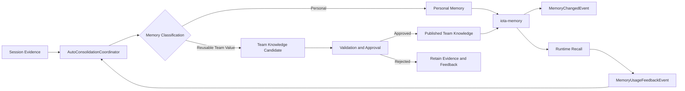
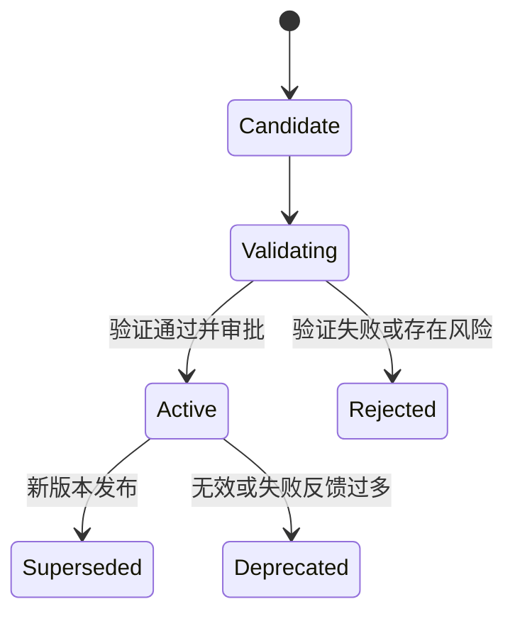

# iota 对齐 autoDream 能力方案摘要

## 1. 要解决什么问题

当前 `iota-core` 和 `iota-memory` 已经解决：

- session transcript 不再依赖本地存储，具备集群能力
- 长期记忆不再依赖本地 markdown，具备服务化能力

但仍缺少一条完整的后台记忆治理链路：

> 系统需要从多用户 session 中持续整理个人记忆，并将具有复用价值的经验受控地提升为团队共享知识；所有改写、发布和使用效果都必须可感知、可验证、可审计、可回滚。

## 2. 核心结论

`autoDream` 的本质不是“再存一条 memory”，而是后台长期记忆治理：

- 从近期 session 中收集增量信号
- 与已有长期记忆做对比
- 对记忆执行合并、修正、替换和删除
- 保持索引轻量并输出整理结果

Hermes 的持续学习方案进一步补充了：

- 将“发生过什么”与“以后应该怎么做”区分开
- 从成功路径、错误恢复和用户纠正中提炼可复用知识
- 用验证、审批和回归门禁控制知识发布
- 根据真实使用反馈持续优化或回滚

因此，`iota` 第一阶段只建设两大类长期记忆：

| 类型 | 典型内容 | 默认 scope | 生效策略 |
| --- | --- | --- | --- |
| 个人记忆 | 用户偏好、习惯、背景、个人工作方式和经验 | `user` | 用户隔离域内整理后生效 |
| 团队共享知识记忆 | 项目事实、决策、最佳实践、故障经验和可复用流程 | `team/project` | 候选经过验证和审批后发布 |

Session transcript、summary、tool call 和执行轨迹属于证据来源层，不作为第三类长期记忆。

## 3. 总体流程

个人记忆不能因为被频繁使用就自动共享给团队。任何 `user -> team/project` 的 scope promotion 都必须通过独立提升流程，普通 merge API 不允许跨 scope 写入。

## 4. 职责边界

`iota-core` 负责：

- 从 `RedisClaudeSessionStore` / `RedisConversationStore` 收集 session evidence
- 做时间门控、session 数门控、并发锁和隔离域调度
- 区分个人记忆与团队知识候选
- 编排 consolidation、验证、审批和发布
- 汇总真实使用反馈，触发重新验证、降级或回滚

`iota-memory` 负责：

- 提供统一的 memory query / write / search / classify 能力
- 提供 `create / merge / supersede / delete / promote / publish / rollback` 能力
- 维护 ledger、index、状态、版本链、证据 lineage 和审批信息
- 发布 `MemoryChangedEvent`
- 接收并保存 `MemoryUsageFeedbackEvent`

不建议让 `iota-memory` 内嵌 dream agent 或直接扫描 Redis transcript，否则会让 memory domain 与 agent orchestration 耦合。

## 5. 多用户与双记忆约束

所有 consolidation job、memory query、memory write 和 event 都必须带：

- `isolation_key`
- `scope_type`
- `scope_id`

两类记忆遵循不同治理规则：

- 个人记忆只允许在当前用户隔离域内自动整理和改写。
- 团队知识必须具有跨 session 或跨成员复用价值，不能包含个人偏好或无权共享内容。
- 团队知识中的 `procedure` 对应可复用 Skill，应包含适用条件、步骤、工具、验证方式和失败恢复。
- 团队知识默认从 candidate 开始，不能直接进入 active recall。

## 6. 团队知识提升与质量门禁

团队知识建议支持以下状态：

发布前至少检查：

- Scope 与隐私：不能包含个人隐私或无权共享内容
- 来源证据：保留来源 session、成员数量、观察时间和关键轨迹
- 复用价值：不是一次性任务状态
- 语义一致性：不与现有 active knowledge 无解释地冲突
- 效果验证：procedure 应通过任务级验证
- 人工审批：高风险 decision / procedure 必须人工批准

`supersede` 只能表达新版本替换旧版本，不能证明新版本更好，因此验证和审批是团队知识发布的必要能力。`rollback` 是恢复上一已验证版本的治理动作，不作为独立长期状态。

## 7. 渐进召回与反馈闭环

为避免知识规模增长直接推高 prompt 成本，召回应采用渐进加载：

1. 少量稳定个人偏好和关键团队规则可高优先级召回。
2. 默认只返回 knowledge name、summary、适用条件和版本信息。
3. 当前任务明确命中后，再加载完整知识正文。
4. 只有审计或重新验证时，才加载来源 session 和执行轨迹。

运行时需要记录知识是否被召回、采用、执行成功、用户纠正、关联失败或长期未使用。

`MemoryChangedEvent` 描述“记忆发生了什么变化”；`MemoryUsageFeedbackEvent` 描述“记忆在真实使用中效果如何”。两者共同构成持续治理闭环。

## 8. 五个关键问题的结论

### 8.1 做梦的 sessions 范围

Claude Code 默认只扫描当前工作目录对应项目中，自上次 consolidation 后发生过活动的合法主 session；排除当前 session 和 subagent transcript。它不是全局扫描，也不是固定读取最近 N 个 session。

### 8.2 做梦的频率

系统会在每个符合条件的主线程 turn 结束时检查，但默认只有同时满足“距离上次 consolidation 至少 `24` 小时”和“新增至少 `5` 个合格 session”才真正做梦。时间条件满足但 session 数不足时，最多每 `10` 分钟重新扫描一次。

### 8.3 Claude Code 触发 memory 的时机

记忆链路分为三层：主 agent 在执行中通过 memory tools 主动写入；每个合格 turn 结束后由 extractor 补提取遗漏记忆；满足慢周期门控后由 autoDream 做合并、修正和裁剪。iota 应将前两者映射为 `iota-memory` MCP / memory tools，将 autoDream 映射为后台 mutation 编排。

### 8.4 Prompt 如何替换

不整段替换上游 system prompt，而是分别维护运行时 memory 指引、turn-end extractor prompt、后台 consolidation prompt 和 recall capsule。Prompt 独立版本化并在 session 边界发布，替换能力边界而不是持续 patch 上游文本。

### 8.5 Memory 与 Skill 是否可以兼得

可以。事实、偏好、决策和经验写入个人或团队 memory；可复用流程先形成经过验证的 `procedure` 团队知识，再由独立 Skill Publisher 生成或更新 Hermes Skill。Memory 负责知识与证据治理，Skill 负责可执行流程，两者通过来源和版本关系关联。

MVP 阶段只需产出 `procedure` memory，不自动修改 Skill；效果稳定后再增加 Skill 发布和演进链路。

## 9. 建议落地路径

### P1：后台调度骨架

- 增加 consolidation coordinator
- 补时间门控、session 门控、并发锁和隔离域调度
- 打通 session summary / hint 输入

### P2：整理编排与 mutation API

- 增加 consolidation agent 编排
- 明确 `create / merge / supersede / delete / history` API
- 打通个人记忆整理链路

### P3：改写事件链路

- 发布 `MemoryChangedEvent`
- 对 create、supersede、delete、promote、publish 和 rollback 发出正式事件

### P4：可视化与审计

- 建设 manifest 视图
- 提供按 user / project / namespace 查询的审计视图
- 展示 active、candidate、superseded、deprecated 和 deleted 状态
- 支持回看来源证据、审批信息和版本演化链

### P5：团队知识提升与质量门禁

- 增加 candidate、validation、approval、publish 和 rollback
- 实施证据、隐私、效果和人工审批门禁

### P6：渐进召回与使用反馈

- 建设 manifest-first、detail-on-demand 的召回链路
- 发布 `MemoryUsageFeedbackEvent`
- 基于成功率、纠正率和失败率触发优化、降级或回滚

## 10. 一句话建议

建议将 `iota` 建设为一条“多用户隔离下的双记忆持续治理链路”：

> 从 session 证据中整理个人记忆，将可复用经验提升为经过验证和审批的团队共享知识，并通过改写事件、渐进召回和真实使用反馈持续演进。
