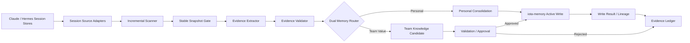
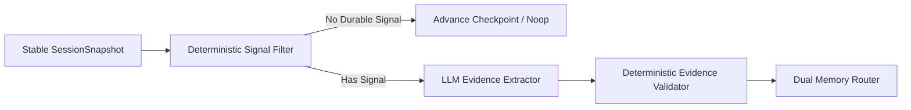
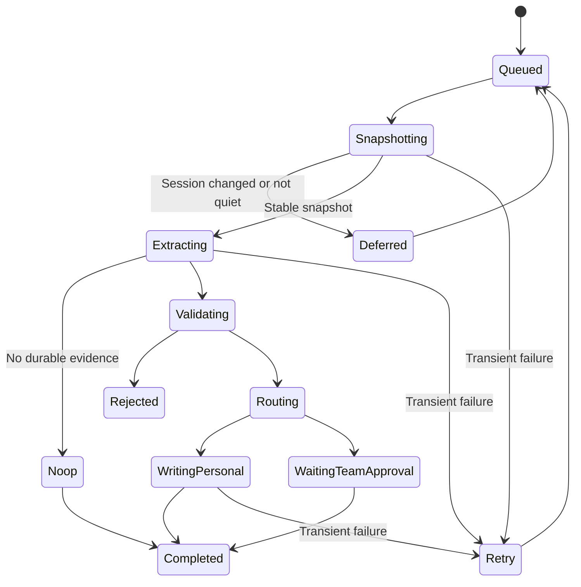

# iota Session Evidence 到双记忆的稳定后台提取流程

## 1. 目标与结论

本文基于当前 `iota-core` 和 `iota-memory` 的实际代码，设计一条从 Claude Code / Hermes session 后台提取 evidence，并沉淀为个人记忆和团队共享知识的稳定流程。

目标不是“定时扫描 transcript 后直接调用 memory classify/write”，而是建设一条可增量处理、可重试、可审计、不会重复写入、不会跨 scope 污染的后台流水线。

核心结论：

1. Session transcript、summary 和 tool trace 是证据来源，不直接等于长期记忆。
2. `iota-core` 负责 session 扫描、证据提取、双记忆路由和写入编排。
3. `iota-memory` 负责长期记忆的持久化、检索和版本治理。
4. 个人记忆可以在满足规则后自动进入 active。
5. 团队共享知识必须先成为 candidate，经过验证或审批后才能发布。
6. 必须先建设独立的 evidence ledger 和稳定 scope binding，不能只依赖 Redis 扫描游标。

推荐总流程：



---

## 2. 当前能力与现实约束

### 2.1 当前可直接复用的能力

#### `RedisClaudeSessionStore`

当前已经具备：

- 按 `project_key` 保存主 transcript
- 保存 subagent transcript
- `psess:{project_key}` 按 `mtime` 建立 session zset
- 增量维护 session summary sidecar
- summary 带 `mtime`

因此 Claude session 已经具备较好的增量扫描基础。

#### `RedisConversationStore`

当前已经具备：

- 保存 `SessionMeta`
- 按 session 保存完整消息列表
- `conversation:index:recent` 按最近活动时间建立 zset
- session TTL
- 跨实例共享读取

因此 Hermes session 可以作为 evidence 来源，但尚不具备稳定后台提取所需的 summary、scope index 和增量版本信息。

#### `iota-memory`

当前已经具备：

- `MemoryRecord` 统一模型
- `write / recall / search / classify`
- `scope=user/project/session/global`
- `type + facet + record_kind`
- `selectors / payload / metadata`
- user semantic memory 的 selector-axis merge
- supersede 和 delete
- recall 只返回 `active` 状态

这些能力足以支持个人记忆 MVP 写入，但不足以完整承载团队知识 candidate、审批和稳定幂等写入。

### 2.2 当前不能直接用于稳定后台提取的点

| 问题 | 当前现状 | 直接风险 |
| --- | --- | --- |
| Hermes scope 无法稳定还原 | `SessionMeta.extra` 可承载，但 runtime 创建 session 时没有写入 memory scopes | 个人记忆和团队知识可能写错 scope |
| Hermes conversation key 与 kernel session 不完全等价 | runtime 当前使用 `memory_namespace` 作为 `ConversationStore` session id，它可能跨多个 kernel session 长期复用 | evidence 边界和 checkpoint 不能假设等同一次 Hermes session |
| Hermes 缺可靠增量游标 | recent zset 有活动时间，但 `list_sessions()` 返回的是 `started_at`，无 `after_score` API | 重复扫描或漏扫 |
| Hermes 缺 summary | 只能读取完整 messages | 成本高，长 session 易超上下文 |
| Hermes tool trace 未进入 conversation store | runtime 当前主要持久化 user prompt 和 assistant final text | 无法可靠识别成功 procedure 和 failure recovery |
| Claude project 无全局发现索引 | 只能已知 `project_key` 后扫描 | coordinator 无法发现所有项目 |
| 活跃 session 没有稳定快照门禁 | session 可能边写边提取 | evidence 不完整或重复变化 |
| classifier 面向用户原始输入 | 输出不包含 evidence、selectors、confidence 和治理状态 | 不能直接承担后台 evidence 提取 |
| `HttpMemoryGateway` 未暴露 classify | memory service 有 `:classify` endpoint，但 core HTTP gateway/protocol 只有 write/recall/search | coordinator 不能通过现有 gateway 直接调用 classify |
| `idempotency_key` 未真正落库 | DTO 接收字段，但 ledger 没有唯一约束或查询 | 重试可能重复写 memory |
| 写入结果可能存在歧义 | MySQL 已提交但 ES 失败时接口会报错；调用方无法确认记录是否已经写入 | 重试可能重复写入 |
| create 与 supersede 非同一事务 | 新记录 insert 和旧记录 mark_superseded 分步提交 | 中途失败可能同时存在两个 active 版本 |
| selector merge 仅支持 user semantic | project/procedural 不自动归并 | 团队知识容易重复堆积 |
| candidate 无管理 API | status 字段可写 candidate，但 search/recall 默认只查 active | candidate 写入后难以评审和发布 |
| 无正式 change event/outbox | 写入成功后没有可靠事件 | 难以审计和反馈 |

因此稳定方案必须在调用现有能力前增加 evidence orchestration 层。

### 2.3 当前代码依据

本方案的关键现状判断来自：

- [claude_session_store.py](/Users/lixp7/workspace/pyWorkspace/iota-core/src/iota_core/storage/claude_session_store.py:20)
  - Claude transcript、summary sidecar、project session index
- [redis_backend.py](/Users/lixp7/workspace/pyWorkspace/iota-core/src/iota_core/storage/redis_backend.py:59)
  - Hermes conversation meta、messages、recent index 和 TTL
- [runtime.py](/Users/lixp7/workspace/pyWorkspace/iota-core/src/iota_core/runtime.py:488)
  - ConversationStore 当前使用 `memory_namespace`，并持久化 user/assistant turn
- [scope.py](/Users/lixp7/workspace/pyWorkspace/iota-core/src/iota_core/memory/scope.py:18)
  - runtime 当前 user/project/session scope 解析方式
- [gateway.py](/Users/lixp7/workspace/pyWorkspace/iota-memory/packages/iota-memory-protocol/src/iota_memory_protocol/gateway.py:39)
  - Memory write/recall/search DTO 与 `idempotency_key`
- [service.py](/Users/lixp7/workspace/pyWorkspace/iota-memory/packages/iota-memory/src/iota_memory/service.py:91)
  - write、selector merge、supersede 和 ES 同步流程
- [mysql.py](/Users/lixp7/workspace/pyWorkspace/iota-memory/packages/iota-memory/src/iota_memory/ledger/mysql.py:54)
  - 当前 ledger insert、status 和事务边界
- [classifier service.py](/Users/lixp7/workspace/pyWorkspace/iota-memory/packages/iota-memory/src/iota_memory/classifier/service.py:32)
  - 当前 classifier 输入输出和 scope enrichment

---

## 3. 稳定流程的核心边界

### 3.1 Evidence 与 Memory 分离

Evidence 表示“session 中发生了什么以及为什么可以得出某个结论”，Memory 表示“未来值得复用的稳定结论”。

```text
Evidence:
- 来源 session、消息范围、summary 版本
- 用户明确表达、用户纠正、任务结果、工具执行结果
- 可追溯、可重复分析，但不直接进入 recall

Memory:
- 面向未来复用的稳定内容
- 已经过 scope、质量、去重和治理规则处理
- 进入 iota-memory 后参与 recall
```

Evidence ledger 应属于提取治理域。建议由 `iota-core` 新增独立模块维护，不要把原始 transcript 或完整 evidence 塞入 `MemoryRecord.content`。

### 3.2 双记忆路由

第一阶段只允许路由到：

- `personal_memory`
  - 目标 scope 必须为 `user`
  - 典型内容：明确偏好、稳定习惯、用户身份和个人工作方式
- `team_knowledge`
  - 目标 scope 必须为 `project`
  - 典型内容：项目事实、决策、流程和故障经验
  - 默认只能生成 candidate

禁止后台流程自动写入 `global`。`session` episodic 可以作为 evidence 中间结果，但不属于本阶段最终双记忆输出。

---

## 4. 必须新增的最小数据契约

### 4.1 SessionScopeBinding

后台提取必须能从任意 session 稳定还原用户和项目边界。

```json
{
  "source_type": "claude|hermes",
  "source_namespace": "business-namespace",
  "project_key": "claude-project-key-or-empty",
  "session_id": "session-id",
  "user_scope_id": "user-123",
  "project_scope_id": "project-456",
  "session_scope_id": "session-789",
  "agent_namespace": "agent-or-memory-namespace",
  "created_at": 1781140000,
  "updated_at": 1781140300
}
```

要求：

- session 第一次创建时写入，后续不可静默改变主体边界
- 未找到 binding 的 session 不允许进入长期记忆写入阶段
- Claude 的 `project_key` 只能用于发现 transcript，不能替代 `project_scope_id`

### 4.2 SessionSnapshot

所有 source adapter 统一输出以下快照：

```json
{
  "source_type": "claude|hermes",
  "source_session_key": "namespace/project/session",
  "session_id": "session-id",
  "revision": "source-specific-monotonic-revision",
  "last_activity_at": 1781140300,
  "is_closed": false,
  "scope_binding": {},
  "summary": {},
  "message_count": 42,
  "messages": [],
  "tool_traces": []
}
```

`revision` 是幂等与稳定快照的关键：

- Claude：可使用主 session `mtime + transcript length`
- Hermes：建议新增 `updated_at_ms + message_count`

对 Hermes 来说，`source_session_key` 更准确地表示 conversation stream，而不一定表示底层 kernel session。若一个 `memory_namespace` 下发生 kernel session 重建，应将 kernel session id 作为 snapshot metadata 保留，但 checkpoint 仍以稳定 conversation stream 为主键。

### 4.3 EvidenceRecord

```json
{
  "evidence_id": "deterministic-hash",
  "source_session_key": "namespace/project/session",
  "source_revision": "revision",
  "evidence_kind": "explicit_statement|user_correction|successful_procedure|failure_recovery|project_decision|stable_behavior",
  "content": "可供治理层判断的证据摘要",
  "source_refs": [
    {"message_start": 10, "message_end": 18, "tool_call_ids": ["call-1"]}
  ],
  "observed_at": 1781140300,
  "proposed_memory_class": "personal_memory|team_knowledge|none",
  "proposed_scope_id": "user-123-or-project-456",
  "confidence": 0.86,
  "sensitivity": "normal|personal|restricted",
  "status": "extracted|validated|routed|written|rejected",
  "reason": "为什么值得或不值得长期保存"
}
```

`evidence_id` 建议由以下内容计算：

```text
sha256(source_session_key + source_revision + normalized_evidence_kind + normalized_content)
```

### 4.4 ExtractionCheckpoint

每个 session 单独维护 checkpoint，不使用单个全局时间游标：

```json
{
  "source_session_key": "namespace/project/session",
  "last_seen_revision": "rev-10",
  "last_extracted_revision": "rev-9",
  "last_success_at": 1781140300,
  "next_retry_at": null,
  "failure_count": 0,
  "status": "idle|queued|running|retry|dead"
}
```

原因：

- session 会被反复续写
- 不同 session 处理速度不同
- 单个失败 session 不应阻塞整个项目游标
- checkpoint 必须在 memory 写入结果明确后再推进

### 4.5 Evidence Ledger 最小表结构

建议至少包含三张表：

| 表 | 主键/唯一键 | 作用 |
| --- | --- | --- |
| `session_extraction_jobs` | `job_id`；唯一约束 `source_session_key + target_revision` | 记录一次 revision 的处理状态和失败阶段 |
| `session_evidence_records` | `evidence_id` | 保存 evidence、source refs、路由和写入结果 |
| `session_extraction_checkpoints` | `source_session_key` | 保存每个 conversation stream 的处理进度 |

建议 `session_evidence_records` 至少保存：

- `source_session_key`
- `source_revision`
- `evidence_kind`
- `content`
- `source_refs`
- `proposed_memory_class`
- `proposed_scope_id`
- `confidence`
- `sensitivity`
- `status`
- `memory_id`
- `rejection_reason`
- `created_at / updated_at`

Evidence ledger 必须支持按 `evidence_id` 幂等插入，以及按 `source_session_key + source_revision` 查询本轮完整处理结果。

---

## 5. Source Adapter 设计

建议在 `iota-core` 增加统一协议：

```python
class SessionEvidenceSource(Protocol):
    async def list_changed_sessions(
        self,
        *,
        shard_key: str,
        after: str | None,
        limit: int,
    ) -> list[SessionChange]: ...

    async def load_snapshot(
        self,
        change: SessionChange,
        *,
        include_messages: bool,
    ) -> SessionSnapshot: ...
```

### 5.1 ClaudeSessionEvidenceSource

复用当前能力：

- `psess:{project_key}` 作为 session activity index
- `smry:{project_key}:{session_id}` 作为第一层输入
- `load()` 只在 summary 信号不足时读取主 transcript
- `list_subkeys()` 按需读取 subagent transcript

必须补齐：

1. 增加全局或 namespace 级 project index，例如：
   - `{ns}:claude:projects:recent`
2. 增加游标式 API：
   - `list_changed_sessions(project_key, after_mtime, limit)`
3. summary 返回值显式携带 `session_id`
4. 提供轻量 `get_session_revision()`：
   - `mtime`
   - transcript length
   - summary mtime
5. 建立 `SessionScopeBinding`

### 5.2 HermesSessionEvidenceSource

复用当前能力：

- `conversation:index:recent`
- `SessionMeta`
- `get_messages()`

必须补齐：

1. `SessionMeta.extra` 写入：
   - `user_scope_id`
   - `project_scope_id`
   - `session_scope_id`
   - `agent_namespace`
2. meta 增加或维护：
   - `updated_at`
   - `message_count`
   - `ended_at`
3. 增加 scope-aware recent index：
   - `{ns}:conversation:index:project:{project_scope_id}`
   - 可选 `{ns}:conversation:index:user:{user_scope_id}`
4. 增加 `list_changed_sessions(after_score, limit)`，返回 recent zset score
5. 增加 Hermes summary sidecar，由 append 或独立 summary builder 增量维护
6. 持久化 tool call / tool result，或新增独立 execution trace sidecar
7. coordinator 的扫描周期必须小于 session TTL，且成功提取后 evidence ledger 不依赖 Redis TTL

如果 P0 暂时无法补 tool trace，Hermes evidence extractor 必须降级：

- 可以提取明确个人偏好、身份和项目事实
- 不应自动生成“流程成功”或“错误恢复成功”类团队知识 candidate

### 5.3 不建议统一底层存储格式

Claude 和 Hermes transcript 格式差异较大，不建议为了后台提取强行改成相同 Redis schema。

正确做法是：

- source adapter 负责读取各自格式
- 在 `SessionSnapshot` 层统一
- evidence extractor 只依赖统一 snapshot

---

## 6. Session 稳定快照门禁

后台提取不能在每次 append 后立即执行。建议使用“事件提示 + 周期兜底”的混合触发方式：

- append 时只更新 recent index，不直接运行 LLM
- coordinator 每 5 分钟扫描一次 changed sessions
- session 显式结束时立即触发一次
- 长 session 每累计一定增量可触发一次

默认门禁建议：

| 门禁 | 建议值 | 目的 |
| --- | --- | --- |
| quiet period | 最近 10 分钟无写入 | 避免读取活跃中的半截 session |
| minimum delta | 新增至少 4 条消息或 summary revision 变化 | 避免微小增量频繁调用模型 |
| maximum delay | 活跃 session 最长 6 小时强制检查一次 | 防止长 session 永不整理 |
| minimum content | 至少存在一组 user + assistant 消息 | 过滤空 session |

读取时采用 double-read：

1. 读取 revision A
2. 加载 summary / messages
3. 再读取 revision B
4. `A != B` 时放弃本轮，不推进 checkpoint

这样可以避免在 session 并发写入时产生不一致快照。

---

## 7. Evidence 提取流程

### 7.1 分两级处理，不直接全量调用 LLM



第一级规则过滤负责识别高价值信号：

- 用户明确表达“记住、以后、默认、偏好”
- 用户纠正 agent
- 明确项目决策或架构结论
- 多步骤任务成功完成
- 工具调用失败后恢复成功
- 相同个人行为在多个 session 重复出现

过滤掉：

- 临时状态
- 单次 debug 噪声
- 无结果的猜测
- 密钥、token 和隐私内容
- 已被当前 memory 完整覆盖且没有新证据的内容

第二级 LLM extractor 只输出 `EvidenceRecord`，不直接输出最终 `MemoryWriteRequest`。

### 7.2 为什么不能直接复用当前 classifier

当前 `classify_memories` 适合对一段明确输入拆分六 bucket，但不适合直接处理后台 session：

- 它默认必须产出 memory draft，缺少 `none/reject`
- 它不输出证据引用
- 它不输出 sensitivity
- 它不输出 selectors
- 它不判断个人记忆和团队知识的发布策略
- 它可能直接输出 project scope

建议新增 `session_evidence_v1` extraction profile，输出 EvidenceRecord；现有 classifier 可在 evidence 通过验证后，作为 memory type/facet/record_kind 的辅助分类器使用。

由于当前 `HttpMemoryGateway` 未暴露 `classify_memories()`，实现时有两个选择：

1. 推荐：扩展 protocol 和 `HttpMemoryGateway`，将 classify 作为正式服务能力。
2. 临时：evidence extractor 独立调用 LLM，最终写入仍只通过 `MemoryGateway`。

不建议让 coordinator 直接依赖 `iota-memory` 内部 Python classifier 模块，否则会破坏服务边界。

---

## 8. 双记忆路由规则

### 8.1 个人记忆自动写入条件

满足以下任一强信号，可生成个人记忆：

- 用户明确声明偏好、身份或长期要求
- 用户明确纠正已有个人记忆
- 同一行为模式跨至少 2 个 session 重复出现

同时必须满足：

- `scope_binding.user_scope_id` 存在
- 不包含 restricted 信息
- 内容对未来 session 有复用价值
- 可生成稳定 `topic + axis + value` selector

推荐映射：

| Evidence | Memory |
| --- | --- |
| explicit preference | `semantic + preference + user` |
| stable user role/background | `semantic + identity + user` |
| personal working method | `procedural + user` |

个人语义记忆可以复用当前 selector-axis merge。个人 procedural 当前不会自动 merge，第一阶段应由 coordinator 先查询已有记录再决策。

### 8.2 团队共享知识候选条件

满足以下条件之一，可生成团队知识 candidate：

- 明确项目事实或已确认架构决策
- 一个复杂流程成功执行，并有可验证结果
- 从失败中恢复，结论可防止团队重复踩坑
- 同类结论来自多个成员或多个 session

同时必须满足：

- `scope_binding.project_scope_id` 存在
- 不包含个人偏好或无权共享内容
- 有明确 source refs
- 不是临时任务状态

推荐映射：

| Evidence | Memory candidate |
| --- | --- |
| project fact | `semantic + domain + project` |
| project decision/goal | `semantic + strategic + project` |
| reusable procedure | `procedural + project` |
| failure lesson | `semantic + domain + project` 或 `procedural + project` |

### 8.3 团队知识第一阶段的落地方式

当前 `iota-memory` 虽然允许写 `status=candidate`，但缺少 candidate 查询、审批和发布 API。

因此推荐：

- **MVP 阶段**：团队知识 candidate 保存在 evidence ledger，不写入 `iota-memory`
- **审批通过后**：使用现有 `write_memories()` 写入 `status=active`
- **能力补齐后**：再将 candidate、validation、publish 原生收口到 `iota-memory`

这样可以避免 candidate 写入后无法管理，或被错误召回。

---

## 9. Consolidation 与写入策略

### 9.1 写入前必须先查已有记忆

每个 validated evidence 在写入前执行：

1. 按相同 scope、record_kind、topic、axis 查询 existing active memories
2. 决策：
   - `noop`：已有内容已覆盖
   - `reinforce`：相同结论增加证据，不产生新 active 版本
   - `create`：不存在同主题记录
   - `supersede`：新证据明确推翻旧版本
   - `candidate`：团队知识等待验证或审批

不要把所有 evidence 都转换为新 `MemoryRecord`。

### 9.2 Selector 规范

后台提取生成的可治理记忆必须尽量带：

```json
{
  "topic": "python_testing",
  "axis": "test_framework",
  "value": "pytest"
}
```

规则：

- `topic`：稳定主题
- `axis`：该主题下可被替换的维度
- `value`：当前结论的规范值

对于无法稳定结构化的团队知识，可先用：

```json
{
  "topic": "memory_architecture",
  "axis": "service_boundary",
  "value": "memory_gateway"
}
```

### 9.3 幂等写入

当前 `idempotency_key` 没有真正落库，稳定流程上线前必须补齐以下任一方案：

推荐方案：

- `memory_records` 增加 `idempotency_key`
- 建立唯一索引
- `write_memories()` 遇到相同 key 返回既有记录

key 建议：

```text
sha256(memory_class + scope + scope_id + record_kind + topic + axis + normalized_value + evidence_set_version)
```

在该能力补齐前，coordinator 可以使用确定性 `MemoryWriteRequest.id` 降低重复概率，但这只能作为临时方案，因为网络超时后的写入结果仍难以确认。

稳定写入还需要把以下动作收口成一个事务型 mutation：

```text
create new version
+ mark previous versions superseded
+ write memory change outbox
```

当前 `write_memories()` 中 insert 和 `mark_superseded()` 分步提交，不能作为严格原子改写使用。P2 在开放自动 supersede 前，应先补事务型 mutation API；否则只能自动 create/noop，supersede 进入人工或重试安全队列。

### 9.4 Lineage metadata

写入 memory 时至少携带：

```json
{
  "source": "session_evidence_extractor",
  "metadata": {
    "evidence_ids": ["ev-1", "ev-2"],
    "source_session_ids": ["s-1", "s-2"],
    "source_revisions": ["r-10", "r-4"],
    "extraction_job_id": "job-1",
    "extractor_profile": "session_evidence_v1",
    "extracted_at": 1781140300
  }
}
```

memory 只保存 evidence 引用和必要摘要，不复制完整 transcript。

---

## 10. Job 状态机与事务边界



关键事务原则：

1. Redis 只负责发现、短期队列和分布式锁，不作为 evidence 最终事实源。
2. evidence、job、checkpoint 使用关系型数据库持久化。
3. 同一 `source_session_key` 同时只允许一个 job 运行。
4. evidence 持久化成功后，才能进入 routing。
5. personal memory 写入结果明确后，才能将对应 evidence 标记为 written。
6. 所有本轮 evidence 处理完成或明确进入 team approval 后，才能推进 `last_extracted_revision`。
7. transient failure 不推进 checkpoint。

建议锁键：

```text
session-evidence:{source_type}:{source_namespace}:{project_key}:{session_id}
```

---

## 11. 失败处理与稳定性

### 11.1 重试分类

| 失败 | 处理 |
| --- | --- |
| session 正在变化 | deferred，不计失败，下一周期重试 |
| Redis 临时失败 | 指数退避 |
| LLM 超时或格式错误 | 最多重试 3 次，保留原 snapshot revision |
| evidence 校验失败 | rejected，记录原因，不自动重试 |
| memory service 超时 | 使用幂等键重试 |
| scope binding 缺失 | quarantine，禁止写 memory |
| restricted 内容 | rejected 或人工处理 |

### 11.2 Dead letter

连续失败超过阈值的 job 进入 dead 状态，至少记录：

- source session key
- revision
- failure stage
- error type
- retry count
- last error
- snapshot reference

不能因为单个坏 session 阻塞同项目其他 session。

### 11.3 监控指标

建议至少监控：

- changed sessions scanned
- stable snapshots / deferred snapshots
- evidence extracted / rejected
- personal memories created / reinforced / superseded
- team candidates generated / approved / rejected
- duplicate prevented count
- scope binding missing count
- extraction latency and LLM cost
- checkpoint lag

---

## 12. 建议模块划分

### `iota-core`

```text
iota_core/
└── evidence/
    ├── coordinator.py          # 扫描、门控、调度和重试
    ├── models.py               # Snapshot / Evidence / Job / Checkpoint
    ├── ledger.py               # evidence 与 checkpoint 事实源
    ├── extractor.py            # session_evidence_v1
    ├── validator.py            # scope、隐私、质量规则
    ├── router.py               # personal / team / none
    ├── consolidator.py         # existing memory 对比与决策
    └── sources/
        ├── claude.py
        └── hermes.py
```

### `iota-memory`

MVP 必须补齐：

- 真正的 idempotent write
- 按 selectors 查询 existing active memory 的稳定 API

后续补齐：

- candidate / validating / rejected / deprecated 管理 API
- approve / publish / rollback
- outbox 与 `MemoryChangedEvent`
- project/procedural 的 merge-aware write

---

## 13. 分阶段落地建议

### P0：先补数据可提取性

目标：

- runtime 创建 Hermes session 时写入 scope binding
- Hermes meta 增加 `updated_at + message_count`
- Hermes 持久化 tool trace，或明确以无 tool trace 的降级模式运行
- Claude 增加 project discovery index
- 两类 store 增加 cursor-based changed session API

验收：

- 能稳定列出“某隔离域从某游标之后发生变化的 session”
- 任意 session 都能还原 user/project/session scope

### P1：建设 evidence ledger 与只读提取

目标：

- 建设 job、checkpoint、evidence 表
- 实现 Claude/Hermes source adapter
- 实现 quiet period 和 double-read
- 实现 `session_evidence_v1`
- 只产出 evidence，不写 memory

验收：

- 重复扫描同 revision 不产生重复 evidence
- session 并发写入时不会推进错误 checkpoint
- 可以回看 evidence 到原 session 的 lineage

### P2：打通个人记忆自动写入

目标：

- 仅开放明确个人 preference / identity
- 补齐 selectors
- 写入前查询 existing active memory
- 支持 noop / reinforce / create / supersede
- 补齐 idempotent write
- 补齐 create + supersede 的事务型 mutation

验收：

- 重试不会产生重复个人记忆
- 用户纠正可以 supersede 旧偏好
- 不会写入其他用户 scope

### P3：建设团队知识 candidate

目标：

- 从 project fact / decision / procedure / lesson 生成 candidate
- candidate 先保存在 evidence ledger
- 建设人工审批和发布动作

验收：

- 未审批团队知识不参与 recall
- candidate 可以追溯来源 session 和证据
- 审批后通过现有 write API 发布为 active

### P4：将团队知识治理收口到 iota-memory

目标：

- 增加 candidate 状态管理 API
- 增加 validation / approve / publish / rollback
- 增加 change event/outbox
- 增加 project/procedural merge-aware write

验收：

- 团队知识完整生命周期由 memory domain 统一治理
- 发布、替换和回滚均可审计、可重放

---

## 14. 第一阶段推荐范围

为了尽快得到稳定结果，第一阶段应严格限制提取范围：

自动写入个人记忆：

- 用户明确表达的 preference
- 用户明确身份或长期职责
- 用户对旧偏好的明确纠正

只生成团队知识 candidate：

- 明确架构事实
- 明确项目决策
- 有成功结果的多步骤 procedure
- 有恢复结果的故障 lesson

暂不处理：

- 从单次隐式行为推断个人偏好
- 自动发布团队知识
- global memory
- 自动删除团队知识
- 对所有历史 session 做一次性全量回填

先用新产生的 session 验证稳定性，再通过受控批任务回填历史数据。

## 15. 最终建议

基于 iota 当前现状，最稳妥的实现顺序不是先写 `AutoConsolidationCoordinator` 调用现有 classifier，而是：

> 先补 scope binding、增量 revision 和 evidence ledger，再做只读 evidence 提取；验证稳定后开放个人记忆自动写入，最后建设团队知识 candidate 和审批发布。

这条顺序能够复用当前 Redis session store 和 `iota-memory` 的 active memory 能力，同时避免重复写入、跨用户污染和未经验证的团队知识直接进入 recall。
