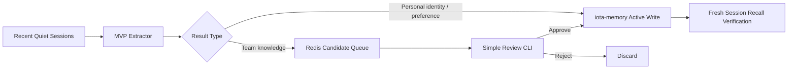

# iota Session Evidence 到双记忆的 MVP 方案

## 1. MVP 目标

本方案目标是在尽量不改造 `iota-memory` 的前提下，快速验证：

1. 后台可以从 Claude Code 和 Hermes session 中提取有价值内容。
2. 明确的个人偏好和身份信息可以自动写入个人记忆，并在新 session 中召回。
3. 项目事实、决策和流程可以形成团队知识候选，经过人工确认后发布。

MVP 不追求完整治理能力，只验证端到端价值：



---

## 2. MVP 核心取舍

### 2.1 本期做什么

- 定时扫描配置中明确指定的 session source
- 只处理最近一段时间没有更新的静默 session
- 使用一个专用 LLM prompt 同时提取个人记忆和团队知识候选
- 个人记忆只自动写入明确的 `identity / preference`
- 团队知识只进入 Redis candidate queue
- 提供简单 CLI 查看、批准和拒绝团队知识候选
- 使用 Redis marker 避免重复处理同一 session revision

### 2.2 本期不做什么

- 不建设 MySQL evidence ledger
- 不建设完整 job 状态机
- 不建设 candidate / approve 原生 memory API
- 不自动发布团队知识
- 不自动 supersede 或 delete 旧记忆
- 不处理 `global` memory
- 不从单次隐式行为推断个人偏好
- 不保证处理所有历史 session
- 不提取 Hermes tool trace 中的复杂流程和错误恢复

这些能力保留到稳定版本继续建设。

---

## 3. 直接复用的现有能力

| 能力 | MVP 用法 |
| --- | --- |
| `RedisClaudeSessionStore.list_sessions()` | 扫描已配置 `project_key` 下的 Claude session |
| `RedisClaudeSessionStore.list_session_summaries()` | 优先使用 Claude summary 作为提取输入 |
| `RedisClaudeSessionStore.load()` | summary 信息不足时读取 transcript 尾部 |
| `RedisConversationStore.list_sessions()` | 扫描最近 Hermes conversation |
| `RedisConversationStore.get_messages()` | 读取 Hermes 最近消息 |
| `/v1/memories:write` | 写入个人记忆和批准后的团队知识 |
| `/v1/memories:search` | 发布前做简单重复检查 |
| `MemoryContextService` | 在新 session 中验证召回结果 |

MVP extractor 可以直接调用与 `memory_classify` 工具相同的 LLM 服务配置，但使用独立 prompt。现有 classifier 输出缺少双记忆路由和 selectors，不建议直接作为完整 extractor。

---

## 4. 最小配置

MVP 不先改造 session scope binding，而是在 worker 配置中显式声明扫描范围和目标 scope。

```yaml
session_evidence_mvp:
  enabled: true
  scan_interval_seconds: 300
  quiet_period_seconds: 600
  lookback_hours: 24
  max_sessions_per_scan: 20
  max_input_chars: 30000

  sources:
    - source_type: claude
      namespace: iota
      project_key: iota-core
      user_scope_id: user-lixp7
      project_scope_id: /Users/lixp7/workspace/pyWorkspace/iota-core

    - source_type: hermes
      namespace: iota
      conversation_id: iota-core-agent
      user_scope_id: user-lixp7
      project_scope_id: /Users/lixp7/workspace/pyWorkspace/iota-core

  memory_service:
    base_url: http://localhost:8081
    api_key: ""
```

约束：

- 只有配置中的 source 才允许扫描和写入。
- `user_scope_id` 与 `project_scope_id` 必须显式填写。
- 一个 source 配置只能对应一个用户和一个项目。
- 配置错误的风险由部署者承担，因此 MVP 只建议用于小范围试点。

---

## 5. 最短处理流程

### 5.1 定时扫描

新增一个独立 worker：

```text
python -m iota_core.evidence_mvp.worker
```

每 5 分钟执行：

1. 遍历配置中的 source。
2. 获取最近 session。
3. 过滤最近 10 分钟仍有更新的 session。
4. 计算当前 revision。
5. 已存在 processed marker 时跳过。
6. 加载提取输入并调用 LLM。
7. 写入个人记忆或团队候选。
8. 成功后写 processed marker。

MVP source reader 可以直接复用底层 Redis client：

- Claude 按已配置 `project_key` 读取 `psess` zset score 作为最近活动时间。
- Hermes 按已配置 `conversation_id` 读取 `conversation:index:recent` zset score。

这里允许 MVP worker 暂时知道 Redis key layout，以换取快速验证。稳定版本必须收口为正式 source adapter API。

### 5.2 简化 revision

MVP 使用当前已有数据计算 revision：

| Source | Revision |
| --- | --- |
| Claude | `session_id + mtime` |
| Hermes | `conversation_id + message_count + last_message_hash` |

Redis processed marker：

```text
{namespace}:evidence-mvp:processed:{source_type}:{source_id}:{revision}
```

marker value：

```json
{
  "processed_at": 1781140300,
  "personal_written": 2,
  "team_candidates": 1,
  "extractor_version": "mvp-v1"
}
```

marker 建议保留 30 天。

该方案不能提供严格 exactly-once，但足以避免正常定时扫描产生大量重复处理。

### 5.3 提取输入

Claude：

1. 优先使用 session summary。
2. summary 不存在或过短时，读取 transcript 最后约 30,000 字符。
3. MVP 暂不主动读取 subagent transcript。

Hermes：

1. 读取 conversation 最近 20 条 user/assistant 消息。
2. 截断到约 30,000 字符。
3. 当前没有完整 tool trace，因此不提取“流程成功”和“错误恢复”类知识。

---

## 6. MVP Extractor 输出

Extractor 必须允许返回空结果，避免“每个 session 都必须产生记忆”。

建议输出：

```json
{
  "personal_memories": [
    {
      "content": "用户偏好中文回答，代码标识保持英文。",
      "type": "semantic",
      "facet": "preference",
      "record_kind": "communication_style",
      "selectors": {
        "topic": "communication",
        "axis": "response_language",
        "value": "zh_with_english_identifiers"
      },
      "confidence": 0.95,
      "reason": "用户明确表达长期偏好"
    }
  ],
  "team_candidates": [
    {
      "content": "iota-core 中 ConversationStore 负责 transcript，MemoryGateway 负责长期记忆。",
      "type": "semantic",
      "facet": "domain",
      "record_kind": "architecture_fact",
      "selectors": {
        "topic": "memory_architecture",
        "axis": "service_boundary",
        "value": "conversation_store_vs_memory_gateway"
      },
      "confidence": 0.9,
      "reason": "会话中明确确认的项目架构事实"
    }
  ]
}
```

### 6.1 个人记忆自动写入白名单

MVP 只允许自动写入：

| type | facet | scope |
| --- | --- | --- |
| `semantic` | `identity` | `user` |
| `semantic` | `preference` | `user` |

还必须满足：

- `confidence >= 0.85`
- reason 表明是用户明确表达，而不是模型推断
- selectors 包含 `topic / axis / value`
- 内容不包含 token、密码、密钥等敏感信息

其他个人内容全部丢弃或仅写日志，不自动写 memory。

### 6.2 团队知识候选白名单

MVP 允许生成：

| type | facet | 说明 |
| --- | --- | --- |
| `semantic` | `domain` | 项目事实、架构约束 |
| `semantic` | `strategic` | 明确项目决策和方向 |
| `procedural` | `null` | Claude transcript 中有明确步骤的流程 |

团队候选不会自动写入 `iota-memory`。

---

## 7. 个人记忆写入

个人记忆直接调用现有 `/v1/memories:write`：

```json
{
  "requests": [
    {
      "scope": "user",
      "scope_id": "user-lixp7",
      "type": "semantic",
      "facet": "preference",
      "record_kind": "communication_style",
      "content": "用户偏好中文回答，代码标识保持英文。",
      "selectors": {
        "topic": "communication",
        "axis": "response_language",
        "value": "zh_with_english_identifiers"
      },
      "confidence": 0.95,
      "source": "session_evidence_mvp",
      "metadata": {
        "source_type": "claude",
        "source_session_id": "session-1",
        "source_revision": "session-1:1781140300",
        "extractor_version": "mvp-v1"
      }
    }
  ]
}
```

现有 `iota-memory` 对 user semantic memory 支持 selector-axis merge：

- 相同 `topic + axis + value` 会复用已有记录
- 相同 `topic + axis` 但 value 冲突会 supersede 旧记录

为了降低 MVP 风险，worker 写入前必须调用 `/v1/memories:search`，按相同 `record_kind + topic + axis` 查询已有记录：

- 没有已有记录：允许自动写入。
- 已有相同 value：允许写入，由现有 merge 逻辑复用旧记录。
- 已有不同 value：不调用 write，进入 personal conflict 日志等待人工确认。

因此 MVP 不会自动触发现有 supersede 行为。

---

## 8. 团队知识候选队列

团队候选使用 Redis 保存，不新增数据库。由于 Redis Stream entry 不适合更新状态，MVP 使用 candidate hash 加 pending zset：

```text
{namespace}:evidence-mvp:team-candidate:{candidate_id}
{namespace}:evidence-mvp:team-candidates:pending
```

candidate hash value 包含：

```json
{
  "candidate_id": "sha256(project_scope_id + normalized_content)",
  "project_scope_id": "/Users/lixp7/workspace/pyWorkspace/iota-core",
  "content": "iota-core 中 ConversationStore 负责 transcript，MemoryGateway 负责长期记忆。",
  "type": "semantic",
  "facet": "domain",
  "record_kind": "architecture_fact",
  "selectors": {},
  "confidence": 0.9,
  "reason": "会话中明确确认的项目架构事实",
  "source_type": "claude",
  "source_session_id": "session-1",
  "source_revision": "session-1:1781140300",
  "status": "pending"
}
```

相同 `candidate_id` 再次出现时不新增候选，只更新：

- `observation_count`
- `last_observed_at`
- 最近的 `source_session_id`

这可以用很小的成本观察某条团队知识是否在多个 session 中被反复确认。

增加简单 CLI：

```bash
# 查看待审核候选
python -m iota_core.evidence_mvp.review list

# 查看详情
python -m iota_core.evidence_mvp.review show <candidate-id>

# 批准并写入 iota-memory project scope
python -m iota_core.evidence_mvp.review approve <candidate-id>

# 拒绝
python -m iota_core.evidence_mvp.review reject <candidate-id>
```

批准时：

1. 调用 `/v1/memories:search` 做简单相似内容检查。
2. 人工确认无明显重复后调用 `/v1/memories:write`。
3. 写入 `scope=project`，`source=session_evidence_mvp_approved`。
4. 更新 candidate hash status，并从 pending zset 移除。

---

## 9. MVP 安全边界

MVP 必须保留以下硬限制：

1. 未配置明确 scope 的 source 不处理。
2. 个人记忆只自动写 `identity / preference`。
3. 团队知识不自动发布。
4. 禁止自动写 `global`。
5. 输入和输出均执行敏感词过滤。
6. 单个 session 最多写入 3 条个人记忆、生成 5 条团队候选。
7. LLM 输出格式错误时跳过，不尝试宽松猜测。
8. memory 写入报错时不写 processed marker，下一轮允许重试。
9. MVP 不自动 delete。

---

## 10. 推荐代码结构

只需要增加一个小模块：

```text
iota_core/
└── evidence_mvp/
    ├── config.py       # YAML/env 配置
    ├── worker.py       # 定时扫描主循环
    ├── sources.py      # Claude/Hermes 读取适配
    ├── extractor.py    # LLM prompt 与 JSON 解析
    ├── writer.py       # personal write / team candidate enqueue
    └── review.py       # team candidate 审核 CLI
```

不修改 `iota-memory` 核心代码即可完成第一版。

---

## 11. 一周落地计划

### 第 1-2 天：扫描与提取

- 完成配置读取
- 打通 Claude summary 和 Hermes recent messages
- 实现静默 session 过滤和 processed marker
- 实现 MVP extractor prompt

### 第 3 天：个人记忆写入

- 增加个人记忆白名单校验
- 调用现有 memory write API
- 验证新 session recall

### 第 4 天：团队候选队列

- Redis Stream 保存 team candidate
- 实现 review list/show/approve/reject CLI

### 第 5 天：真实试点

- 配置 1 个用户和 1 个项目
- 跑 10-20 个真实 session
- 检查提取准确率、重复率和召回效果
- 根据误提取案例调整 prompt 和白名单

---

## 12. MVP 验收标准

满足以下条件即可证明方案有价值：

- 10-20 个 session 中能够提取出真实有用的个人偏好
- 新 session 能召回并使用自动写入的个人记忆
- 相同 session revision 不会被重复处理
- 团队候选不会未经人工审核进入 recall
- 人工批准的团队知识可以在项目新 session 中召回
- 错误或无价值 session 可以输出空结果
- 没有跨用户或跨项目写入

建议重点观察：

- 个人记忆准确率
- 团队候选有效率
- 每个 session 平均产生记录数
- 重复候选比例
- 单次扫描 LLM 成本

---

## 13. MVP 后的升级顺序

MVP 验证有效后，再按以下顺序升级：

1. 将配置式 scope binding 改为 session 创建时自动持久化。
2. 将 Redis processed marker 升级为正式 checkpoint/evidence ledger。
3. 为 Hermes 增加 summary 和 tool trace。
4. 为 memory write 增加真正的 idempotency key。
5. 将团队 candidate、审批和发布收口到 `iota-memory`。
6. 增加事务型 supersede、outbox 和反馈闭环。

## 14. MVP 与稳定版本的关系

| 能力 | MVP | 稳定版本 |
| --- | --- | --- |
| Scope 来源 | 配置显式指定 | session 创建时自动绑定 |
| Session 发现 | 扫描配置范围 | scope-aware 全量增量发现 |
| 处理进度 | Redis processed marker | evidence ledger + checkpoint |
| 提取输入 | summary 或 transcript 尾部 | 稳定 snapshot + tool trace |
| 个人记忆 | 白名单自动写入 | 完整 consolidation 与版本治理 |
| 团队知识 | Redis 候选 + CLI 审批 | memory domain 原生 candidate 生命周期 |
| 幂等保证 | revision marker + pre-search | 数据库唯一键与事务 mutation |
| 事件与审计 | 日志和候选记录 | outbox + change event |

MVP 产出的 extractor prompt、候选结构、review 经验和真实误判样本都可以直接作为稳定版本的输入，不是一次性实现。

## 15. 一句话建议

MVP 不先建设完整后台治理平台，而是先跑通：

> 配置指定 session 范围，扫描静默会话，保守提取明确个人记忆并自动写入，将团队知识放入 Redis 候选队列人工发布，最后用新 session 验证召回效果。

这条链路改动小、风险可控，能够最快验证 session evidence 到双记忆是否真的有业务价值。
