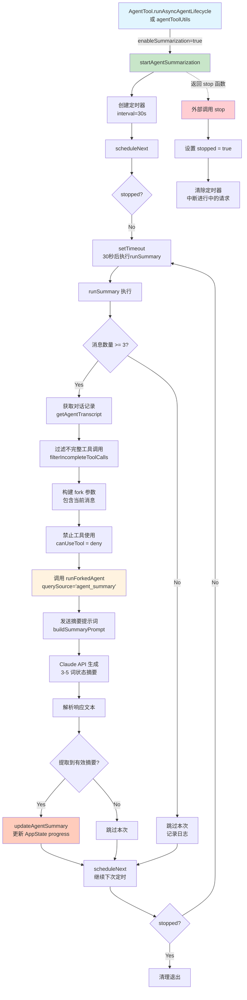

# AgentSummary 模块分析

## 概述

`agentSummary.ts` 是 Claude Code 中用于**后台 Agent 周期性状态摘要**的模块。它每 30 秒 fork 一个子 Agent 来生成当前任务的简短状态摘要（3-5 个词），供 UI 显示。

---

## 文件位置

- **主模块**: `src/services/AgentSummary/agentSummary.ts`
- **状态更新**: `src/tasks/LocalAgentTask/LocalAgentTask.tsx`
- **调用入口**: `src/tools/AgentTool/AgentTool.tsx`, `src/tools/AgentTool/agentToolUtils.ts`

---

## 核心功能

### 1. 定时摘要生成

```typescript
const SUMMARY_INTERVAL_MS = 30_000  // 每 30 秒执行一次
```

### 2. 主要导出函数

```typescript
export function startAgentSummarization(
  taskId: string,
  agentId: AgentId,
  cacheSafeParams: CacheSafeParams,
  setAppState: TaskContext['setAppState'],
): { stop: () => void }
```

**参数说明**:
- `taskId`: 任务唯一标识
- `agentId`: Agent 唯一标识
- `cacheSafeParams`: 缓存安全参数（用于共享 prompt cache）
- `setAppState`: 用于更新 UI 状态的函数

**返回值**: 包含 `stop` 函数的对象，用于停止摘要生成

---

## 调用链

```
AgentTool.tsx 或 agentToolUtils.ts
    ↓
runAsyncAgentLifecycle()
    ↓
enableSummarization ? startAgentSummarization() : skip
    ↓
每 30s 执行 runSummary()
    ↓
runForkedAgent() → Claude API
    ↓
updateAgentSummary() → 更新 UI progress
```

---

## 执行流程 Mermaid 图



---

## 关键实现细节

### 1. 提示词构建 (buildSummaryPrompt)

```typescript
function buildSummaryPrompt(previousSummary: string | null): string {
  return `Describe your most recent action in 3-5 words using present tense (-ing).
Name the file or function, not the branch. Do not use tools.

Good: "Reading runAgent.ts"
Good: "Fixing null check in validate.ts"
Bad (past tense): "Analyzed the branch diff"
Bad (too vague): "Investigating the issue"`
}
```

### 2. 工具禁用策略

为了不破坏 prompt cache，**不通过传递空工具列表来禁用工具**，而是使用回调函数：

```typescript
const canUseTool = async () => ({
  behavior: 'deny' as const,
  message: 'No tools needed for summary',
  decisionReason: { type: 'other' as const, reason: 'summary only' },
})
```

### 3. Cache 共享机制

- 使用与父 Agent 相同的 `CacheSafeParams`
- 共享 system prompt、tools、model 等参数
- 确保 prompt cache 命中，降低成本

---

## 状态存储

摘要结果存储在 `LocalAgentTask` 的 `progress` 对象中：

```typescript
// LocalAgentTask.tsx
export interface LocalAgentTaskProgress {
  tokenCount: number
  toolUseCount: number
  summary?: string        // ← AgentSummary 生成的摘要
  lastActivity?: AgentActivity
}
```

更新函数 `updateAgentSummary` 会将摘要写入 AppState，UI 组件可订阅该状态显示实时进度。

---

## 使用场景

1. **后台 Agent 任务**: 当 Agent 以异步/后台模式运行时，显示当前正在做什么
2. **UI 进度展示**: 在任务列表或进度条中显示 "Reading config.ts" 等简短状态
3. **长任务监控**: 帮助用户了解耗时较长的 Agent 任务的实时进展

---

## 注意事项

1. **最小消息数**: 需要至少 3 条消息才会生成摘要（避免过早生成无意义摘要）
2. **错误处理**: API 错误消息会被跳过，不会作为摘要存储
3. **防重叠**: 在摘要生成完成（finally 块）后才安排下一次定时，防止重叠执行
4. **清理**: 任务完成或中止时必须调用 `stop()` 清理定时器和中止进行中的请求
