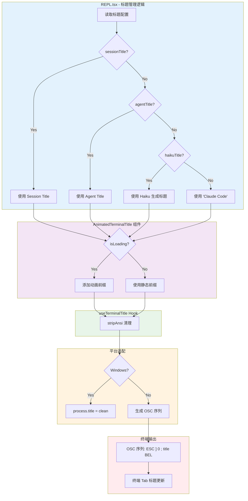

# Terminal Title（终端标题）实现分析

## 概述

Claude Code 的终端 tab 标题是动态设置的，支持以下几种标题来源（按优先级排序）：

1. **Session Title** - 用户通过 `/rename` 命令设置的自定义标题
2. **Agent Title** - 当前运行的 Agent 类型名称（如 "researcher", "coder"）
3. **Haiku Title** - 由 Haiku 模型从对话内容自动生成的主题标题
4. **默认标题** - "Claude Code"

---

## 核心实现

### 1. Hook: useTerminalTitle

**文件**: `src/ink/hooks/use-terminal-title.ts`

```typescript
export function useTerminalTitle(title: string | null): void {
  const writeRaw = useContext(TerminalWriteContext)

  useEffect(() => {
    if (title === null || !writeRaw) return

    const clean = stripAnsi(title)  // 去除 ANSI 转义序列

    if (process.platform === 'win32') {
      process.title = clean  // Windows 直接使用 process.title
    } else {
      writeRaw(osc(OSC.SET_TITLE_AND_ICON, clean))  // 其他平台使用 OSC 序列
    }
  }, [title, writeRaw])
}
```

**实现原理**:
- **Windows**: 使用 `process.title` 直接设置（经典 conhost 不支持 OSC）
- **Unix/macOS**: 写入 **OSC 0** 序列 (`ESC ] 0 ; title BEL`) 到 stdout

---

### 2. OSC 序列生成

**文件**: `src/ink/termio/osc.ts`

```typescript
export const OSC_PREFIX = ESC + String.fromCharCode(ESC_TYPE.OSC)  // ESC ]

export function osc(...parts: (string | number)[]): string {
  const terminator = env.terminal === 'kitty' ? ST : BEL
  return `${OSC_PREFIX}${parts.join(SEP)}${terminator}`
}

// 示例: osc(OSC.SET_TITLE_AND_ICON, "My Title")
// 输出: ESC ] 0 ; My Title BEL
```

**OSC (Operating System Command)** 是终端控制序列，用于与终端模拟器通信：
- `OSC 0` - 设置窗口标题和图标名称
- `OSC 2` - 仅设置窗口标题

---

### 3. 标题优先级与动画

**文件**: `src/screens/REPL.tsx:1124-1144`

```typescript
// -- Terminal title management
const terminalTitleFromRename = useAppState(s => s.settings.terminalTitleFromRename) !== false;
const sessionTitle = terminalTitleFromRename ? getCurrentSessionTitle(getSessionId()) : undefined;
const [haikuTitle, setHaikuTitle] = useState<string>();
const agentTitle = mainThreadAgentDefinition?.agentType;

// 优先级: sessionTitle > agentTitle > haikuTitle > 默认
const terminalTitle = sessionTitle ?? agentTitle ?? haikuTitle ?? 'Claude Code';
```

---

## 调用流程 Mermaid 图



---

## 动画效果

当 Claude 正在处理请求时（`isLoading=true`），标题会显示旋转动画前缀：

```typescript
const TITLE_ANIMATION_FRAMES = ['◐', '◓', '◑', '◒']  // 每 960ms 切换
const TITLE_STATIC_PREFIX = '◉'

// 示例:
// 处理中: "◐ Reading code..."
// 完成:   "◉ Reading code..."
```

**文件**: `src/screens/REPL.tsx:485-520`

```typescript
function AnimatedTerminalTitle({ isAnimating, title, disabled, noPrefix }) {
  const [frame, setFrame] = useState(0);

  useEffect(() => {
    if (disabled || noPrefix || !isAnimating) return;
    const interval = setInterval(() => {
      setFrame(f => (f + 1) % TITLE_ANIMATION_FRAMES.length);
    }, TITLE_ANIMATION_INTERVAL_MS);  // 960ms
    return () => clearInterval(interval);
  }, [disabled, noPrefix, isAnimating]);

  const prefix = isAnimating ? TITLE_ANIMATION_FRAMES[frame] : TITLE_STATIC_PREFIX;
  useTerminalTitle(disabled ? null : `${prefix} ${title}`);
  return null;
}
```

---

## 标题来源详解

### 1. Session Title (/rename)

用户可通过 `/rename <title>` 命令自定义会话标题，存储在 session metadata 中。

```typescript
const sessionTitle = getCurrentSessionTitle(getSessionId());
```

### 2. Agent Title

当使用 Agent Tool 运行子 Agent 时，显示 Agent 类型名称：

```typescript
const agentTitle = mainThreadAgentDefinition?.agentType;
// 可能值: "general-purpose", "researcher", "coder" 等
```

### 3. Haiku Title（自动生成）

当没有自定义标题且没有 Agent 时，调用 Haiku 模型从对话中提取主题：

```typescript
// REPL.tsx:2688
if (!titleDisabled && !sessionTitle && !agentTitle && !haikuTitleAttemptedRef.current) {
  // 调用 Haiku 生成标题
  generateHaikuTitle(messages).then(setHaikuTitle);
  haikuTitleAttemptedRef.current = true;
}
```

---

## 环境变量控制

```bash
# 禁用终端标题更新（保持终端默认行为）
export CLAUDE_CODE_DISABLE_TERMINAL_TITLE=1
```

代码中检查：
```typescript
const titleDisabled = isEnvTruthy(process.env.CLAUDE_CODE_DISABLE_TERMINAL_TITLE);
```

---

## 清理机制

会话结束时清理标题：

**文件**: `src/utils/gracefulShutdown.ts:122-129`

```typescript
if (!isEnvTruthy(process.env.CLAUDE_CODE_DISABLE_TERMINAL_TITLE)) {
  if (process.platform === 'win32') {
    process.title = ''
  } else {
    writeSync(1, CLEAR_TERMINAL_TITLE)  // ESC ] 0 ; BEL
  }
}
```

---

## 总结

| 组件 | 文件路径 | 职责 |
|------|----------|------|
| `useTerminalTitle` | `src/ink/hooks/use-terminal-title.ts` | 核心 hook，跨平台设置标题 |
| `osc` | `src/ink/termio/osc.ts` | 生成 OSC 转义序列 |
| `AnimatedTerminalTitle` | `src/screens/REPL.tsx:485` | 动画前缀效果 |
| 标题优先级逻辑 | `src/screens/REPL.tsx:1124` | 决定使用哪个标题源 |
