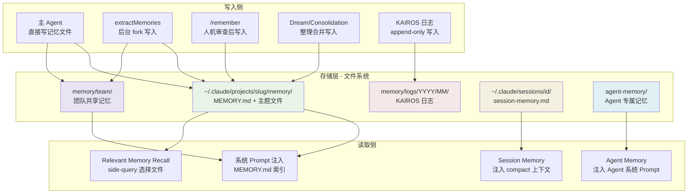

# 15. 记忆系统——8 层子系统全景

## 概述

Claude Code 的记忆系统是一个精心设计但并不显眼的工程体系。代码里没有一个叫"MemoryManager"的统一管理器，也没有一个"7 层架构"的类继承树。实际上，它由 **8 个独立子系统**协同工作，每个子系统有自己的职责边界、数据流向和生命周期：

| # | 子系统 | 核心文件 | 一句话定位 |
|---|--------|----------|------------|
| 1 | Durable Memory (自动记忆) | `memdir/memdir.ts`, `memdir/paths.ts`, `memdir/memoryTypes.ts` | 跨会话持久化的四类记忆，文件系统即数据库 |
| 2 | Team Memory | `memdir/teamMemPaths.ts`, `memdir/teamMemPrompts.ts`, `services/teamMemorySync/` | 多人共享的团队记忆，带秘钥扫描和同步 |
| 3 | Relevant Memory Recall | `memdir/findRelevantMemories.ts`, `memdir/memoryScan.ts` | 异步预取，用 side-query 让 Sonnet 选取最相关记忆 |
| 4 | KAIROS 模式 | `memdir/memdir.ts` (buildAssistantDailyLogPrompt) | 长会话 append-only 日志，每日一文件 |
| 5 | Session Memory | `services/SessionMemory/sessionMemory.ts`, `services/SessionMemory/prompts.ts` | 会话内续航笔记，不是长期记忆 |
| 6 | extractMemories | `services/extractMemories/extractMemories.ts`, `services/extractMemories/prompts.ts` | 会话结束时的后台记忆提取 fork |
| 7 | Agent Memory | `tools/AgentTool/agentMemory.ts` | Agent 专属的 user/project/local 三层记忆 |
| 8 | /remember 命令 | `skills/bundled/remember.ts` | 人机交互式记忆审查与归档 |

另有一个跨子系统的后台维护流程：**Dream/Consolidation**（`services/autoDream/`），负责周期性整理与合并记忆。

这些子系统之间没有继承关系，而是通过共享的 `memdir/` 基础层（路径计算、文件格式、类型定义）和 `forkedAgent` 执行模式产生协作。理解记忆系统的关键是把它当成一个联邦，而不是一棵树。



---

## 1. Durable Memory —— 四类记忆与索引机制

### 1.1 四类记忆类型

Durable Memory 是整个记忆系统的核心，定义在 `memdir/memoryTypes.ts`。它采用一个封闭的四类分类法：

```typescript
export const MEMORY_TYPES = ['user', 'feedback', 'project', 'reference'] as const
```

每种类型有明确的职责边界：

- **user**：用户画像——角色、目标、知识背景、偏好。目的是让不同会话的 Claude 都能"认识"同一个人。scope 永远是 private，永远不进团队记忆。
- **feedback**：行为校正——用户纠正的工作方式和已验证的好做法。这是最重要的记忆类型之一，因为它让 Claude 不会重复犯错。同时要求记录 *Why*（为什么这样做）和 *How to apply*（什么时候触发），而不只是记一条规则。
- **project**：项目上下文——正在进行的工作、截止日期、决策背景等不能从代码推导出来的信息。特别要求把相对日期转换为绝对日期（"下周四" -> "2026-03-05"），否则过几天记忆就没意义了。
- **reference**：外部指针——Linear 项目、Grafana 面板、Slack 频道等外部系统的位置和用途。

### 1.2 显式排除列表

`WHAT_NOT_TO_SAVE_SECTION` 定义了一个严格的排除规则，即使用户明确要求也不保存：

- 代码模式、架构、文件路径、项目结构 —— 能通过 grep/git/CLAUDE.md 推导出来的一切
- Git 历史、最近变更、谁改了什么 —— git log / git blame 才是权威来源
- 调试方案和修复配方 —— 修复在代码里，上下文在 commit message 里
- CLAUDE.md 中已有的任何内容
- 临时任务细节

这个排除列表的设计哲学很清晰：**记忆系统只存储"不可推导"的信息**。如果一个事实可以从当前项目状态推导出来，它就不应该成为记忆，因为记忆会过时但代码不会（至少代码是当前的权威来源）。

### 1.3 MEMORY.md 索引机制

每个记忆目录有一个 `MEMORY.md` 作为索引文件。索引的设计遵循几个约束：

- **不是记忆本身**：索引只包含指针（`- [Title](file.md) — 一行描述`），不包含记忆内容
- **行数上限 200**：超过 200 行会被截断，因为整个索引在每次会话启动时注入系统 prompt
- **字节上限 25KB**：防止少数超长行绕过行数限制（实际观测到过 197KB 且不到 200 行的情况）
- **每条记忆是独立 .md 文件**：使用 frontmatter 格式，包含 name、description、type 字段

```markdown
---
name: memory name
description: one-line description
type: user | feedback | project | reference
---

memory content
```

### 1.4 路径计算

记忆目录的路径计算在 `memdir/paths.ts`，解析优先级为：

1. `CLAUDE_COWORK_MEMORY_PATH_OVERRIDE` 环境变量（Cowork 场景的完整路径覆盖）
2. `settings.json` 中的 `autoMemoryDirectory`（仅信任 policy/local/user 来源，**不信任 projectSettings**——防止恶意仓库通过 `.claude/settings.json` 把记忆目录指向 `~/.ssh`）
3. 默认路径：`~/.claude/projects/<sanitized-git-root>/memory/`

路径验证包含完整的安全检查：拒绝相对路径、根路径、Windows 驱动器根、UNC 路径、null 字节，并且要求 NFC 规范化。所有 worktree 共享同一个记忆目录（通过 `findCanonicalGitRoot` 找到 canonical git root）。

---

## 2. Team Memory —— 共享记忆与安全守卫

### 2.1 Scope 维度

Team Memory 引入了 private 与 shared-team 两个 scope 维度。在 `memdir/teamMemPrompts.ts` 的 `buildCombinedMemoryPrompt` 中，系统会同时展示两个目录：

- **private**：`~/.claude/projects/<slug>/memory/` —— 个人记忆，只对当前用户可见
- **team**：`~/.claude/projects/<slug>/memory/team/` —— 团队共享记忆，所有贡献者可见

每种记忆类型都有 `<scope>` 标签指导放置策略：
- user 永远 private
- feedback 默认 private，只有明确是项目级约定时才放 team
- project 偏向 team（"strongly bias toward team"）
- reference 通常 team

### 2.2 敏感信息禁令

Team Memory 有一条额外的硬约束，在多处重复出现：

> You MUST avoid saving sensitive data within shared team memories. For example, never save API keys or user credentials.

这不只是 prompt 层面的约束。`services/teamMemorySync/secretScanner.ts` 实现了一个客户端侧的秘钥扫描器，在内容上传前检测 30+ 种高置信度的凭证模式（AWS access key、GitHub PAT、Anthropic API key、Stripe token、SSH private key 等），使用的规则来自 gitleaks 项目。扫描发现秘钥时不只是警告——会触发 `redactSecrets()` 进行就地脱敏。

### 2.3 路径安全

Team Memory 的路径验证比普通记忆更严格（`memdir/teamMemPaths.ts`）：

- 双重验证：先 `path.resolve()` 做字符串级别的 `..` 消除，再 `realpath()` 解析符号链接
- 防 dangling symlink 攻击：`lstat()` 区分真正不存在的路径和悬空符号链接
- 防 symlink loop：捕获 `ELOOP` 错误
- 防 Unicode normalization 攻击：检测 NFKC 规范化后可能产生的 `../` 序列
- 防 URL 编码遍历：检测 `%2e%2e%2f` 等编码形式

---

## 3. Relevant Memory Recall —— 异步预取与精确度优先

### 3.1 整体流程

当用户提交查询时，`memdir/findRelevantMemories.ts` 中的 `findRelevantMemories()` 会作为异步 side-query 执行记忆检索：

1. **扫描**：`scanMemoryFiles()` 递归读取记忆目录中所有 `.md` 文件（排除 MEMORY.md），提取 frontmatter 中的 description 和 type，按修改时间倒序排列，上限 200 个文件
2. **筛选**：用 `formatMemoryManifest()` 将文件列表格式化为清单（包含 type 标签、文件名、时间戳、描述）
3. **选择**：通过 `sideQuery()` 调用 Sonnet 模型，让它从清单中选择最多 5 个与当前查询相关的记忆文件
4. **返回**：返回选中文件的绝对路径和 mtime，由调用者注入对话上下文

### 3.2 精确度优先的设计

选择器的 system prompt 明确要求"be selective and discerning"——只选确定有用的记忆，不确定就不选。还有一个巧妙的细节：如果最近使用了某些工具（比如 `mcp__X__spawn`），选择器会跳过这些工具的 API 参考文档（因为对话中已经有了工作用法），但仍然会选择包含"warnings, gotchas, or known issues"的记忆。

另外还有一个 `alreadySurfaced` 过滤：已经在之前的 turn 中展示过的记忆不会再被选择，避免浪费 5 个 slot。

### 3.3 side-query 的使用

side-query 模式意味着这个 Sonnet 调用独立于主对话流，不阻塞用户交互，返回的是结构化 JSON（`json_schema` output format）：

```typescript
output_format: {
  type: 'json_schema',
  schema: {
    type: 'object',
    properties: {
      selected_memories: { type: 'array', items: { type: 'string' } }
    },
    required: ['selected_memories'],
    additionalProperties: false
  }
}
```

max_tokens 只有 256——因为只需要返回文件名列表，不需要任何解释。

---

## 4. KAIROS 模式 —— Append-Only 日志

### 4.1 设计动机

KAIROS 模式（`feature('KAIROS')`）面向长会话场景（比如 assistant 模式下的常驻会话）。在这种场景下，传统的 MEMORY.md 索引维护方式不适用——会话可能持续数天，频繁修改索引文件会很低效。

### 4.2 日志结构

KAIROS 采用纯 append-only 的日志方式，每天一个文件：

```
memory/logs/YYYY/MM/YYYY-MM-DD.md
```

Agent 在工作过程中把值得记住的事情以时间戳条目的形式追加到当日日志文件中。日志文件只追加不修改——不需要维护 MEMORY.md 索引，因为有一个独立的 nightly `/dream` 流程负责把日志蒸馏成主题文件和 MEMORY.md。

### 4.3 与 TEAMMEM 不兼容

`loadMemoryPrompt()` 中有明确的优先级注释：

> KAIROS daily-log mode takes precedence over TEAMMEM: the append-only log paradigm does not compose with team sync (which expects a shared MEMORY.md that both sides read + write).

这是一个有意识的设计决策：append-only 的日志模式与 team memory 的双向同步模型从根本上冲突。如果同时启用，KAIROS 会赢，team memory 被跳过。

### 4.4 Prompt 的缓存考量

`buildAssistantDailyLogPrompt()` 有一个很有意思的细节：它输出的是路径**模式**（`logs/YYYY/MM/YYYY-MM-DD.md`）而不是当天的实际路径。原因是这段 prompt 通过 `systemPromptSection('memory', ...)` 缓存，不会在日期变更时失效。模型从 `date_change` attachment（在午夜翻转时追加）获取当前日期，而不是从用户上下文消息获取——后者故意保持过时以保留 prompt 缓存前缀。

---

## 5. Session Memory —— 会话续航笔记

### 5.1 定位：不是长期记忆

Session Memory（`services/SessionMemory/`）和前面所有子系统有一个根本区别：**它不是跨会话的长期记忆，而是当前会话的结构化笔记**。它的核心用途是在 autocompact（上下文压缩）之后保留关键上下文，让压缩后的对话不会丢失重要信息。

### 5.2 结构化模板

Session Memory 使用固定的 Markdown 模板（`services/SessionMemory/prompts.ts`）：

```markdown
# Session Title
_A short and distinctive 5-10 word descriptive title for the session_

# Current State
_What is actively being worked on right now?_

# Task specification
_What did the user ask to build?_

# Files and Functions
_What are the important files?_

# Workflow
_What bash commands are usually run and in what order?_

# Errors & Corrections
_Errors encountered and how they were fixed_

# Codebase and System Documentation
_What are the important system components?_

# Learnings
_What has worked well? What has not?_

# Key results
_If the user asked a specific output, repeat the exact result here_

# Worklog
_Step by step, what was attempted, done?_
```

这个模板不能被修改——更新 prompt 明确要求"NEVER modify, delete, or add section headers"。斜体描述行也不能动，它们是永久的模板指令。只有每个 section 的实际内容可以更新。

### 5.3 触发条件与阈值

Session Memory 的更新由 post-sampling hook 驱动，触发条件有两个维度：

- **token 阈值**：上下文窗口 token 数增长到一定程度（`minimumMessageTokensToInit` 用于首次触发，`minimumTokensBetweenUpdate` 用于后续更新）
- **tool call 阈值**：自上次更新以来至少有 N 次 tool call（`toolCallsBetweenUpdates`）

提取策略是：当两个阈值都满足时触发，或者当 token 阈值满足且最后一个 assistant turn 没有 tool call 时也触发（利用对话的自然断点）。

### 5.4 Autocompact 快速路径

Session Memory 与 autocompact 紧密集成。`truncateSessionMemoryForCompact()` 会在注入 compact 消息前截断过长的 section（每 section 最多 ~2000 token / ~8000 字符），总量上限 12000 token。这确保 session memory 不会吃掉整个压缩后的 token 预算。

更新使用 forked agent（`runForkedAgent`），只允许使用 `FileEditTool` 且只能编辑特定的 session memory 文件——权限通过 `createMemoryFileCanUseTool()` 精确控制。

---

## 6. extractMemories —— 受约束的后台 Fork

### 6.1 运行时机

`extractMemories`（`services/extractMemories/extractMemories.ts`）在每次完整的 query loop 结束时（模型产生无 tool call 的最终响应时）由 `handleStopHooks` 触发。它是 fire-and-forget 的——不阻塞用户交互。

### 6.2 与主 Agent 的互斥

extractMemories 和主 Agent 之间存在一个精妙的互斥机制：

- 主 Agent 的 system prompt 始终包含完整的记忆保存指令
- 如果主 Agent 在某个 turn 中直接写了记忆文件（`hasMemoryWritesSince()` 检测 Write/Edit tool_use 目标路径是否在 auto-memory 目录内），extractMemories 跳过这个范围并推进游标
- 只有主 Agent 没写时，extractMemories 才会启动 fork 提取

这意味着主 Agent 和后台 Agent 对同一段对话内容是**互斥的**，不会产生重复记忆。

### 6.3 受约束的 Fork

extractMemories 使用 `runForkedAgent()`——一个完美 fork，共享主对话的 prompt cache。但它的工具权限被严格限制（`createAutoMemCanUseTool()`）：

- 允许：`FileRead`、`Grep`、`Glob`（纯只读）
- 允许：只读 `Bash` 命令（ls、find、grep、cat、stat、wc、head、tail 等，通过 `tool.isReadOnly()` 验证）
- 允许：`FileEdit`、`FileWrite` 但**仅限** auto-memory 目录内的路径
- 拒绝：其他一切（MCP、Agent、写入型 Bash 等）

### 6.4 通过索引防重复

extractMemories 在启动前会用 `scanMemoryFiles()` + `formatMemoryManifest()` 构建现有记忆清单，预注入到提取 prompt 中：

```
## Existing memory files

- [user] user_role.md (2026-03-01T10:00:00.000Z): Senior backend engineer
- [feedback] testing_policy.md (2026-03-02T15:00:00.000Z): Always use real DB
...

Check this list before writing - update an existing file rather than creating a duplicate.
```

这比让 fork agent 自己 `ls` 更高效（节省一个 turn），也确保了去重。

### 6.5 Turn 预算

Fork 有硬性的 `maxTurns: 5` 上限。设计预期是 2-4 个 turn（read -> write），5 是防止验证型兔子洞的安全网。还有一个频率节流器（`tengu_bramble_lintel`，默认每 1 个合格 turn 执行一次），防止过于频繁的提取。

---

## 7. Agent Memory —— 三层作用域

### 7.1 三种 Scope

Agent Memory（`tools/AgentTool/agentMemory.ts`）为每个 Agent 类型提供独立的持久记忆，有三种 scope：

| Scope | 路径 | 用途 |
|-------|------|------|
| **user** | `~/.claude/agent-memory/<agentType>/` | 跨项目的通用学习，所有项目共享 |
| **project** | `<cwd>/.claude/agent-memory/<agentType>/` | 特定项目的学习，通过版本控制与团队共享 |
| **local** | `<cwd>/.claude/agent-memory-local/<agentType>/` | 特定项目+机器的学习，不进版本控制 |

每种 scope 都有对应的 prompt 注入提示，指导 Agent 如何适配：
- user scope：保持通用性，因为适用于所有项目
- project scope：针对当前项目定制，因为与团队共享
- local scope：针对当前项目和机器定制，不进版本控制

### 7.2 共享基础设施

Agent Memory 复用了 Durable Memory 的全部基础设施——同样的 `buildMemoryPrompt()`、同样的 frontmatter 格式、同样的 MEMORY.md 索引。唯一的区别是 `skipIndex` 参数和目录路径不同。`ensureMemoryDirExists()` 在 agent spawn 时 fire-and-forget 执行，不阻塞同步的 prompt 构建。

### 7.3 路径检测

`isAgentMemoryPath()` 需要检查三种 scope 下的所有可能路径，包括 `CLAUDE_CODE_REMOTE_MEMORY_DIR` 覆盖的情况。这个函数被权限系统使用，用于决定文件写入是否应该被自动允许。

---

## 8. /remember 命令 —— 人机交互审查器

### 8.1 设计理念

`/remember`（`skills/bundled/remember.ts`）不是一个自动化工具，而是一个**人机交互式审查流程**。它的核心理念是：记忆应该被主动组织和归档，而不是任其在 auto-memory 中无序堆积。

### 8.2 审查流程

`/remember` 执行四个步骤：

1. **收集所有记忆层**：读取 CLAUDE.md、CLAUDE.local.md、auto-memory 内容、team memory
2. **分类每个 auto-memory 条目**，判断最佳归属：
   - `CLAUDE.md`：所有贡献者都应遵循的项目约定（"用 bun 不用 npm"）
   - `CLAUDE.local.md`：当前用户的个人指令（"我喜欢简洁的回复"）
   - Team memory：跨仓库的组织知识
   - 留在 auto-memory：工作笔记或不确定的条目
3. **识别清理机会**：跨层去重、过时条目更新、矛盾解决
4. **生成报告**：分组展示 Promotions / Cleanup / Ambiguous / No action needed

关键规则是：**先展示所有提案，不做任何修改，等用户逐条审批**。这是一个审查器，不是自动归档器。

### 8.3 当前限制

`/remember` 目前只对 `USER_TYPE === 'ant'`（Anthropic 内部用户）开放。它需要 auto-memory 已启用（`isAutoMemoryEnabled()` 检查）。

---

## 9. Dream/Consolidation —— 四步整理流程

### 9.1 触发条件

Dream/Consolidation（`services/autoDream/autoDream.ts`）是一个后台维护流程，不由用户触发，而是在满足以下条件时自动启动：

1. **时间门控**：距上次整理至少 N 小时（默认 24h，通过 `tengu_onyx_plover` 配置）
2. **会话门控**：自上次整理以来至少有 N 个会话（默认 5，排除当前会话）
3. **锁门控**：没有其他进程正在整理（通过文件锁实现，支持回滚）

检查顺序经过优化（最廉价的先检查）：时间 -> 扫描节流（10 分钟内不重复扫描）-> 会话计数 -> 锁。

### 9.2 四步流程

Dream 的 prompt（`services/autoDream/consolidationPrompt.ts`）定义了四个阶段：

**Phase 1 -- Orient（定位）**
- `ls` 记忆目录，看已有什么
- 读 MEMORY.md，理解当前索引
- 浏览现有主题文件，避免创建重复

**Phase 2 -- Gather recent signal（收集近期信号）**
- 优先看 daily logs（如果是 KAIROS 模式的 assistant 布局）
- 检查已有记忆是否与当前代码库矛盾（drift 检测）
- 必要时窄范围搜索会话 transcript（最后手段，因为 JSONL 文件很大）

**Phase 3 -- Consolidate（合并整理）**
- 合并新信号到已有主题文件，而不是创建近似重复
- 相对日期转绝对日期
- 删除已被推翻的旧事实

**Phase 4 -- Prune and index（修剪与索引）**
- MEMORY.md 保持 200 行以内、25KB 以内
- 移除过时指针
- 压缩过长条目（超过 ~200 字符的索引行应该把细节移到主题文件）
- 解决矛盾

### 9.3 工具约束

Dream fork 使用与 extractMemories 相同的 `createAutoMemCanUseTool()`——只读 shell + 只写 memory 目录。它的进度通过 `DreamTask` 注册到 UI 的后台任务面板，用户可以在 bg-tasks dialog 中查看进度甚至 kill。

### 9.4 与 KAIROS 的关系

Dream 在非 KAIROS 模式下自动触发。在 KAIROS 模式下（`getKairosActive()` 为 true），autoDream 的 `isGateOpen()` 直接返回 false——因为 KAIROS 有自己的 nightly `/dream` skill 来做日志蒸馏。这两条路径不会同时活跃。

---

## 子系统间的关键交互

理解了每个子系统后，值得关注它们之间的几个关键交互模式：

**1. extractMemories 与主 Agent 的互斥**：主 Agent 写了记忆则 extractMemories 跳过。这通过 `hasMemoryWritesSince()` 检测 tool_use 块中的文件路径实现。

**2. Session Memory 与 Autocompact 的协作**：Session Memory 的主要消费者不是用户而是 compact 系统。压缩对话时，session memory 提供了一个结构化的"已知事实"快照，让压缩后的上下文不丢失关键信息。

**3. MEMORY.md 索引作为共享锚点**：MEMORY.md 同时被注入系统 prompt（静态）、被 Relevant Memory Recall 读取（动态）、被 Dream 维护（后台）。它是多个子系统的共享锚点。

**4. forkedAgent 作为共享执行模式**：extractMemories、Session Memory、Dream 都使用 `runForkedAgent()`。这不只是代码复用——fork 共享主对话的 prompt cache，显著降低了后台提取的 API 成本（cache hit rate 通常很高）。

**5. Team Memory 的安全隔离**：Team Memory 有自己的路径验证（symlink 解析）、内容验证（秘钥扫描）和 scope 路由（per-type `<scope>` 标签），形成了一个独立的安全边界。
