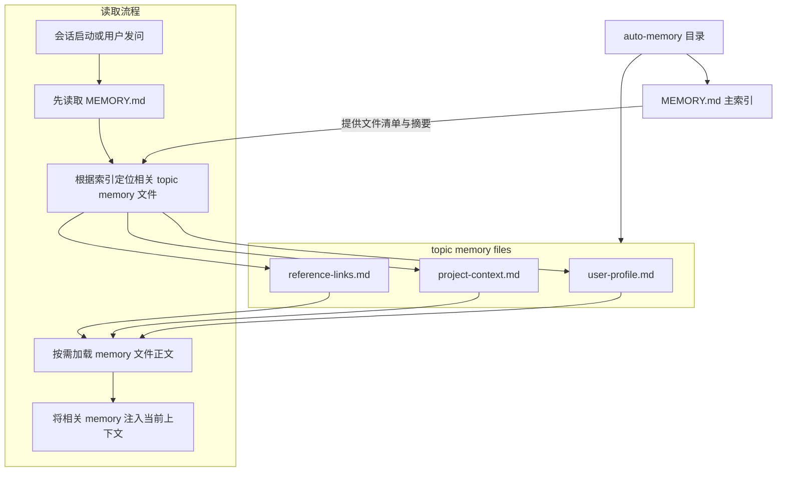
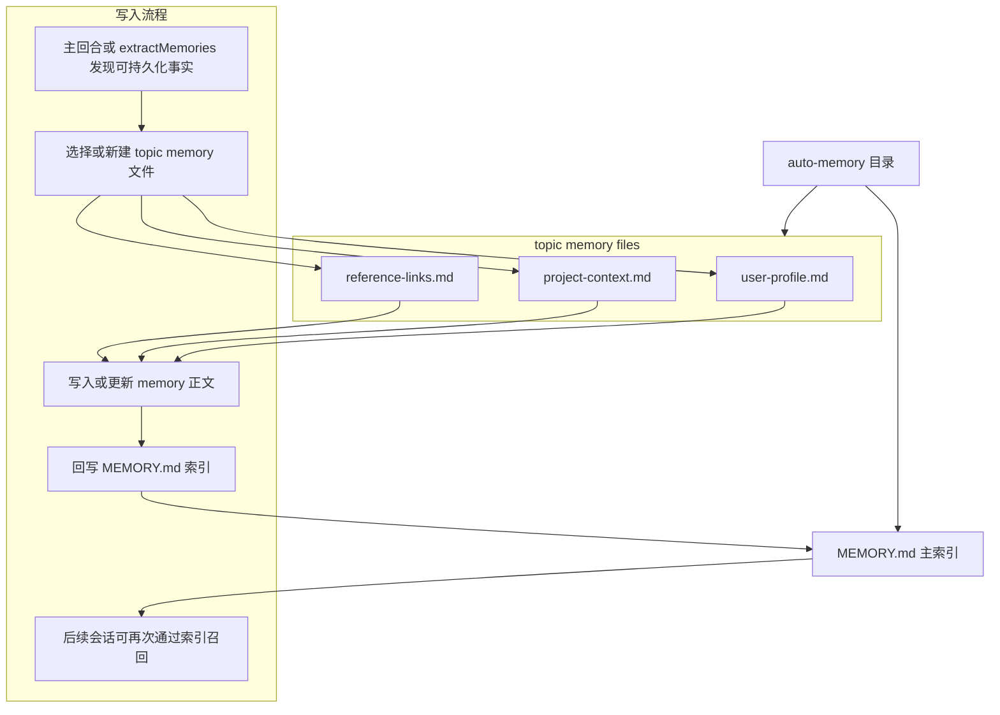
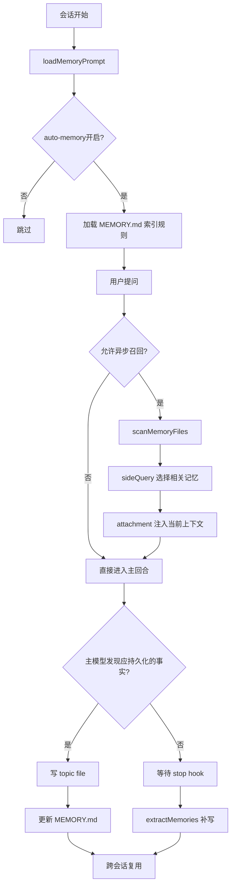

# auto-memory 详细分析

## 1. 定位

`auto-memory` 是 Claude Code 的主长期记忆子系统。它不是外挂服务，而是由 `src/memdir/memdir.ts` 生成规则后，直接进入主 system prompt 的一部分。其职责是保存未来会话仍然有价值、但不能从当前代码仓直接推导出的事实。

关键源码锚点：

- `src/memdir/memdir.ts`
- `src/memdir/paths.ts`
- `src/memdir/memoryTypes.ts`
- `src/memdir/findRelevantMemories.ts`
- `src/utils/attachments.ts`

## 2. 存取、触发时机、生命周期策略

### 2.1 存储

- 入口目录：`getAutoMemPath()`
- 索引文件：`MEMORY.md`
- 内容文件：按 topic 拆分的独立 markdown 文件
- 元信息：frontmatter 中至少包含 `name`、`description`、`type`





### 2.2 读取

- 会话启动时，可能读取 `MEMORY.md` 作为索引入口
- 查询过程中，可能通过 `findRelevantMemories()` 动态挑选相关 topic files
- 注入方式不是全量常驻，而是 attachment 形式的按需召回

### 2.3 写入触发

- 主回合中，模型判断“当前事实值得跨会话保留”时直接写入
- 若主回合未写，stop hook 后可能由 `extractMemories` 异步补写
- 非 KAIROS 模式下，topic file 与 `MEMORY.md` 都可被更新

### 2.4 生命周期

- 生命周期是跨会话、跨任务的 durable memory
- 支持更新、去重、删除、索引裁剪
- 使用前需验证，避免旧记忆污染当前判断
- 用户要求忽略 memory 时，逻辑上应视为“索引为空”

## 3. 执行伪代码

```text
onSessionStart():
  if autoMemoryEnabled:
    loadMemoryPrompt()
    maybeInjectMemoryIndex()

onUserQuery(query):
  if relevantMemoryPrefetchAllowed(query):
    manifest = scanMemoryFiles(limit=200, headerLines=30)
    selected = sideQuerySelectRelevantMemories(query, manifest, max=5)
    attach(selected, byteBudget=60KB)

onConversationTurn():
  if modelFindsDurableFact():
    writeTopicFile()
    updateMemoryIndex()

onTurnStop():
  if mainAgentDidNotWriteMemory():
    triggerExtractMemories()
```

## 4. 详细代码流程分析

### 4.1 prompt 装载

- `loadMemoryPrompt()` 先判断 auto-memory 开关。
- 若开启，则把“记什么、怎么写、何时读”的约束装入主系统提示。
- 这意味着 memory policy 不是后处理规则，而是主推理链路的一部分。

### 4.2 目录与索引设计

- `getAutoMemPath()` 解析实际 memory 目录。
- `MEMORY.md` 只承担索引职责，不承载完整事实正文。
- topic 文件按语义拆分，避免把全部长期知识堆进一个大文件。

### 4.3 相关性召回

- `scanMemoryFiles()` 最多扫描 200 个 memory 文件，并排除 `MEMORY.md`。
- 每个文件只读取前 30 行 frontmatter，形成轻量 manifest。
- `selectRelevantMemories()` 用 `sideQuery(...)` 调 Sonnet 旁路选择器，只返回 `selected_memories: string[]`。
- `attachments.ts` 再做大小限制、去重和 surfacing 控制。

### 4.4 写入约束

- `memoryTypes.ts` 将长期记忆限制为 `user`、`feedback`、`project`、`reference` 四类。
- prompt 明确禁止把代码结构、路径、git 变更、临时 debug recipe、当前任务状态写进 memory。
- 这使 auto-memory 更像“未来仍然成立的非代码事实库”，而不是第二份项目文档。

## 5. Mermaid 流程图



## 6. 对车机智能语音座舱的借鉴意义

- 应把长期记忆限定为“用户偏好、设备关系、稳定场景事实、外部账号入口”，不能把临时对话垃圾都持久化。
- 记忆应以“索引 + 专题卡片”方式组织，而不是把所有用户历史堆成单文档。
- 检索必须精确优先，宁可少召回，也不要把不相关偏好注入当前语音回合。
- 记忆使用前应校验新鲜度，例如座椅偏好、常去地点、媒体账号都可能过时。

## 7. 面向车机语音记忆系统的设计建议

### 7.1 分层设计

- `Redis`：热记忆层，保存最近高频用户偏好、近期上下文、召回缓存，目标是毫秒级访问。
- `ES`：结构化检索层，保存事件索引、按时间/设备/技能的可过滤记忆。
- `Milvus`：语义召回层，保存用户习惯、场景片段、语义摘要 embedding。

### 7.2 读路径

1. ASR/NLU 得到意图后先查 `Redis` 热槽位。
2. 若热槽位未命中，再去 `ES` 做过滤检索。
3. 对模糊意图、跨轮引用、口语偏好，补充 `Milvus` 语义召回。
4. 最终只取少量高置信结果注入对话状态机。

### 7.3 写路径

- 在线回合先写 `Redis` 和异步队列，保证低时延。
- 后台 worker 再异步落 `ES` 和 `Milvus`。
- durable memory 仅保存稳定偏好与高价值事实。
- 临时对话状态只放 session memory，不放长期库。

### 7.4 生命周期策略

- 短期偏好设置 TTL，例如最近常听歌单、临时导航意图。
- 中期偏好按最近使用频率衰减。
- 长期偏好需要显式确认或多次行为一致后再固化。
- 每条记忆记录 `source`、`confidence`、`last_verified_at`，读取时先校验。
