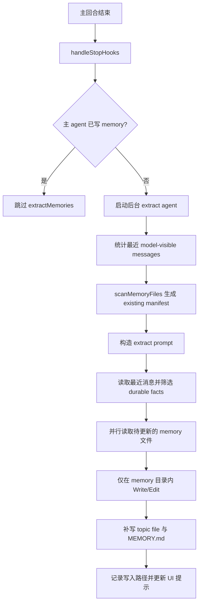

# extractMemories 详细分析

## 1. 定位

`extractMemories` 是回合结束后的后台补写器。它不负责定义新规则，而是在主模型没有主动写 memory 时，按同一套 policy 异步提取最近消息里的可保留事实。

关键源码锚点：

- `src/services/extractMemories/prompts.ts`
- `src/services/extractMemories/extractMemories.ts`

## 2. 存取、触发时机、生命周期策略

### 2.1 输入

- 最近若干条 model-visible messages，即最近的 `user/assistant` 消息
- 当前 auto-memory 目录及其已有 memory manifest
- 主对话已经注入的长期记忆规则与类型约束

这里有两个容易忽略的实现细节：

- `countModelVisibleMessagesSince(...)` 只统计模型可见消息，不把 progress/system/attachment 消息算进“最近消息”窗口。
- `runExtraction()` 在真正启动 forked agent 之前，会先调用 `scanMemoryFiles()` 和 `formatMemoryManifest()`，把当前 memory 目录的轻量清单预注入到 prompt 里，减少子代理再花一轮去 `ls` 的成本。

### 2.2 输出

- 新 topic file
- 对现有 topic file 的补充
- `MEMORY.md` 的索引更新

输出不是“先产出结构化 JSON，再由外层写入”，而是让子代理直接调用 `FileWrite/FileEdit` 改 memory 文件。也就是说，事实抽取结果的最终载体就是 memory markdown 文件本身。

### 2.3 触发时机

- 主回合结束后的 stop hook
- 前提是本回合主 agent 没有自己写过 memory

### 2.4 生命周期

- 作为长期记忆的补写链路
- 输入窗口很短，只处理最近对话片段
- 不做深调查，不做复杂重构

## 3. 提取 prompt 的详细结构

### 3.1 prompt 的角色定义

`buildExtractAutoOnlyPrompt()` / `buildExtractCombinedPrompt()` 的开头会把子代理明确设定为：

- 一个 `memory extraction subagent`
- 只分析最近约 `newMessageCount` 条消息
- 目的不是回答用户，而是“更新持久记忆系统”

这个角色定义很重要，因为它把子代理从“继续对话”切成“只做记忆提取”。

### 3.2 prompt 的硬约束

prompt 对子代理施加了很强的执行边界：

- 只能使用最近约 `N` 条消息中的内容更新记忆
- 不允许继续调查，不允许读代码验证，不允许跑 `git` 命令
- 允许的工具仅包括 `Read/Grep/Glob`、只读 `Bash`、以及 memory 目录内的 `Edit/Write`
- 明确禁止 `rm`
- 要求采用两阶段策略：
  - 第 1 轮并行读所有可能会更新的文件
  - 第 2 轮并行执行所有 `Write/Edit`
  - 不要在多轮中交错读写

这意味着 extractMemories 的设计目标不是高思考深度，而是低成本、强约束、快速补写。

### 3.3 prompt 如何定义“哪些事实该被提取”

extract prompt 自身没有重新发明一套“候选事实 schema”，而是直接复用主 memory taxonomy：

- `user`
- `feedback`
- `project`
- `reference`

对应的提取语义如下：

- `user`：用户角色、职责、知识背景、协作偏好
- `feedback`：用户对工作方式的纠偏或确认，尤其是未来应继续遵循的方法
- `project`：项目中的非代码事实，例如目标、约束、截止时间、推动原因
- `reference`：外部系统入口、看板、Linear/Grafana/Slack 等信息来源

此外，prompt 还保留了两条特别重要的显式规则：

- 如果用户明确说“记住某件事”，要立即保存为最合适的 memory type
- 如果用户明确说“忘掉某件事”，要找到并删除对应 memory

### 3.4 prompt 如何定义“不该提取的内容”

子代理会继承 `WHAT_NOT_TO_SAVE_SECTION`，因此以下内容即便出现在最近消息里，也不应被提取：

- 代码结构、架构、文件路径、项目目录
- git 历史、最近谁改了什么
- debug 解法或修复 recipe
- 已经写在 `CLAUDE.md` 中的内容
- 当前对话里的临时任务状态和短期上下文

这解释了为什么 extractMemories 只能作为长期记忆的补写器，而不是“把最近对话自动归档”的泛化摘要器。

## 4. 提取结果的格式与落盘规范

### 4.1 memory 文件格式

子代理写 memory 时必须使用统一 frontmatter。源码中的 `MEMORY_FRONTMATTER_EXAMPLE` 要求格式如下：

```markdown
---
name: {{memory name}}
description: {{one-line description}}
type: {{user|feedback|project|reference}}
---

{{memory content}}
```

其中每个字段的作用分别是：

- `name`：记忆标题，供人读和索引引用
- `description`：一行摘要，后续相关性召回时会参与判断，因此必须具体
- `type`：四选一，决定该记忆的使用方式与正文结构
- 正文：真正的长期事实内容

### 4.2 不同类型事实的正文结构

并不是所有类型的正文都一样。`memoryTypes.ts` 对 `feedback` 和 `project` 给了更强的结构要求：

- `feedback`：先写规则本身，再写 `**Why:**` 与 `**How to apply:**`
- `project`：先写事实/决策，再写 `**Why:**` 与 `**How to apply:**`
- `user`：更偏画像与背景描述，不强制 `Why/How to apply`
- `reference`：更偏外部资源定位，不强制 `Why/How to apply`

可将其理解为：

```markdown
integration tests must hit a real database, not mocks.

**Why:** prior incident showed mock/prod divergence can hide migration failures.
**How to apply:** when proposing or writing integration tests in this repo, prefer real DB coverage.
```

### 4.3 MEMORY.md 的索引格式

若 `skipIndex=false`，保存记忆是两步：

1. 先写独立 topic file
2. 再在 `MEMORY.md` 中写一行索引

索引行格式被限制为：

```markdown
- [Title](file.md) — one-line hook
```

并且有几条额外约束：

- `MEMORY.md` 本身没有 frontmatter
- 每条索引尽量控制在约 150 个字符内
- 200 行之后可能会被截断，因此索引必须短小
- 绝不能把真正的 memory 正文直接写进 `MEMORY.md`

### 4.4 去重与更新策略

extract prompt 会显式告诉子代理：

- 先检查现有 memory manifest
- 如果已有相关记忆，优先更新，不要新建重复文件
- 如果已有记忆过时或错误，应更新或删除
- 记忆要按语义 topic 组织，而不是按时间顺序组织

因此“提取结果格式”不只是某个 markdown 模板，还包括一组更新语义：

- `append` 不是默认动作
- `update existing topic` 比 `create new topic` 更优先
- topic 维度优先于时间维度

## 5. 执行伪代码

```text
onStopHook():
  if mainAgentWroteMemory():
    return

  recentMessages = loadRecentMessages()
  existingManifest = scanAndFormatExistingMemories()
  prompt = buildExtractPrompt(recentMessages.count, existingManifest)
  candidateFacts = extractDurableFacts(recentMessages, promptRules)
  if candidateFacts.empty():
    return

  readExistingMemoryFilesInParallel()
  writeOrEditOnlyInsideMemoryDir(candidateFacts)
  maybeUpdateMemoryIndex()
```

## 6. 详细代码流程分析

### 6.1 完美继承主 policy

- extract agent 被描述为主对话的 perfect fork。
- 它不发明另一套记忆分类，而是沿用主系统 prompt 里已有的 memory taxonomy。
- 所以它更像“异步补漏 worker”。

### 6.2 能力限制

- 只能看最近消息，不准再去读代码做验证。
- shell 只允许 read-only。
- `Edit/Write` 只允许发生在 memory 目录里。
- 推荐两阶段执行：先并行读取，再并行写入。

更具体地说，`createAutoMemCanUseTool(memoryDir)` 会在运行时强约束：

- `Read/Grep/Glob` 可直接放行
- `Bash` 只有在 `tool.isReadOnly(...)` 判定通过时才能放行
- `Edit/Write` 只有 `file_path` 位于 auto-memory 目录内时才允许
- 其它工具一律 deny

因此 extractMemories 的 prompt 约束并不只是“说说而已”，而是有 canUseTool 的执行层兜底。

### 6.3 现有 memory manifest 的预注入

`runExtraction()` 里会先做：

1. `scanMemoryFiles(memoryDir, signal)`
2. `formatMemoryManifest(...)`
3. 把结果拼进 prompt 的 `## Existing memory files` 段落

这样子代理一开始就知道：

- 当前 memory 目录里已经有哪些 topic
- 每个文件的摘要和类型
- 应优先更新哪个文件，避免重复落盘

这一点正好补全了“提取最近消息可保留事实”的关键上下文：它不是只看最近消息，还会把已有长期记忆目录的轻量索引作为对照基线。

### 6.4 工程价值

- 主回合不用为了保证记忆完整而停下来做额外写入。
- 抽取逻辑异步化后，可降低主交互时延。
- 但由于不能深验证，因此适合作为补写，而不适合作为唯一写入通道。

### 6.5 实际运行节奏

从 `extractMemories.ts` 看，完整节奏是：

1. stop hook 触发 `executeExtractMemoriesImpl()`
2. 检查总开关、remote mode、主 agent 身份
3. 如果本回合主 agent 已写 memory，则直接跳过
4. 计算最近新增的 model-visible messages 数量
5. 预扫描 memory 目录，生成 manifest
6. 构造 extract prompt
7. 用 `runForkedAgent(...)` 启动后台子代理，最大 5 turns
8. 提取本次实际写入的路径，并过滤出真正的 memory topic files
9. 若有写入，则追加 memory-saved system message

这里还有两个实现细节值得记录：

- 若本轮抽取报错，`lastMemoryMessageUuid` 不会前移，后续还有机会重试这批消息。
- 若抽取过程中又来了新的上下文，系统会 stash 最新 context，待当前抽取结束后再做一次 trailing run。

## 7. Mermaid 流程图

```mermaid
flowchart TD
    Start(["runExtraction 开始"]) --> A["解构参数: context, appendSystemMessage, isTrailingRun"]
    A --> B["从 context 中获取 messages"]
    B --> C["获取 memoryDir = getAutoMemPath()"]
    C --> D["计算 newMessageCount = countModelVisibleMessagesSince(messages, lastMemoryMessageUuid)"]

    D --> E{"hasMemoryWritesSince?\n主Agent是否已写入过记忆文件?"}
    E -- 是 --> F["logForDebugging: 跳过提取"]
    F --> F1["更新 lastMemoryMessageUuid = messages最后一条的uuid"]
    F1 --> F2["logEvent: tengu_extract_memories_skipped_direct_write"]
    F2 --> Return1(["return 提前退出"])

    E -- 否 --> G["获取 teamMemoryEnabled\n(TEAMMEM feature flag)"]
    G --> H["获取 skipIndex\n(tengu_moth_copse feature flag)"]
    H --> I["创建 canUseTool = createAutoMemCanUseTool(memoryDir)"]
    I --> J["创建 cacheSafeParams = createCacheSafeParams(context)"]

    J --> K{"isTrailingRun?\n是否为尾随运行?"}
    K -- 否 --> L["turnsSinceLastExtraction++"]
    L --> M{"turnsSinceLastExtraction < 阈值?\n(tengu_bramble_lintel, 默认1)"}
    M -- 是 --> Return2(["return 未达轮次阈值,跳过"])
    M -- 否 --> N["turnsSinceLastExtraction = 0"]
    K -- 是 --> N

    N --> O["设置 inProgress = true"]
    O --> P["记录 startTime = Date.now()"]

    P --> Q["try 块开始"]
    Q --> R["logForDebugging: 开始提取"]
    R --> S["扫描已有记忆文件\nscanMemoryFiles(memoryDir)"]
    S --> T["格式化记忆清单\nformatMemoryManifest()"]

    T --> U{"TEAMMEM && teamMemoryEnabled?"}
    U -- 是 --> V["userPrompt = buildExtractCombinedPrompt(\nnewMessageCount, existingMemories, skipIndex)"]
    U -- 否 --> W["userPrompt = buildExtractAutoOnlyPrompt(\nnewMessageCount, existingMemories, skipIndex)"]

    V --> X["调用 runForkedAgent"]
    W --> X

    X --> X1["runForkedAgent 参数:\n- promptMessages: userPrompt\n- cacheSafeParams\n- canUseTool\n- querySource: 'extract_memories'\n- forkLabel: 'extract_memories'\n- skipTranscript: true\n- maxTurns: 5"]

    X1 --> Y["获取 result (forkedAgent 结果)"]

    Y --> Z["更新游标\nlastMemoryMessageUuid = messages最后一条的uuid"]
    Z --> AA["提取写入路径\nwrittenPaths = extractWrittenPaths(result.messages)"]
    AA --> AB["统计 turnCount (assistant消息数)"]

    AB --> AC["计算缓存命中率\ntotalInput / cache_read 百分比"]
    AC --> AD["logForDebugging: 完成信息 + 缓存统计"]

    AD --> AE{"writtenPaths.length > 0?"}
    AE -- 是 --> AF["logForDebugging: 列出保存的记忆文件路径"]
    AE -- 否 --> AG["logForDebugging: 本次无记忆保存"]

    AF --> AH["过滤 memoryPaths\n(排除 ENTRYPOINT_NAME 索引文件)"]
    AG --> AH

    AH --> AI["统计 teamCount\n(TEAMMEM下的团队记忆数)"]
    AI --> AJ["logEvent: tengu_extract_memories_extraction\n(记录详细usage指标)"]

    AJ --> AK{"memoryPaths.length > 0?"}
    AK -- 是 --> AL["创建 memorySavedMessage"]
    AL --> AM{"TEAMMEM feature?"}
    AM -- 是 --> AN["msg.teamCount = teamCount"]
    AN --> AO["appendSystemMessage?.(msg)\n通知主线程记忆已保存"]
    AM -- 否 --> AO
    AK -- 否 --> Finally

    AO --> Finally

    Q -- "catch(error)" --> Catch["logForDebugging: 记录错误"]
    Catch --> CatchLog["logEvent: tengu_extract_memories_error\n+ duration_ms"]
    CatchLog --> Finally

    Finally["finally 块"] --> FIN1["设置 inProgress = false"]
    FIN1 --> FIN2["获取 trailing = pendingContext"]
    FIN2 --> FIN3["pendingContext = undefined"]
    FIN3 --> FIN4{"trailing 存在?\n(有挂起的提取请求?)"}
    FIN4 -- 是 --> FIN5["logForDebugging: 运行尾随提取"]
    FIN5 --> FIN6["递归调用 runExtraction\nisTrailingRun = true\n使用 trailing.context"]
    FIN6 --> End(["runExtraction 结束"])
    FIN4 -- 否 --> End
```





## 8. 对车机智能语音座舱的借鉴意义

- 车机主对话链路不应承担全部记忆沉淀工作，否则会拉长交互尾延迟。
- 更合理的方式是在线返回结果后，再由后台任务抽取值得固化的偏好和事实。
- 但后台补写必须受限，避免读写过度、误写和资源争抢。

此外，这个实现还有三个对车机场景很有价值的点：

- “最近消息窗口 + 已有 memory manifest” 的双输入模式，适合做轻量增量抽取。
- prompt 先定义可保留事实类型，再定义禁止提取项，能明显降低噪声固化。
- 写入直接落在 memory 主存储中，避免额外设计复杂的中间表示格式。

## 9. 面向车机语音记忆系统的设计建议

### 9.1 在线与离线解耦

- 主对话只输出结果，并把候选事件发到消息队列。
- 后台 worker 从队列消费，提取长期偏好候选。
- 提取完成后异步更新 `ES/Milvus`，必要时再回刷 `Redis`。

### 9.2 中间件职责

- `Redis`：短期候选、幂等去重、消费进度缓存。
- `ES`：持久化候选事实和可审计事件。
- `Milvus`：为稳定摘要生成向量索引。

### 9.3 时延与扩展

- 主链路只做投递，不做复杂抽取，保证低时延。
- 后台抽取器可以按技能域横向扩展。
- 抽取器必须做置信度和稳定性阈值控制，防止一次性口误被固化。

### 9.4 建议补充“提取结果中间格式”

Claude Code 当前是让子代理直接改 markdown 文件；若放到车机系统，为了更强的可观测性，建议在真正落库前先形成一层标准化中间对象，例如：

```json
{
  "memory_type": "feedback",
  "scope": "driver-private",
  "title": "导航播报偏好",
  "summary": "用户偏好简洁播报，不要重复路况解释",
  "content": {
    "rule": "导航播报保持简洁",
    "why": "用户明确表示重复解释会干扰驾驶",
    "how_to_apply": "在路线引导和 reroute 提示中使用短句"
  },
  "source_window": {
    "session_id": "xxx",
    "message_range": [120, 128]
  },
  "confidence": 0.92,
  "last_verified_at": "2026-04-02T13:00:00+08:00"
}
```

这样可以做到：

- 在线抽取与最终存储解耦
- `Redis` 暂存候选结果
- `ES` 存结构化审计记录
- `Milvus` 只接收经审核或归纳后的语义摘要
